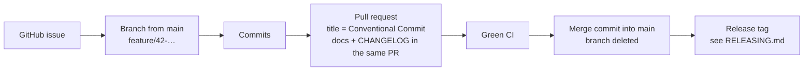

# Contributing to rpmgr

These rules apply to every change: design documents now, code later. "Must" is a rule that CI or a
reviewer enforces; "should" is the expected default that a pull request may deviate from with a
stated reason.

rpmgr is a personal open-source project with **one maintainer**
([D26, D27](docs/14-open-decisions.md#project-and-process)). Releases, versions and the changelog
are covered in [RELEASING.md](RELEASING.md).

## Contents

- [Workflow](#workflow)
- [Issues](#issues)
- [Branches](#branches)
- [Commits](#commits)
- [Size of changes](#size-of-changes)
- [Pull requests](#pull-requests)
- [Reviews](#reviews)
- [Documenting features](#documenting-features)
- [Architecture decision records](#architecture-decision-records)
- [Spikes](#spikes)
- [Definition of done](#definition-of-done)
- [Security-sensitive changes](#security-sensitive-changes)
- [License, sign-off and third-party code](#license-sign-off-and-third-party-code)
- [AI-assisted changes](#ai-assisted-changes)
- [Repository settings](#repository-settings)

## Workflow



- `main` is the only long-lived branch. It must always build, pass CI and be releasable.
- Every change reaches `main` through a pull request (PR).
  Nobody pushes to `main` directly, and history on `main` is never rewritten.

## Issues

- Every `feature/` and `bugfix/` branch starts from a **GitHub issue** in this repository. The issue
  says what is wrong or missing and why it matters; the PR says how it was solved.
- Small changes without behaviour change (typos, wording, tooling) may use an `improvement/` branch
  without an issue.
- Labels:

  | Label group | Values |
  |---|---|
  | `type:` | `feature`, `bug`, `improvement`, `security`, `docs`, `release` |
  | `area:` | `controller`, `gateway`, `connector`, `tunnel`, `pki`, `policy`, `authz`, `store`, `api`, `web`, `dns`, `acme`, `ota`, `importer`, `cli`, `ops`, `design` |
  | `phase:` | `p0`, `p1`, `p2`, `p3` ([13](docs/13-roadmap.md)) |
  | Flags | `breaking`, `no-changelog`, `needs-adr`, `security-sensitive` |

- Security vulnerabilities are **never** reported in public issues; see [SECURITY.md](SECURITY.md).

## Branches

**Names** contain only lowercase letters, digits, `-` and `.`, plus one `/` after the prefix. The
description is 2–5 words in kebab case; the whole name is at most 60 characters.

| Prefix | Use | Example |
|---|---|---|
| `feature/<issue>-<desc>` | New or changed behaviour, including new design | `feature/42-dns-automation` |
| `bugfix/<issue>-<desc>` | Fix of a defect | `bugfix/57-etag-mismatch-on-retry` |
| `improvement/<desc>` | Refactoring, documentation, tooling; no behaviour change | `improvement/contribution-rules` |
| `merge/<desc>` | Merging one long-lived branch into another, e.g. a release branch's changelog into `main` | `merge/release-1.4-into-main` |
| `tmp/<desc>` | Experiments and Phase 0 spikes; **never merged** | `tmp/s2-reverse-h2` |
| `release/<major>.<minor>` | Maintenance branch for patch releases of an older minor ([RELEASING.md](RELEASING.md#maintenance-branches)) | `release/1.4` |

`<issue>` is the number of the GitHub issue, any length. The pattern CI checks:

```
^(feature|bugfix)/[0-9]+-[a-z0-9]+([.-][a-z0-9]+)*$
^(improvement|merge|tmp)/[a-z0-9]+([.-][a-z0-9]+)*$
^release/[0-9]+\.[0-9]+$
```

Branches created by the dependency bot (`dependabot/…`) are exempt. A pull request from a `tmp/`
branch fails CI, because `tmp/` branches are never merged.

**Lifetime**

- Branch from the current `main`; a backport branches from its `release/<major>.<minor>`.
- Keep branches short-lived: merge within about a week. Rebase on `main` (or merge `main` in) at
  least every two working days while the branch is open.
- Branches are deleted when their PR is merged or closed. A `tmp/` branch is deleted when its
  result is written down; a spike's branch is first tagged ([Spikes](#spikes)).
- Force-pushing your own unmerged branch is fine; force-pushing `main` or `release/*` is never
  allowed.

## Commits

Commit messages follow [Conventional Commits 1.0.0](https://www.conventionalcommits.org/en/v1.0.0/):

```
<type>(<scope>)!: <subject>

<body: why the change is needed, wrapped at 72 columns>

<footers: Closes #42, BREAKING CHANGE: …, Co-Authored-By: …, Signed-off-by: …>
```

| Type | Use | In the changelog? |
|---|---|---|
| `feat` | New user-visible behaviour | Yes: Added or Changed |
| `fix` | Defect fix | Yes: Fixed (Security for vulnerabilities) |
| `perf` | Faster or leaner, same behaviour | If users notice |
| `refactor` | Code change without behaviour change | No |
| `docs` | Design documents, comments, README | No, unless shipped user documentation changes |
| `test` | Tests only | No |
| `build` | Build system, dependencies (`build(deps): …`) | Only if users are affected |
| `ci` | CI configuration | No |
| `chore` | Maintenance, release preparation (`chore(release): v1.4.0`) | No |
| `revert` | Reverts an earlier commit (`revert: feat(dns): …`) | If the reverted change was released |

- **Scope** is optional and uses the `area:` label values (`dns`, `gateway`, `api`, …), or `adr`,
  `deps`, `release`.
- **Subject**: imperative mood ("add", not "added"), lowercase start, no trailing period, English.
  The whole first line is at most **72 characters**.
- **Body**: explains *why*; the diff shows *what*. Required for `feat`, `fix` and anything
  non-obvious.
- **Breaking changes** add `!` after the type or scope **and** a `BREAKING CHANGE:` footer that
  says what users must do. See [RELEASING.md](RELEASING.md#versioning) for what counts as breaking.
- **Issue references** go into footers: `Closes #42` when the change resolves the issue,
  `Refs #42` otherwise.
- **Sign-off.** Every commit carries a `Signed-off-by:` trailer (`git commit -s`), which certifies
  the [Developer Certificate of Origin 1.1](https://developercertificate.org/) for the change. CI
  checks it ([License, sign-off and third-party code](#license-sign-off-and-third-party-code)).
  Merge commits, which add no content of their own, need none.
- Every commit leaves the tree buildable; nothing is committed that the commit then fixes.
  Fix-ups made during review are folded into the commit they fix before merging
  (`git commit --fixup <commit>`, then `git rebase --autosquash main`); CI refuses `fixup!`
  commits.
- Never commit secrets, credentials, private keys, real customer data, or build output. Generated
  files are committed only where the toolchain requires it (for example Atlas migration files) and
  are regenerated in the same PR; CI fails if regeneration produces a diff.

PRs are merged with a **merge commit** ([Pull requests](#pull-requests)), so every commit of the
branch reaches `main` unchanged and no commit is lost. These rules therefore apply to each commit,
not only to the PR title, and CI checks every commit header.

## Size of changes

One PR is **one logical change**, and becomes one merge commit on `main`. Small changes are
reviewed better, reverted more safely and released more predictably.

| Kind of change | Limit |
|---|---|
| Code (production code, excluding tests, generated files, lockfiles and fixtures) | **Should** stay below 400 changed lines. 400–800 lines **must** explain in the description why it cannot be split. Above 800 lines **must** be split, unless the change is mechanical (rename, move, generated) |
| Tests | No limit; tests for a change belong in the same PR |
| Design documents | One feature or one decision per PR. Above about 1 000 changed lines, split into the decision (ADR and main document) and follow-up edits |
| Dependency updates | One dependency, or one bot-grouped set, per PR |

How to split:

- **Separate refactoring from behaviour change.** First a `refactor` PR that changes no behaviour,
  then the `feat` or `fix` PR on top.
- **Separate mechanical changes** (renames, moves, formatting) from everything else.
- **Slice features vertically or by layer** (schema → API → job → UI), each slice merged on its own
  and kept inert until the feature is complete: not reachable from the UI or API, or behind a
  setting that defaults to off. `main` must stay releasable at every merge.
- Stacked PRs (a branch based on another open branch) are allowed; retarget them to `main` after
  the base merges.

## Pull requests

- **Title** is a Conventional Commit header, at most 72 characters; the merge commit records it
  in its message, and the release notes are written from it. CI lints it.
- **Description** follows the [PR template](.github/pull_request_template.md): what and why, the
  issue, how it was tested, what was not verified, breaking changes and upgrade notes, security
  impact, screenshots for UI changes.
- Docs and the [CHANGELOG](RELEASING.md#changelog) entry are part of the **same** PR as the change,
  never a follow-up. A PR without a user-visible change gets the `no-changelog` label.
- Open a **draft** PR early for feedback on direction; mark it ready when it meets the
  [Definition of done](#definition-of-done).
- Before merging, the branch must be up to date with `main` and CI must be green.
- **Merge method: merge commit** ("Create a merge commit", GitHub's default,
  [D35](docs/14-open-decisions.md#project-and-process)). The branch's commits reach `main`
  unchanged, with their `Closes #…`, `BREAKING CHANGE:`, `Co-Authored-By:` and `Signed-off-by:`
  footers; the merge commit keeps GitHub's default message (`Merge pull request #N from …`, with
  the PR title as its body). Squash and rebase merges stay enabled, as in GitHub's default
  settings, but are not used: a squash merge drops the branch's commits, and a rebase merge
  rewrites them.
- The **author merges** once CI is green ([Reviews](#reviews)); for an external contribution the
  maintainer merges. The branch is deleted automatically; its commits stay reachable from the merge
  commit.
- Reverting is a new PR (`revert: …`) through the same process; it reverts the merge commit
  (`git revert -m 1 <merge commit>`).

## Reviews

rpmgr has one maintainer, and GitHub does not let an author approve their own pull request. The
**merge gate is therefore the pull request plus green CI; no approval is required**
([D27](docs/14-open-decisions.md#project-and-process)). This includes
[security-sensitive changes](#security-sensitive-changes), ADRs moving to *Accepted*, and release
PRs.

- Before marking a PR ready, the author reviews the whole diff for: correctness including error
  paths, tests, documentation and CHANGELOG, security impact, and the size rules. Additional
  tools, such as an AI code or security review, may be used at the author's discretion; they are
  not required.
- **External contributions** are reviewed by the maintainer, with a first response within about
  a week. Prefix optional suggestions with `nit:`; they do not block merging.
- **If further maintainers join**, this section changes by PR to: at least one approval from a
  maintainer other than the author, and two for security-sensitive changes, ADRs moving to
  *Accepted* and release PRs.

## Documenting features

**Design first.** A feature is described in the design documents before it is implemented, and
the documents change in the same PR as any behaviour change. A feature without documentation is
not done.

### Where each fact goes

Each fact has exactly one home; other documents link to it. Configuration reconciliation is a
worked example: the decision in [ADR-0007](docs/adr/0007-desired-state-reconciliation.md), the
mechanism in [03](docs/03-connections.md#configuration-reconciliation), the tables in
[06](docs/06-data-model.md#desired-vs-observed-state), the apply status in
[07](docs/07-api.md#writes-and-apply-status) and the UI rule in
[09](docs/09-web-ui.md#ux-principles).

| Aspect of the feature | Home |
|---|---|
| What it is, and its phase | [05](docs/05-features.md) feature catalogue row |
| How it works | The topical document (e.g. [03](docs/03-connections.md) for connections), or a new numbered document (below) |
| A load-bearing decision | An [ADR](#architecture-decision-records) |
| Tables, IDs, desired vs observed state, tenancy | [06](docs/06-data-model.md) |
| Services, messages, errors, manifests, webhooks | [07](docs/07-api.md) |
| Libraries, with rationale and rejected alternatives | [08](docs/08-software-stack.md) |
| Threats, roles, secrets, step-up, audit | [04](docs/04-security.md) |
| Navigation, areas, key screens | [09](docs/09-web-ui.md) |
| Configuration, ports and egress, metrics, alerts, runbooks, backup | [10](docs/10-operations.md) |
| The importer and migration | [11](docs/11-migration.md) |
| Test strategy and named tests | [12](docs/12-testing-and-quality.md) |
| Phase scope, spikes, verification backlog, risks | [13](docs/13-roadmap.md) |
| Open questions, each with a recommended default | [14](docs/14-open-decisions.md) |
| New terms | [00](docs/00-vision-and-scope.md#glossary) glossary |

### Feature documentation checklist

1. Row in [05](docs/05-features.md) with its phase (`P1`, `P2`, `P3`).
2. Mechanism described in its topical document, with diagrams where flows or states matter.
3. ADR written or updated if the feature makes or changes a load-bearing decision.
4. Every affected document in the table above updated, including security (what can go wrong,
   who may do it), operations (how to run and monitor it) and tests (named tests for the error
   paths, not only the happy path).
5. Every unverified assumption tagged `[V Sx]` or `[V VB-xx]` and added to
   [13](docs/13-roadmap.md#verification-backlog); every open question added to
   [14](docs/14-open-decisions.md) with a recommended default.
6. New documents and new ID ranges reflected in the [README](README.md).
7. Link check and Mermaid parse pass ([12](docs/12-testing-and-quality.md#continuous-integration)).

Once code exists, these also belong to a feature: comments on every public `.proto` message and
field (they are the API reference), CLI `--help` text, configuration reference in
[10](docs/10-operations.md#configuration), and the CHANGELOG entry.

### When to write a new numbered document

When a feature's mechanism needs more than about 150 lines and fits none of the existing
documents. It gets the next free number, the standard header blockquote, an entry in the README's
document table, and, if it defines timers or limits, a "single source of truth" statement
(see [README](README.md#how-to-read-these-documents)).

### Writing rules

- **Tags and citations.** Facts are `[F …]` with a citation: source at a version and line, or
  vendor documentation with a retrieval date ([README](README.md#citations)). Design choices with
  reasoning are `[R]`, targets `[T]`, assumptions to verify `[V Sx]` or `[V VB-xx]`. Untagged text
  is the design itself.
- **Single sources of truth.** Timers, sizes, limits, lifetimes and cryptographic parameters are
  defined only in the document the README names as their source
  ([README](README.md#how-to-read-these-documents)); every other document links to it.
- **Identifiers are never reused.** Use the next free number: `ADR-NNNN`, `Dnn` (open decisions),
  `Sn` (spikes), `VB-nn`, `Un` (UX principles), ID prefixes in
  [06](docs/06-data-model.md#identifiers). Resolved items are struck through, not deleted.
- **Style.**
  - British spelling ("organisation", "behaviour"); "authorization" and "license" as already used.
  - Short, declarative, present-tense sentences.
  - Prose hard-wrapped at 100 columns; a table row stays on one line.
  - Links use the document number as text, at the end of the sentence:
    `([03](03-connections.md#port-443-multiplexing))`.
  - Bold for key terms and invariants, never for whole sentences.
  - Units with a space (`30 s`, `4 MiB`), a space as thousands separator (`1 200`), `→`, `≥`, `×`
    where they read better.
  - Diagrams in Mermaid (`flowchart`, `sequenceDiagram`, `erDiagram`); UI mock-ups as box-drawing
    ASCII in plain code blocks.

## Architecture decision records

- **When:** a decision that is expensive to reverse, constrains other parts of the design, or was
  chosen over serious alternatives (protocol, storage, security model, external integrations).
  Label the issue `needs-adr`.
- **How:** copy [docs/adr/0000-template.md](docs/adr/0000-template.md) to the next free number,
  `docs/adr/NNNN-<kebab-title>.md`, title stated as the decision. Update every document the
  decision affects in the same PR, and the ADR range in the README.
- **Status lifecycle:** `Proposed (design phase)` → `Accepted` (after its spike passes, or decided
  by the product owner) → `Superseded by ADR-NNNN` or `Deprecated`.
- An accepted ADR's decision is never edited. A changed decision gets a new ADR that supersedes the
  old one; the old one only gets its status line updated. Typos and links may be fixed anytime.
- Closing an open decision is recorded in [14](docs/14-open-decisions.md).

## Spikes

A spike answers one Phase 0 question with a throw-away prototype and applies the rule agreed
before it runs ([13](docs/13-roadmap.md#phase-0--spikes),
[D36](docs/14-open-decisions.md#project-and-process)):

1. **Issue** from the *Spike* issue template, titled `Spike Sx: <question>`, labelled `type:docs`,
   `phase:p0`, `needs-adr` and the area.
2. **Code** on `tmp/sx-<desc>`, in `spikes/sx/` as its own Go module, with SPDX headers and a
   `README.md` that says how to repeat every run. Raw results are committed next to the code in
   `spikes/sx/results/`. The branch is never merged, and CI does not run on it.
3. **Result** in one PR from `feature/<issue>-sx-<desc>`, titled `docs(adr): …`, labelled
   `no-changelog`, with `Closes #<issue>`: `docs/spikes/Sx.md` from the
   [template](docs/spikes/TEMPLATE.md), the ADR moved to *Accepted* or to the fallback the rule
   names, and every document the result affects.
4. **Archive.** After that PR is merged, the last commit of the spike branch is tagged with an
   annotated tag `spike/sx` (immutable, protected by a ruleset), the tag is pushed, and the branch
   is deleted. `docs/spikes/Sx.md` links to the tag, so the code behind the numbers stays
   available.

A spike pins the current releases of the libraries it tests and re-checks, at those versions,
every `[F]` fact its decision rests on ([D39](docs/14-open-decisions.md#project-and-process)).

## Definition of done

A change is done when:

- [ ] It builds cleanly with no new warnings, and existing tests pass.
- [ ] New or changed behaviour has tests that cover **error cases and edge conditions** (invalid
      input, boundary values, failure paths), not only the happy path
      ([12](docs/12-testing-and-quality.md)).
- [ ] Documentation is updated per the
      [feature documentation checklist](#feature-documentation-checklist).
- [ ] The CHANGELOG has an entry under `Unreleased`, or the PR is labelled `no-changelog`.
- [ ] Breaking changes are marked and come with upgrade notes.
- [ ] Anything that could not be run or verified is stated in the PR description.
- [ ] The PR meets the size rules, its commits are signed off, and CI is green.

## Security-sensitive changes

Changes in these areas carry the `security-sensitive` label. With one maintainer the label adds no
approval ([Reviews](#reviews)); it marks the changes for the documented self-review before 1.0 and
for any external review ([D28](docs/14-open-decisions.md#project-and-process),
[12](docs/12-testing-and-quality.md#security-testing)):

- PKI, enrollment, certificate verification and the deny-list (`internal/pki`);
- authorization and tenancy enforcement (`internal/authz`, store privacy rules, composite keys);
- connector-local policy (`internal/policy`);
- secrets, the KEK and redaction (`internal/secret`);
- tunnel framing and TLS configuration (`internal/tunnel`);
- release signing, OTA and install scripts;
- anything that holds or uses credentials for external services (ACME accounts, DNS providers,
  webhooks, SMTP, KMS);
- the corresponding design sections in [04](docs/04-security.md).

Fixes for vulnerabilities that are not public yet are developed in a private security advisory,
not in a public PR ([SECURITY.md](SECURITY.md)).

## License, sign-off and third-party code

- rpmgr, code and documentation, is licensed under the [Apache License 2.0](LICENSE)
  ([D1](docs/14-open-decisions.md#product-and-project)). Contributions are accepted under the
  same license.
- **Developer Certificate of Origin.** Every commit is signed off (`git commit -s`); CI fails a PR
  with a commit that lacks a `Signed-off-by:` line of its author. Commits of the dependency bot
  are exempt. There is no contributor license agreement.
- **License headers.** Every source file starts with an SPDX identifier in its language's comment
  syntax, e.g. `// SPDX-License-Identifier: Apache-2.0`; CI checks it. Markdown documents need none.
- The [dependency policy](docs/08-software-stack.md#dependency-policy) applies: every new
  dependency is justified in the PR description, pinned and scanned.
- Code copied from elsewhere keeps its license notice, and its license must be compatible with
  Apache-2.0 (for example MIT, BSD or Apache-2.0).

## AI-assisted changes

- AI-written code and text are reviewed and tested like any other change. The person who opens
  the PR is responsible for every line.
- Commits with substantial AI-written content carry a `Co-Authored-By:` footer naming the
  assistant.
- Facts produced by an assistant are tagged `[F]` only after the citation was checked; otherwise
  they are `[V]`.

## Repository settings

The repository is `github.com/felix-homelab/rpmgr`
([D3](docs/14-open-decisions.md#product-and-project)). The maintainer configures GitHub so that
the rules above are enforced, not just written down:

- **`main` ruleset:** pull request required, with **no required approval**
  ([Reviews](#reviews)); conversations resolved; required status checks (all per-PR CI stages,
  currently `pr-rules`, `lint`, `docs` and `secrets`,
  [12](docs/12-testing-and-quality.md#continuous-integration)); branch up to date before merge;
  force pushes and deletion blocked. There is no CODEOWNERS file, and no linear-history rule,
  because PRs are merged with merge commits.
- **`release/*` ruleset:** the same as `main`.
- **Tag rulesets for `v*` and `spike/*`:** only the maintainer creates tags; tags cannot be
  updated or deleted.
- **Merge settings:** GitHub's defaults: merge commits, squash and rebase merges allowed, the
  default merge commit message; merge commits are the method used ([Pull requests](#pull-requests)).
  Head branches are deleted automatically.
- **Security:** private vulnerability reporting enabled; secret scanning and push protection on.
- **CI and dependencies:** GitHub Actions; Dependabot for Go modules, npm, GitHub Actions and
  container base images.

These rules apply from 2026-10-06.
