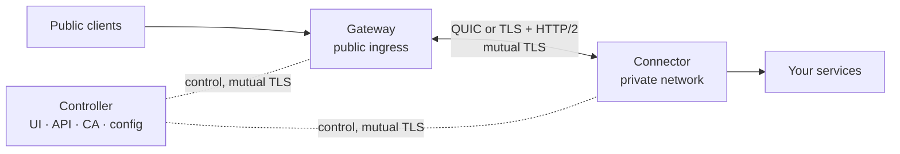

# rpmgr — Reverse Proxy Manager

**Status: design. Nothing here is implemented yet.**

rpmgr publishes services that run on private networks — behind NAT, CGNAT or firewalls — through
public gateways, and manages them from one control plane. It is built as **one product**: one
identity system, one typed configuration model, one protocol, one UI.

In one paragraph: agents only dial out; every connection is TLS 1.3 with per-agent certificates from
an internal CA; configuration is desired state, compiled per agent, applied atomically and
acknowledged, and a bad change never takes working tunnels down; a root-owned policy file on each
connector host limits what even a compromised controller can make it do. One binary, `rpmgr`, runs
every role.

## Documents

| Document | What it answers |
|---|---|
| [00 — Vision and scope](docs/00-vision-and-scope.md) | What rpmgr is, for whom, goals and non-goals, principles, naming, glossary |
| [02 — Architecture](docs/02-architecture.md) | Roles, planes, components, deployment topologies, trust boundaries, source layout |
| [03 — Connections](docs/03-connections.md) | **How connections work, fast and securely**: enrollment, control and data sessions, framing, UDP, HTTP, port 443, fallback, private services, P2P, timeouts, failure modes, performance budget |
| [04 — Security](docs/04-security.md) | Threat model, PKI, enrollment, human authentication, authorization, local policy, secrets, supply chain, audit |
| [05 — Features](docs/05-features.md) | Feature catalogue by phase; platform support |
| [06 — Data model](docs/06-data-model.md) | Entities, desired vs observed state, tenancy enforcement, migrations |
| [07 — API](docs/07-api.md) | Public API and agent protocol, apply status, concurrency, errors, manifests, versioning |
| [08 — Software stack](docs/08-software-stack.md) | Every technology choice with rationale and rejected alternatives |
| [09 — Web UI](docs/09-web-ui.md) | UX rules, information architecture, key screens, frontend architecture |
| [10 — Operations](docs/10-operations.md) | Install, ports, configuration, upgrades, backup, HA, observability, hardening, runbooks |
| [11 — Migration](docs/11-migration.md) | The importer for existing tunnel configurations; cutover plan |
| [12 — Testing and quality](docs/12-testing-and-quality.md) | Test strategy, end-to-end matrix, benchmarks, security testing, CI |
| [13 — Roadmap](docs/13-roadmap.md) | Phase 0 spikes, MVP, production, advanced; exit criteria; verification backlog; risks |
| [14 — Open decisions](docs/14-open-decisions.md) | Every decision that was open, with its outcome; currently none is open |
| [15 — DNS automation](docs/15-dns.md) | Cloudflare integration: managed zones, records for route hostnames, ownership and conflicts, plan approval, DNS-01, proxied routes |
| [ADRs](docs/adr/) | One record per load-bearing decision (0001–0015) |
| [Spikes](docs/spikes/) | Phase 0 spike results, written from the [template](docs/spikes/TEMPLATE.md) |

Suggested reading order: 00 → 02 → 03 → 04, then whatever you need.

## How to read these documents

Statements carry a tag when it matters whether they are known, chosen, hoped for or still to be
checked:

| Tag | Meaning |
|---|---|
| **[F]** | **Fact**, verified during the design by reading source code or a library at the cited version and line, or a vendor's published documentation or API schema at the cited retrieval date |
| **[R]** | **Recommendation**: a design choice with its reasoning; can be changed via [14](docs/14-open-decisions.md) or an ADR |
| **[T]** | **Target**: a performance or quality goal to be measured, not a claim about current behaviour |
| **[V Sx]** / **[V VB-xx]** | **Verify at implementation**: an assumption about a library, platform or behaviour that was not verifiable here; tracked as a Phase 0 spike (S1–S9) or in the verification backlog (VB-01–16) in [13](docs/13-roadmap.md) |

Untagged statements are the design itself.

**Single sources of truth.** Connection timeouts, sizes and limits are defined only in
[03](docs/03-connections.md); security lifetimes and cryptographic parameters only in
[04](docs/04-security.md); DNS automation timers and limits only in [15](docs/15-dns.md). Other
documents link to them.

## Citations

`[F <prefix>:<path>:<line>]` points at a line in one of these sources:

| Prefix | Source | Version reviewed |
|---|---|---|
| `quic-go:` | [quic-go/quic-go](https://github.com/quic-go/quic-go) | v0.61.0 |
| `yamux:` | [hashicorp/yamux](https://github.com/hashicorp/yamux) | v0.1.1 |
| `grpc:` | [grpc/grpc-go](https://github.com/grpc/grpc-go) | v1.67.1 |
| `x/net:` | [golang.org/x/net](https://pkg.go.dev/golang.org/x/net) | v0.57.0 |
| `certmagic:` | [caddyserver/certmagic](https://github.com/caddyserver/certmagic) | v0.25.6 |
| `libdns:` | [libdns/libdns](https://github.com/libdns/libdns) | v1.1.1 |
| `libdns-cloudflare:` | [libdns/cloudflare](https://github.com/libdns/cloudflare) | v0.2.2 |
| `cf:` | [Cloudflare developer documentation](https://developers.cloudflare.com/); the path follows the prefix | retrieved 2026-10-06 |
| `cf-api:` | [cloudflare/api-schemas](https://github.com/cloudflare/api-schemas), `openapi.json` on `main` | retrieved 2026-10-06 |

Library facts without a line (for example "`google/uuid` v1.6.0 has `NewV7`") name the version
instead. Line numbers refer to the versions above; later versions may differ. Documentation
citations (`cf:`, `cf-api:`) describe the vendor's documented behaviour on the retrieval date;
behaviour the documentation does not guarantee is tagged [V].

## Changing the design

- Small corrections: edit the document, keeping tags and citations accurate.
- Changing a load-bearing decision: write or update an ADR in [docs/adr](docs/adr/) (from the
  [template](docs/adr/0000-template.md)), then update every document it affects. Phase 0 spikes
  move ADRs from *Proposed* to *Accepted*.
- Closing an open decision: record the outcome in [14](docs/14-open-decisions.md).
- Documenting a feature: follow the
  [feature documentation checklist](CONTRIBUTING.md#documenting-features).

## Contributing and releases

| File | What it covers |
|---|---|
| [LICENSE](LICENSE) | Apache License 2.0 |
| [CONTRIBUTING.md](CONTRIBUTING.md) | Issues, branch names, Conventional Commits, size of changes, pull requests and merge commits, reviews, how features are documented, ADRs, definition of done |
| [RELEASING.md](RELEASING.md) | Semantic versioning, tags, changelog rules, the release process, patch and security releases, supported versions, withdrawing a release |
| [CHANGELOG.md](CHANGELOG.md) | The release history for operators and API users |
| [SECURITY.md](SECURITY.md) | How to report a vulnerability privately |

## License

rpmgr — code and documentation — is licensed under the [Apache License 2.0](LICENSE)
([D1](docs/14-open-decisions.md#product-and-project)). Contributions are accepted under the same
license with a Developer Certificate of Origin sign-off
([CONTRIBUTING](CONTRIBUTING.md#license-sign-off-and-third-party-code)). rpmgr is a personal
open-source project with one maintainer
([D26, D27](docs/14-open-decisions.md#project-and-process)).
