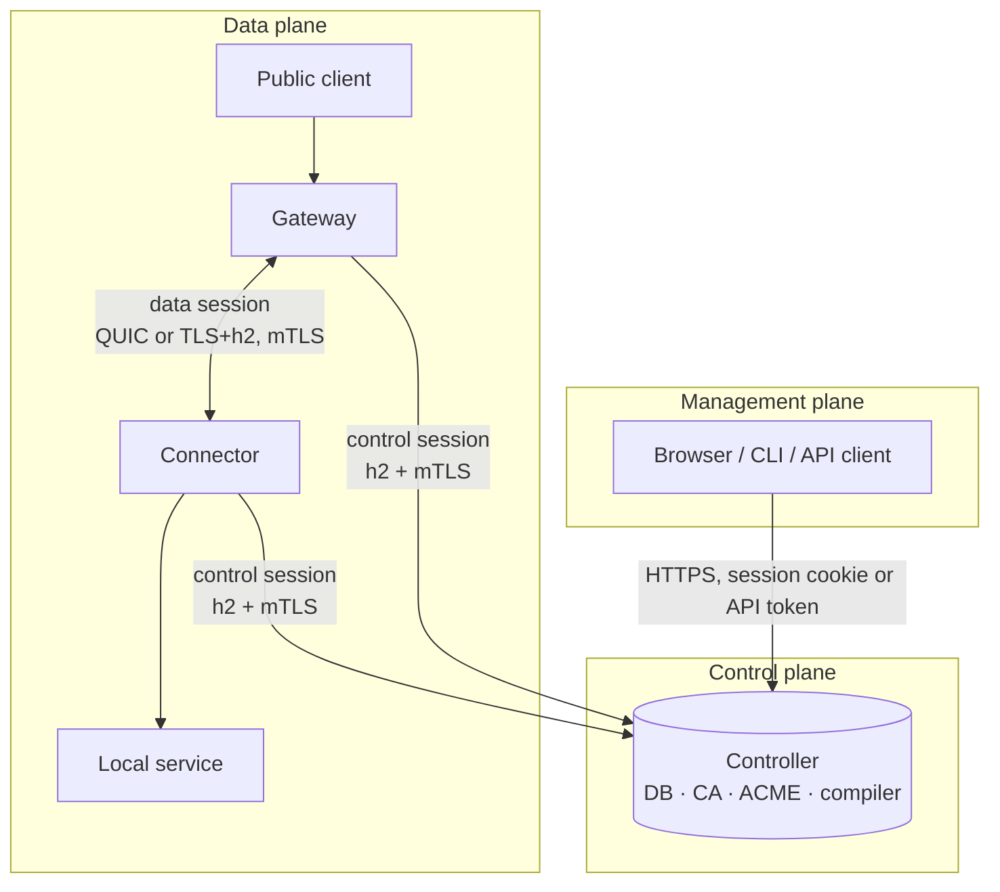
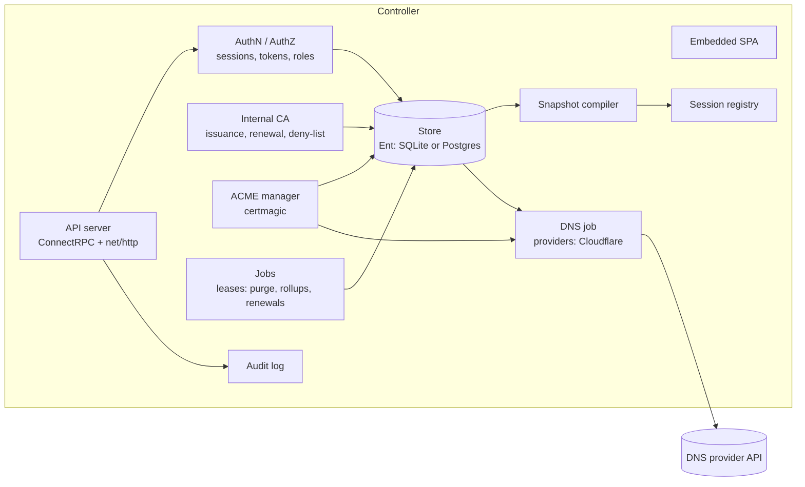
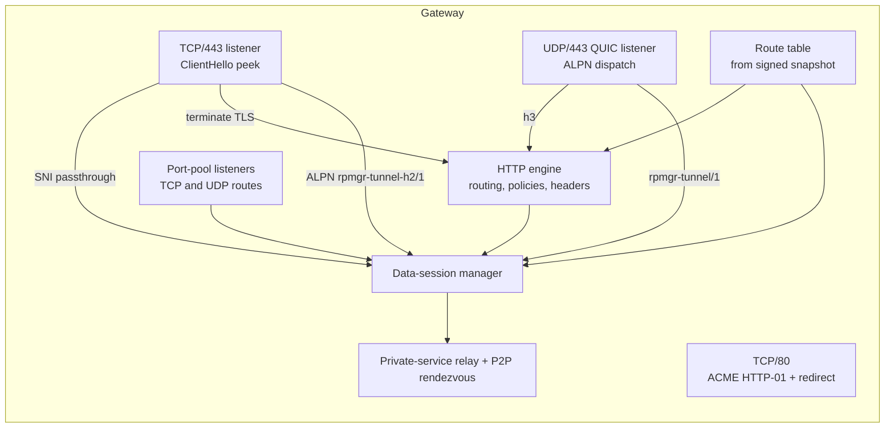
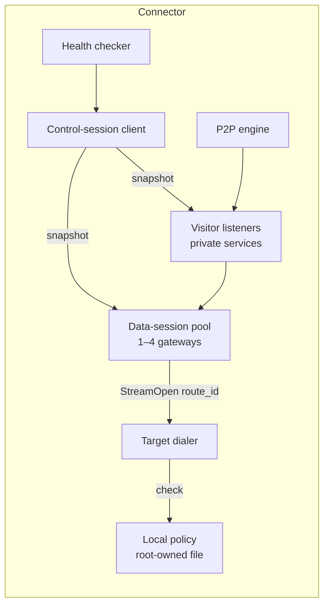
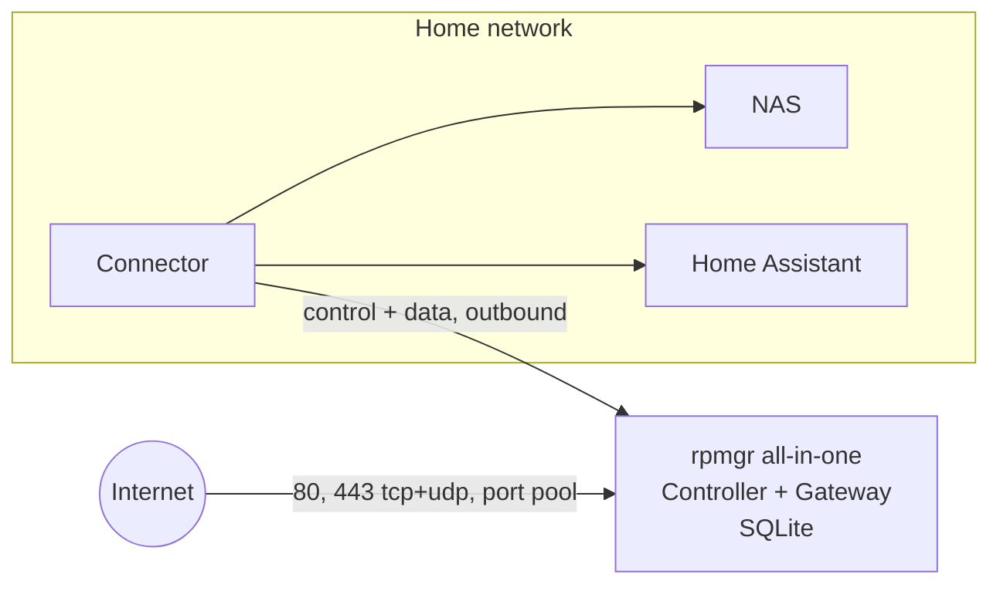
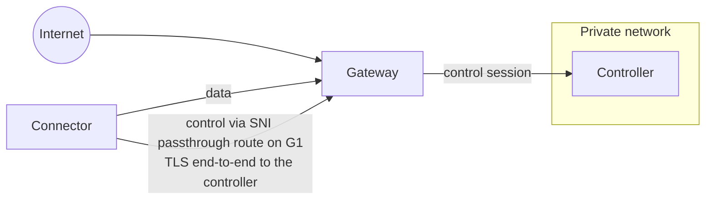
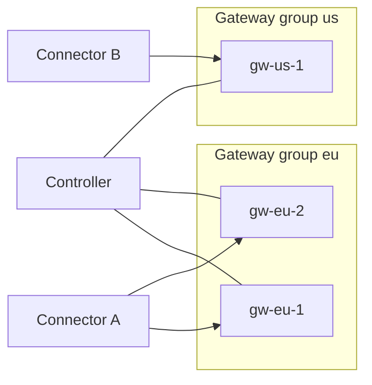
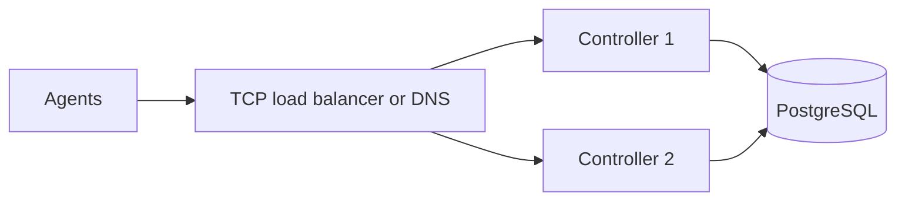
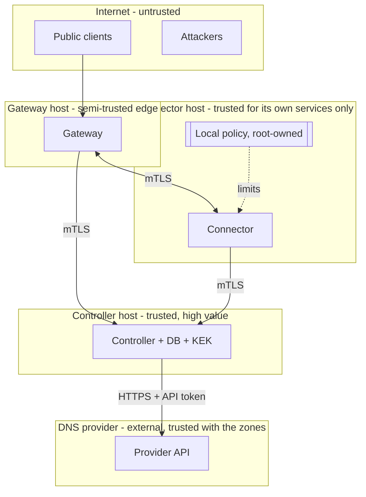

# 02 — Architecture

> Status: design, not implemented. Tags: [F] fact · [R] recommendation · [T] target · [V] verify at
> implementation ([README](../README.md#how-to-read-these-documents)).

## Roles

rpmgr is **one binary, `rpmgr`, with three roles** ([ADR-0002](adr/0002-one-binary-three-roles.md)).
A process runs exactly one role, except `all-in-one`, which runs a Controller and a Gateway in one
process.

| Role | Runs where | Responsibilities |
|---|---|---|
| **Controller** | Anywhere reachable by agents (public VPS, or private behind a gateway) | Web UI and API; database; internal CA and certificate issuance; ACME; compiling per-agent snapshots; agent session registry; audit; jobs (purge, rollups, renewals) |
| **Gateway** | Public host(s) with ports 80/443 and optional port pools | Public listeners; TLS termination or SNI passthrough; HTTP routing and access policies; data sessions from connectors; relay for private services; P2P rendezvous (Phase 3) |
| **Connector** | Private network, next to the services | Data sessions to gateways; dialing local targets (within local policy); health checks; visitor listeners for private services; Phase 3: P2P, virtual networks, functions, shell |

```
rpmgr controller   --config /etc/rpmgr/controller.yaml
rpmgr gateway      --config /etc/rpmgr/gateway.yaml
rpmgr connector    --config /etc/rpmgr/connector.yaml
rpmgr all-in-one   --config /etc/rpmgr/all-in-one.yaml
rpmgr enroll | leave | status | diag | policy          (on agent hosts)
rpmgr apply | import | backup | restore | migrate | ca | kek   (administration)
rpmgr update apply                                (root-owned updater, run by rpmgr-update.service)
rpmgr version
```

Why one binary: one release artifact, one version number, one signature, no version skew between
the parts of a single host, and the in-process `all-in-one` mode for the smallest deployments. The
cost is binary size (all roles are linked in). A connector-only variant, built with a build tag,
ships in Phase 2 ([13](13-roadmap.md#phase-2--production), D21): its artifact is named
`rpmgr-connector_<version>_<os>_<arch>`, it is still installed as `rpmgr`, and the release manifest
tells the variants apart by each artifact's `variant` field ([04](04-security.md#release-signing)).

## Planes



| Plane | Who talks | Transport | Carries |
|---|---|---|---|
| **Management** | Browser, CLI, API clients → Controller | HTTPS (HTTP/1.1 or h2), Connect protocol | User actions, reads, live events and logs |
| **Control** | Gateways and Connectors → Controller | HTTP/2 + TLS 1.3 mTLS, gRPC protocol via ConnectRPC | Snapshots, ACK/NACK, status, metrics summaries, certificate renewal, imperative operations |
| **Data** | Public clients → Gateway ↔ Connector → service | QUIC (default policy) or TLS + reverse HTTP/2 between gateway and connector | User traffic only |

Two invariants:

1. **Agents only dial out.** Gateways dial the Controller; Connectors dial the Controller and their
   Gateways. Nothing dials a Connector. Only Gateways (and the Controller's own HTTPS endpoint) need
   public reachability.
2. **User traffic never passes through the Controller.** The Controller can be stopped, upgraded or
   restored without dropping a single tunnelled connection; agents keep running their
   last-known-good snapshot ([03](03-connections.md#failure-modes)).

The detailed protocols are in [03-connections.md](03-connections.md).

## Components

### Controller



- **API server.** One `net/http` server on 443 serving the SPA, the public API (Connect protocol),
  the agent control service (gRPC protocol) and the enrollment endpoint. SNI selects the
  certificate: the public name gets an ACME or user-supplied certificate; the reserved agent name
  `controller.<trust-domain>` gets an internal-CA certificate ([04](04-security.md#controller-certificates)).
- **Store.** The single source of truth. Every change increments the instance-wide configuration
  revision in the same transaction ([03](03-connections.md#revisions-and-ordering)).
- **Snapshot compiler.** A deterministic function of (database state at revision R, agent
  identity, agent capabilities) → snapshot. Deterministic so that any HA replica produces the same
  bytes and the same hash.
- **Session registry.** Tracks which replica holds each agent's control session, so that a push or
  an imperative operation reaches the right process. Single-node: in memory. HA: a row per session
  plus notifications ([10](10-operations.md#high-availability)).
- **Jobs.** Singleton work (ACME orders, CA rotation, ephemeral purge, metric rollups, DNS
  reconciliation) runs under a database lease with a fencing token, so only one replica performs it.
- **DNS job** (Phase 2). Compiles the desired DNS records of each managed zone from routes, DNS
  names and pending domain claims, and reconciles them with the provider's API. It writes only
  records it owns. ACME's DNS-01 challenges use the same provider client ([15](15-dns.md)).

### Gateway



- Gateways are **stateless apart from their snapshot, deny-list and certificates**. Route table and
  certificates arrive in snapshots, revocations in separate deny-list updates; the gateway keeps the
  last-known-good snapshot **and the deny-list** on disk, signed, and loads both before accepting
  sessions, so it can restart while the Controller is down without forgetting revocations.
- The gateway authorises every data session against its snapshot: a connector may serve a route
  only if the route lists that connector's identity ([04](04-security.md#authorization)).

### Connector



- The connector dials **only** targets that appear in its own snapshot **and** are allowed by its
  local policy. The gateway's stream request names a route, never an address
  ([03](03-connections.md#data-session)).
- Phase 3 components (virtual networks, functions, shell) each need an explicit `allow_*` switch in
  the local policy ([ADR-0009](adr/0009-connector-local-policy.md)).

## Deployment topologies

### All-in-one (homelab default)



One VPS, one process, SQLite. The UI is published on the same 443 as the routes; the gateway's SNI
router hands the controller's hostnames to the in-process controller.

### Split: private controller



The controller has no public port. Agents reach it through a **gateway SNI-passthrough route** to
the controller's agent hostname; TLS terminates at the controller, so the gateway forwards bytes it
cannot read or alter ([03](03-connections.md#reaching-a-private-controller)). The gateway itself
needs a direct path to the controller (same private network or VPN).

### Multi-region gateway groups



A route is published on one gateway group. A group has at most 4 gateways, and connectors serving
the route keep a data session to every gateway in it ([03](03-connections.md#multiple-gateways)).
Larger deployments use several groups. Public DNS for the route's hostnames points at the group
(several A/AAAA records, or anycast — operator's choice). If the hostname lies in a zone managed by
rpmgr (Phase 2), rpmgr publishes the record itself, pointing at the group's DNS target
([15](15-dns.md#publication-rules)).

### High availability



Two or more controllers share PostgreSQL. Any replica can serve any request; singleton jobs run
under leases; agents reconnect to any replica. SQLite is single-node only
([10](10-operations.md#high-availability)).

## Trust boundaries



| Boundary | What crosses it | Protection |
|---|---|---|
| Internet → Gateway | Public traffic | TLS termination with public certs, access policies, rate limits, per-route limits |
| Gateway ↔ Connector | Tunnelled traffic | TLS 1.3 mTLS, identities checked against the signed route table |
| Agent → Controller | Configuration, status | TLS 1.3 mTLS, pinned CA, per-agent authorization of every request |
| Controller → Connector host | Desired state | Connector-local policy bounds what any snapshot can make the host do |
| Gateway ↔ private-service traffic | Relay bytes | End-to-end TLS between connectors; the gateway sees ciphertext only |
| Controller → DNS provider (Phase 2) | Record changes, the API token | HTTPS to a compiled-in API URL; zone-scoped, IP-restricted token; writes only to owned records; every write audited ([15](15-dns.md)) |

The full threat model is in [04-security.md](04-security.md#threat-model).

## Where state lives

| State | Authority | Copies |
|---|---|---|
| Configuration (desired state) | Controller DB | Compiled snapshots on agents (last-known-good on disk, signed) |
| Observed state (sessions, apply status, health) | Agents | Reported to the controller, stored in observed-state tables ([06](06-data-model.md#desired-vs-observed-state)) |
| Agent private keys | Each agent, generated locally | Never copied |
| CA keys, ACME keys, other secrets | Controller DB, envelope-encrypted under the KEK | KEK held outside the DB |
| Public TLS certificates and keys | Controller DB (encrypted) | Pushed to the gateways that serve the hostnames |
| Metrics | Prometheus (scraped from every role) | Hourly/daily rollups in the DB for the UI |
| Audit log | Controller DB (hash-chained) | Signed checkpoints in an external sink |
| Public DNS records in managed zones | The DNS provider | Ownership ledger in the controller DB, which decides which records rpmgr may change ([15](15-dns.md#ownership-ledger)) |

## Source layout (proposed)

[R] A single Go module, `github.com/felix-homelab/rpmgr`, and a single web app:

```
cmd/rpmgr/                 main and CLI subcommands
internal/controller/       api handlers, compiler, registry, jobs
internal/gateway/          listeners, sni router, http engine, relay
internal/connector/        session pool, dialer, health, visitors, p2p
internal/tunnel/           Session/Stream abstraction; quic and h2 implementations; framing
internal/pki/              CA, issuance, verification, enrollment
internal/policy/           connector-local policy parser and enforcement
internal/authz/            roles, permission checks, interceptor
internal/store/            Ent schema, privacy rules, migrations (atlas)
internal/secret/           secret.Value, envelope encryption, KEK providers
internal/dns/              DNS job, desired-record compiler, Provider interface, certmagic adapter
internal/dns/cloudflare/   Cloudflare REST client (Provider implementation)
internal/telemetry/        slog setup, metrics, tracing
proto/rpmgr/v1/              public API (.proto)
proto/rpmgr/agent/v1/        agent protocol (.proto)
web/                       Vite + React SPA (embedded via embed.FS)
docs/                      these documents
```

The `internal/tunnel` package hides quic-go and HTTP/2 behind one interface, so the transport
library can be upgraded or replaced without touching gateway or connector logic
([ADR-0004](adr/0004-quic-default-transport-policy.md)).
