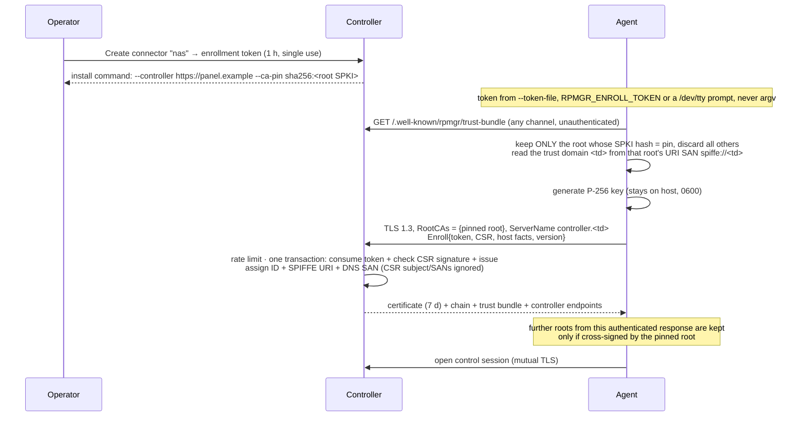
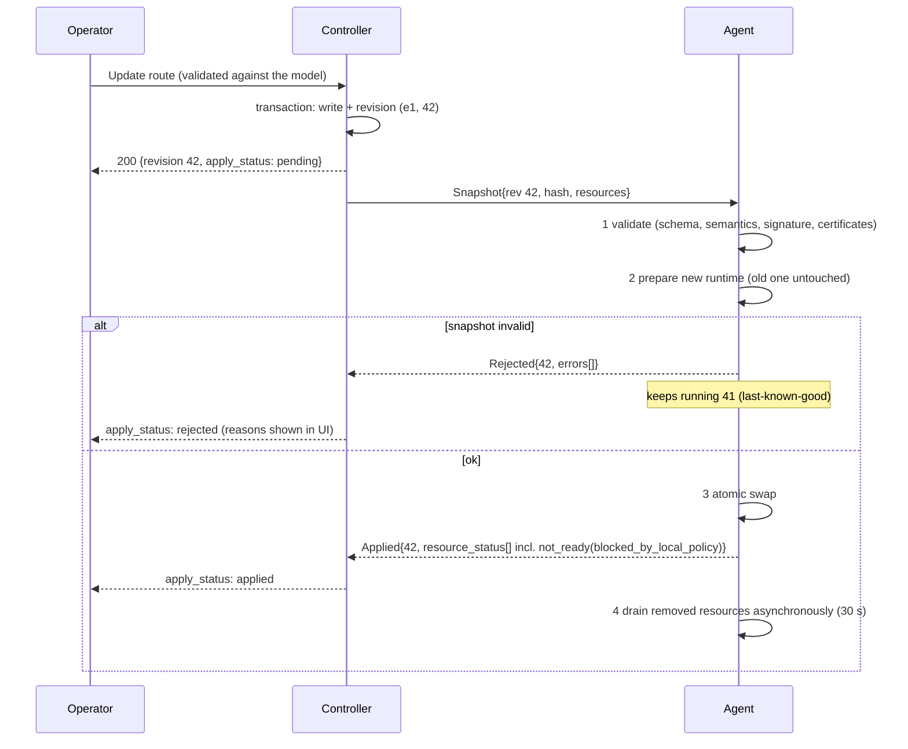
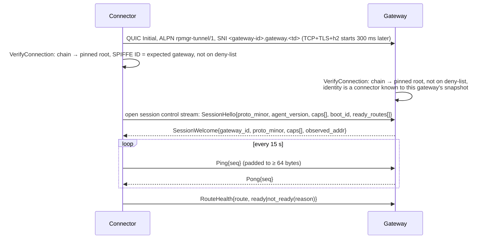
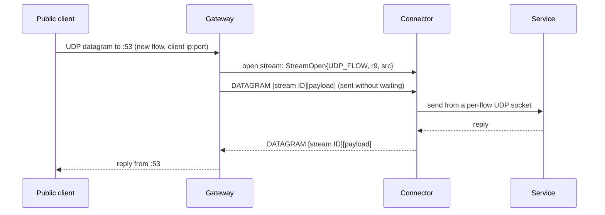
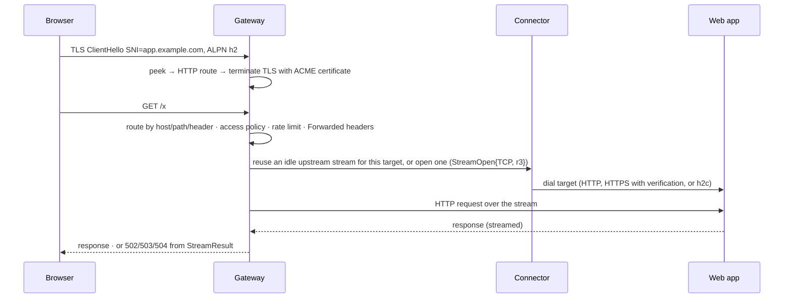
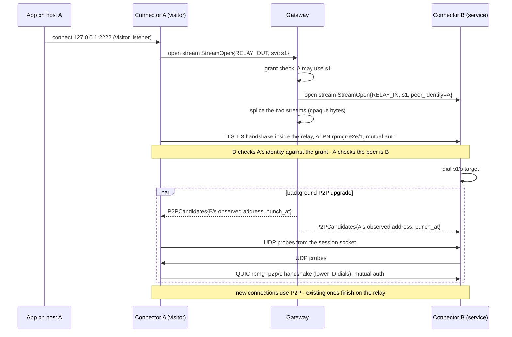

# 03 — Connections: fast and secure

> Status: Phase 1, being implemented. Tags: [F] fact · [R] recommendation · [T] target · [V] verify
> at implementation ([README](../README.md#how-to-read-these-documents)). Library facts were checked
> against **quic-go v0.61.0**, **hashicorp/yamux v0.1.1**, **grpc-go v1.67.1**, **golang.org/x/net
> v0.57.0**; the HTTP/2 facts of the TCP transport were re-checked at **Go 1.27.1** by spike S2 and
> cite that version. Every **[V]** item is tracked in [13-roadmap.md](13-roadmap.md): load-bearing
> ones as [Phase 0 spikes](13-roadmap.md#phase-0--spikes) (`[V S1]`…), the rest in the [verification
> backlog](13-roadmap.md#verification-backlog).
>
> **This document is the single source of truth for connection and protocol values**: timeouts,
> keepalives, backoff, sizes and limits. Security lifetimes and cryptographic parameters (certificates,
> tokens, sessions, step-up, password hashing) are owned by [04-security.md](04-security.md). Other
> documents reference these values instead of restating them.

## Overview

| Connection | From → to | Transport | Authentication | Lifetime |
|---|---|---|---|---|
| **Enrollment** | Agent → Controller | HTTPS, TLS 1.3 | Server: pinned rpmgr root CA. Client: enrollment token | Once per agent |
| **Control session** | Agent → Controller | HTTP/2 over TLS 1.3, gRPC (grpc-go) | Mutual TLS, per-agent certificate | Long-lived |
| **Data session** | Connector → Gateway | QUIC (`rpmgr-tunnel/1`), or TLS + reverse HTTP/2 (`rpmgr-tunnel-h2/1`), optionally wrapped in WSS | Mutual TLS, per-agent certificate | Long-lived |
| **End-to-end session** | Connector ↔ Connector, inside a relayed stream | TLS 1.3 (`rpmgr-e2e/1`) | Mutual TLS | One per private-service connection |
| **P2P session** | Connector ↔ Connector, direct | QUIC (`rpmgr-p2p/1`) | Mutual TLS | Long-lived per peer pair |
| **Public ingress** | Public client → Gateway | TCP, UDP, TLS passthrough, HTTP/1.1, HTTP/2, HTTP/3 (Phase 3) | Route's access policy | Per request/connection |

Design goals, in priority order:

1. **Secure.** Every connection between rpmgr components is TLS 1.3 with mutual authentication and
   per-component identities. No shared secrets, no timestamp tokens, no `InsecureSkipVerify`.
2. **Correct under change.** Configuration changes are validated, applied atomically, acknowledged,
   and never disturb unchanged tunnels.
3. **Fast.** No extra round trip per user connection; no cross-stream head-of-line blocking on the
   default transport; UDP carried as datagrams, not inside a TCP stream.

## Properties common to all rpmgr-internal sessions

- **TLS 1.3 only** (`MinVersion = MaxVersion = tls.VersionTLS13`). Key exchange uses the Go
  `crypto/tls` defaults, which enable the hybrid post-quantum groups X25519MLKEM768,
  SecP256r1MLKEM768 and SecP384r1MLKEM1024, X25519MLKEM768 first
  [F Go 1.27.1 `crypto/tls/defaults.go:23-42`]; a client sends an X25519MLKEM768 key share with an
  X25519 share next to it ([S3](spikes/S3.md)).
- **Certificates chain to the installation's pinned root CA**, never to the system trust store.
  Every certificate carries a SPIFFE URI SAN (the identity) and a DNS SAN derived from it
  (`<id>.connector.<td>`, `<id>.gateway.<td>`, `controller.<td>`). The TLS client always sets
  `ServerName` to the **expected peer's** DNS name — Go's TLS client refuses to handshake without
  one unless verification is disabled [F Go 1.27.1 `crypto/tls/handshake_client.go:47`] — and
  `tls.Config.VerifyConnection` additionally checks the SPIFFE ID against the deny-list and the
  agent's snapshot ([04](04-security.md#pki-and-identity)). `InsecureSkipVerify` is never used.
- **0-RTT is disabled** (no `Allow0RTT`, no `ListenEarly`/`DialEarly`), because 0-RTT data can be
  replayed. TLS session resumption is allowed: Go runs `VerifyConnection` on resumed TLS 1.3
  connections on both sides [F Go 1.27.1 `crypto/tls/handshake_client_tls13.go:595-604`]
  [F Go 1.27.1 `crypto/tls/handshake_server_tls13.go:1033-1042`], so a revoked identity is refused
  on resumption too ([S7](spikes/S7.md)). `VerifyPeerCertificate` is not called on resumed
  connections [F Go 1.27.1 `crypto/tls/common.go:675-678`], so every rpmgr check lives in
  `VerifyConnection`. Session-ticket key rotation is defined in
  [04](04-security.md#leaf-certificates).
- **No renegotiation.** `tls.Config.Renegotiation` is never set: it would disable exported keying
  material [F Go 1.27.1 `crypto/tls/conn.go:1643-1649`], which binds CSRs to their connection
  ([04](04-security.md#flow)).
- **No application-layer secrets on the wire.** After the TLS handshake, the peer identity is
  known; no message carries a password, token or signature for authentication.
- **Every stream has exactly one writer goroutine** behind a bounded queue. Every request has a
  deadline and is cancellable, so no stream can block or race another.

## Enrollment

An agent needs a certificate before it can open any session. It gets one by enrolling once.



What the token grants decides the identity, never the request: a connector token creates a
connector named after the host (`nas`, then `nas-2` if the name is taken in the org), with the
token's labels and ephemeral flag; a gateway token enrolls the gateway it is bound to, which an
Admin created first; a re-enrollment token keeps its connector's identity and replaces only the key. The
`/.well-known/rpmgr/trust-bundle` download is served by the controller's web server as PEM.

The unauthenticated bundle download is only a convenience: the pin selects exactly one root, so an
attacker who adds roots to the bundle (for example a TLS-intercepting proxy) gains nothing. If the
`Enroll` response is lost, the agent retries with the same CSR; the controller returns the same
certificate for the same token and public key for 10 minutes, so a lost response does not burn the
single-use token. Token format, lifetimes and re-enrollment rules are in
[04-security.md](04-security.md#enrollment).

## Control session

### Transport

- **grpc-go** at both ends ([ADR-0016](adr/0016-connectrpc-public-api-grpc-go-agents.md)): agents
  use a grpc-go client, the controller grpc-go's own HTTP/2 server. One TCP connection per agent,
  SNI `controller.<trust-domain>`, ALPN `h2`.
- The controller's TCP/443 listener reads the ClientHello like a gateway
  ([Port 443 multiplexing](#port-443-multiplexing)) and hands the agent names `controller.<td>` and
  `reauth.controller.<td>` to the grpc-go server; every other name, and a ClientHello without a
  name, goes to its `net/http` server, where browsers and the CLI use ConnectRPC. A connection that
  does not start with a ClientHello within the peek limits is closed without an answer.
- **Endpoints and failover.** An agent knows its controller endpoints in order: from enrollment,
  then from every snapshot. It tries them in that order; a failed connection, a `Drain` or
  `Goodbye{shutdown}` moves it to the next endpoint, and after a whole round failed, or after a
  session ended, it waits the reconnect backoff, at least a Goodbye's `retry_after`.
  `Goodbye{revoked}` stops the agent, which must be enrolled again. The agent compares
  `Welcome.server_time` with its own clock and warns above 30 s ([Failure modes](#failure-modes)).
- **Who may call what.** One table lists every method of the agent protocol, and a method missing
  from it is refused, so a new method is unreachable until it is listed:
  - `Enrollment.Enroll` at `controller.<td>`, with or without a client certificate (an enrolling
    agent has none yet);
  - every `Control` method at `controller.<td>`, with a client certificate of a connector or a
    gateway;
  - `Reauth.Reauth` only at `reauth.controller.<td>`, whose verifier admits expired certificates, so
    an expired certificate never reaches `Control`.
- Spike S4 tested ConnectRPC for this session and applied the pre-agreed rule
  ([S4](spikes/S4.md)): with connect-go, a cancelled or expired call did not end a stream the agent
  waits on, and a read-limit error on an open stream blocked; with grpc-go, both sides end within
  about 1 ms.
- [F] grpc-go's server closes clients that ping more often than its enforcement policy's `MinTime`,
  which defaults to 5 minutes [F grpc v1.84.0 `internal/transport/defaults.go:40`]. Agents ping
  every 20 s, so the controller sets `MinTime` to 10 s (see the timeout table). grpc-go raises a
  client ping interval below 10 s to 10 s [F grpc v1.84.0 `dialoptions.go:576-578`].
- The control session uses **no compression**: both stacks check the sender's message limit
  against the compressed size, so without compression the 4 MiB limit ([Framing](#framing)) counts
  message bytes on both sides (S4).

### Service sketch

The protocol is defined in `proto/rpmgr/agent/v1` (`control.proto`, `enrollment.proto`,
`snapshot.proto`); abridged:

```protobuf
// SNI controller.<td>, mutual TLS. The peer's identity comes from its certificate, never from a
// message.
service Control {
  rpc Session(stream AgentMessage) returns (stream ControllerMessage); // one per agent
  rpc Renew(RenewRequest) returns (RenewResponse);         // CSR bound to the connection
  rpc FetchResource(FetchResourceRequest) returns (FetchResourceResponse); // items by hash
  rpc Leave(LeaveRequest) returns (LeaveResponse);         // revoke the caller's identity
}
// SNI controller.<td> without a client certificate: the only method reachable so.
service Enrollment {
  rpc Enroll(EnrollRequest) returns (EnrollResponse);
}
// SNI reauth.controller.<td>: client certificates expired at most the grace period ago
// (04-security.md, Leaf certificates).
service Reauth {
  rpc Reauth(ReauthRequest) returns (ReauthResponse);
}

message AgentMessage {
  oneof msg {
    Hello hello = 1;          // last_applied + hash, capabilities, version, boot_id, clock,
                              // deny-list digest
    Applied applied = 2;      // revision applied, resources not ready
    Rejected rejected = 3;    // revision rejected, structured errors; LKG kept
    Status status = 4;        // readiness changes, route counters, data sessions (gateways)
    OpResult op_result = 5;   // result of an operation that needs no stream
  }
}

message ControllerMessage {
  reserved 3;                       // Open, for imperative operations (Phase 2)
  oneof msg {
    Welcome welcome = 1;            // session_epoch, db_epoch, server_time, min_agent_version,
                                    // config-signing certificates
    Signed snapshot = 2;            // a Snapshot: revision, agent, controller endpoints, resources
    Drain drain = 4;                // reconnect elsewhere before the deadline
    Goodbye goodbye = 5;            // superseded, revoked, upgrade_required, shutdown, overloaded
    Signed deny_list = 6;           // a DenyList; applied unconditionally, never shrinks early
    AcmeChallenge acme_challenge = 7; // gateways: add | remove, acknowledged with OpResult
  }
}

// Signed is a message as the exact bytes the config-signing key signed (R14).
message Signed { bytes payload = 1; bytes signature = 2; string key_id = 3; }
```

- **Hello** carries `last_applied` revision and hash, capability strings, binary and protocol
  version, `boot_id`, the agent's clock, and a digest of its deny-list (the controller resends the
  list on a mismatch). It carries no agent ID: the controller takes the identity from the client
  certificate. **Welcome** carries the controller's time, the `session_epoch` assigned to this
  session, the current `db_epoch`, `min_agent_version`, and the certificates of the config-signing
  keys, the next key included, so the agent can verify snapshots across a key rotation.
- **Signed messages.** Snapshots and deny-lists travel as `Signed{payload, signature, key_id}`: the
  agent verifies and persists exactly the signed bytes, so nothing is re-encoded, and a snapshot's
  hash is the SHA-256 of its payload. A snapshot names the agent it was compiled for; an agent
  refuses one for another identity. The signing key's certificate must chain to the pinned root
  with the config-signing URI; `key_id` names the key ([04](04-security.md#ca-hierarchy)).
- **Imperative operations** (Phase 2: live logs and diagnostics; Phase 3: the shell; the field
  number of `Open` is reserved): the controller sends
  `Open{op_id, kind, ticket, deadline}`; the agent opens an `Attach` stream on the **same HTTP/2
  connection** presenting the single-use ticket. No new TCP or TLS handshake. Every operation has a
  deadline; unanswered operations fail with `DEADLINE_EXCEEDED` instead of blocking forever.
- **Large items** (certificate chains, function bundles) are referenced by content hash inside the
  snapshot and fetched with `FetchResource`, so snapshots stay small and unchanged resources are not
  re-sent. An agent can fetch only items of its own current snapshot.
- **Leaving.** `Leave` lets an agent revoke its own identity; the controller revokes it, pushes the
  deny-list and audits it, and `rpmgr leave` then removes the identity from the host.
- **ACME challenges** (HTTP-01 and TLS-ALPN-01 for route certificates, D41): the controller sends
  `AcmeChallenge{op_id, add, type, identifier, token, key_authorization}` to **every gateway that
  serves the name** and lets the CA validate only after each of them acknowledged with
  `OpResult{op_id}` within the deadline (see the timeout table); otherwise the order fails without a
  validation request and is retried later. Gateways keep challenges in memory only, never in the
  snapshot or on disk, and answer the CA from them; `AcmeChallenge{remove}` follows when the
  authorization is finished ([04](04-security.md#controller-certificates), [S6](spikes/S6.md)).
- **Revocations travel separately from snapshots.** `DenyListUpdate` carries the full current set
  (deltas above 1 MiB) and is applied unconditionally, merged by union; an entry is removed only
  after the covered certificate's `NotAfter`. An agent that rejects a snapshot still receives every
  revocation ([04](04-security.md#revocation)). The controller sends the list after `Welcome` when
  the digest in `Hello` differs from its own, and to every session when the list changes. The
  digest is the SHA-256 over the distinct entries, sorted, each written as `1 serial <serial>` or
  `2 identity <SPIFFE ID>` and a newline, followed by `key <key_id>` and a newline for the key that
  signed the list (for the agent, its newest stored list); an empty list has an empty digest, and
  expiry times are not part of it. After a key rotation every agent therefore receives the list
  signed by the new key.

### Configuration reconciliation

rpmgr uses **desired-state reconciliation**, modelled on Envoy's xDS: the controller declares what
each agent should run; the agent converges and reports
([ADR-0007](adr/0007-desired-state-reconciliation.md)). There is **no polling**: on (re)connect the
agent states what it has, and the controller sends a snapshot only if it differs.



Rules:

1. **Validate before touching anything.** Schema, semantic checks, the snapshot signature, each
   resource's hash against its content, and certificate parsing are evaluated against the whole
   snapshot first.
2. **Prepare, then swap.** New listeners and handlers are built next to the running ones. The swap
   is one atomic pointer exchange of the route table.
3. **Unchanged resources are never touched.** Every resource carries a content hash, the SHA-256 of
   its deterministic encoding; equal hashes mean the running instance is kept, including its open
   connections.
4. **Acknowledge at the swap, then drain.** `Applied` is sent immediately after the swap. Removed
   resources stop accepting new connections at the swap and keep existing ones for the route drain
   period (see the timeout table) in the background, so draining never delays the acknowledgement.
   A route whose **access policy was tightened**, or whose agent was revoked, closes affected
   connections **immediately**.
5. **Two kinds of error, handled differently.**
   - *Invalid snapshots* (malformed, semantically invalid, bad signature, unparsable certificate)
     are rejected **whole**: `Rejected`, last-known-good stays. The controller must issue a new
     revision; an invalid snapshot is a controller bug or an incompatibility, never a host setting.
   - *Resource-level problems* are reported **per resource** in `Applied.resource_status`, and the
     rest of the snapshot is applied. This covers environmental errors (port in use, upstream
     unreachable, DNS failure), which are retried with backoff, and targets **blocked by the
     connector's local policy**, which are `not_ready(blocked_by_local_policy: <ip:port>)` until the
     host's policy changes. One occupied port or one disallowed target must not block unrelated
     changes.
   - When the host's local policy file changes (`rpmgr policy …` triggers a reload; the connector
     also watches the file), the connector re-evaluates the current snapshot and reports the new
     readiness. No new revision is needed ([04](04-security.md#connector-local-policy)).
6. **Last-known-good is persisted.** Agents store the newest applied snapshot on disk, as it was
   signed by the controller's configuration-signing key, and verify it like a new one when loading
   it after a restart, before any session; a copy that does not verify is not run. An agent can
   therefore restart while the controller is unreachable. The config-signing certificates of every
   `Welcome` replace the stored ones, so a copy signed by the next key still verifies
   ([10](10-operations.md#filesystem-layout)).
7. **"Saved" and "applied" are different states.** The API returns the revision immediately and
   tracks `apply_status` per agent (`pending`, `applied`, `rejected`, `apply_timeout`); callers may
   wait for it ([07](07-api.md#writes-and-apply-status)). Success is never reported before the
   agent has applied the change. A snapshot that the agent has neither applied nor rejected within
   the apply acknowledgement time (see the timeout table) is `apply_timeout`.
8. **Snapshots are full, resources are hashed.** [R] v1 sends the complete snapshot for an agent;
   large resources are references. A delta protocol is only worth adding if snapshots routinely
   exceed the control message limit (4 MiB, see [Framing](#framing)).
9. **When a snapshot is sent.** The controller compiles an agent's snapshot when its session starts,
   at every new revision and when the config-signing key changes; the snapshot names its signing
   key, so the agent then keeps a copy signed by the new key. The controller looks for new
   revisions at the revision check interval (see the timeout table), so a revision that another
   process wrote, such as an admin command, reaches the agents too. A snapshot whose hash equals
   the one the agent named in `Hello`, or the one it was sent last, is not sent again. `Applied`
   and `Rejected` count only for a snapshot that the same session was sent; of a rejection the
   controller keeps at most 32 reasons of at most 512 bytes each. The last 5 snapshots sent to
   each agent are kept for support ([06](06-data-model.md#desired-vs-observed-state)).
10. **What an agent gets.** A gateway gets every enabled `tcp` route of its gateway group that has
    a port: the port, the idle timeout and the connectors that serve the route (enabled
    connectors with an enabled target on it); the gateway opens streams only to those. A
    connector gets every enabled route with an enabled target on it: its targets, by priority,
    and the effective transport policy, the route's, else the connector's, else the instance
    default ([Transport selection](#transport-selection)). A disabled or decommissioned agent gets
    an empty snapshot. Each resource's ID is the route's ID; the other route types follow.

### Revisions and ordering

- A **revision** is `(db_epoch, seq)`. `seq` comes from a single-row, instance-wide counter
  (`config_seq`) that the configuration transaction increments with a row lock
  (`UPDATE … RETURNING`) **as its first statement**, at `READ COMMITTED` isolation. Because every
  configuration write holds that lock until it commits, **commit order equals `seq` order**, and
  store-enforced invariants (such as hostname uniqueness rules) are checked serially: a lower
  revision can never become visible after a higher one was pushed. (A database sequence would not
  guarantee this; under `REPEATABLE READ` the second writer would fail with a serialisation error
  instead of waiting.) [R] One counter for the whole instance
  keeps ordering trivial; it serialises configuration writes, which are rare (seconds apart, not
  milliseconds).
- Compilation is a deterministic function of (database at revision, agent identity, agent
  capabilities), read from **one consistent snapshot** (a `REPEATABLE READ` transaction on
  PostgreSQL, an explicit read transaction on SQLite). The compiler reads `config_seq` inside that
  same transaction and labels the snapshot with it. Resources are ordered by ID and the snapshot is
  encoded deterministically, so two controller replicas produce the **same snapshot and hash** for
  the same agent and revision. Each resource kind has its own compiler, which sees the agent's
  capabilities and leaves out what the agent cannot run.
- Agents apply a snapshot only if its revision is greater than the last applied one. If several
  arrive while one is being applied, only the newest is applied next ("latest wins"). A snapshot
  that is not newer is ignored, except the one the agent runs, which it acknowledges again, and the
  running revision signed by another key, which replaces the stored copy after a key rotation.
- `db_epoch` is a fresh random UUIDv7, generated at initialisation and again on **every** restore
  from a backup (revisions could otherwise go backwards, and restoring the same backup twice must
  still yield a new epoch). An agent accepts a lower revision only together with a new `db_epoch`
  announced in `Welcome`. A new epoch never shrinks an agent's deny-list
  ([10](10-operations.md#backup-and-restore)).
- **One active control session per agent.** Each new session gets a `session_epoch` from the
  database; when a newer session for the same agent registers, the older one receives
  `Goodbye{superseded}` and is closed. This prevents two replicas from pushing to one agent.

### Reaching a private controller

The controller does not need a public address. A gateway can publish the controller's agent
hostnames (`controller.<trust-domain>` and `reauth.controller.<trust-domain>`) as **TLS-passthrough routes** whose target is the
controller. TLS terminates at the controller, so the gateway forwards bytes it can neither read nor
alter, and the agent still verifies the controller against the pinned root. Agents get the list of
controller endpoints (direct and via gateways) in every snapshot and try them in order.

[R] Control traffic deliberately does **not** ride inside the data session to a gateway: gateways
are edge components and must not be able to forge or withhold configuration, and gateway restarts
must not interrupt control ([ADR-0006](adr/0006-separate-control-session.md)).

## Data session

### Establishment



- The connector learns which gateways to dial from its snapshot: **each gateway's own tunnel
  endpoint** (address and port; for WSS a per-gateway hostname) **and its gateway ID**. Group-level
  DNS names or anycast addresses are for public traffic only, because a connector must know which
  gateway it reached. It dials each gateway with `ServerName = <gateway-id>.gateway.<td>` and checks
  the SPIFFE ID, so a gateway of another group or org cannot impersonate it even with a valid
  certificate.
- The **session control stream** carries `SessionHello`/`SessionWelcome`, `Ping`/`Pong`,
  `Drain{reason, deadline}`, `RouteHealth`, `OpenRequest`, `P2PCandidates` and `Goodbye{code}`
  (`shutdown`, `protocol`, `unauthorized`); the messages are defined in `proto/rpmgr/tunnel/v1`. On
  QUIC it is the first bidirectional stream, opened by the connector ("stream 0"). On the TCP
  transport it is the first request the gateway opens after the connection is up, because there the
  connector is the HTTP/2 server and cannot open streams ([Transports and fallback](#transports-and-fallback)).
- The gateway opens user streams for a route only if (a) its snapshot assigns that route to this
  connector's identity and (b) the connector reported the route `ready`. A connector whose local
  policy blocks a target reports `not_ready(blocked_by_local_policy)`, and the UI shows the reason.

### One stream per user connection

```mermaid
sequenceDiagram
  participant U as Public client
  participant G as Gateway
  participant A as Connector
  participant S as Local service
  U->>G: TCP connect to :5432 (route r7)
  G->>A: open stream · StreamOpen{TCP, r7, rev, src, dst, trace} · client bytes follow immediately
  A->>A: r7 in active or draining snapshot? target allowed by local policy?
  A->>S: dial configured target (5 s timeout) [+ PROXY v2 header]
  A-->>G: StreamResult{OK} · then service bytes
  U->>G: FIN
  G->>A: stream FIN
  A->>S: CloseWrite (half-close preserved)
```



- **Zero extra round trips.** Opening a QUIC stream needs no handshake, and the gateway writes the
  preamble and the client's first bytes without waiting for a reply. There is no pool of
  pre-opened connections that could run empty.
- **The connector dials only what its own snapshot says.** `StreamOpen` names a `route_id`, never an
  address. A compromised gateway cannot turn a connector into an open proxy.
- **Half-close works.** QUIC `Stream.Close()` closes only the send direction
  [F quic-go:stream.go:183-185]. A client FIN becomes a stream FIN, and the connector calls
  `CloseWrite` on the upstream TCP connection, and vice versa; neither direction is closed just
  because the other one ended. A client RST maps to `CancelRead` + `CancelWrite(ABORTED)`, and the
  connector closes the upstream with `SO_LINGER=0`. On the TCP transport the gateway's FIN is the
  request's `END_STREAM` and the connector's FIN travels in-band ([Framing](#framing)).
- **Backpressure is end to end**: QUIC (or HTTP/2) flow control plus blocking writes. There are no
  unbounded queues anywhere on the data path.

### Framing

- Every message on an rpmgr stream is `varint(length) ‖ protobuf`. Maximum message size: **16 KiB**
  on tunnel streams, **4 MiB** on the control session. A length above the limit is refused before
  the payload is read.
- A `StreamOpen` whose kind is unknown or not available in the running phase, that names no route
  for `TCP` or `UDP_FLOW`, or whose addresses, ports or trace context are malformed, is answered
  with `PROTOCOL` before anything is dialled.
- `StreamOpen` is the first message on every user, relay or diagnostic stream, written by the side
  that opens the stream: the gateway for `TCP`, `UDP_FLOW`, `RELAY_IN`, `DIAG`; the connector for
  `RELAY_OUT` and `CONTROL_PASSTHROUGH` on QUIC. On the TCP transport only the gateway can open
  streams; how a connector requests one with `OpenRequest` is described under
  [Transports and fallback](#transports-and-fallback).

| Field | Type | Meaning |
|---|---|---|
| `kind` | enum | `TCP=1`, `UDP_FLOW=2`, `RELAY_OUT=3`, `RELAY_IN=4`, `CONTROL_PASSTHROUGH=5`, `DIAG=6` |
| `route_id` | string | Route (or private service) the stream belongs to |
| `snapshot_rev` | revision | Revision the gateway routed with; the connector also accepts routes still draining |
| `src_ip`, `src_port`, `dst_ip`, `dst_port` | bytes, uint32 | Original client and listener addresses (for PROXY protocol and logs) |
| `sni`, `alpn` | string | From the client's TLS ClientHello, if any |
| `trace_id`, `span_id` | bytes(16), bytes(8) | W3C trace context |
| `open_timeout_ms` | uint32 | How long the connector may take to connect upstream |
| `peer_identity` | string | Relay: the visitor's SPIFFE ID. HTTP: the authenticated principal, if any |
| `open_id` | uint64 | TCP transport only: answers a connector's `OpenRequest` |
| `result` | `StreamResult` | Set only on `open_id` streams on the TCP transport: the outcome of the requested open |

- `StreamResult` (first message in the return direction, written by the side that received
  `StreamOpen`), then raw bytes. On the TCP transport the connector-to-gateway bytes after
  `StreamResult` (or after `StreamOpen` on an `open_id` stream) are chunks of
  `varint(length) ‖ bytes`, at most 16 KiB each, and a **zero-length chunk is the connector's
  FIN**: net/http's HTTP/2 server cannot end a response while it still reads the request
  ([ADR-0005](adr/0005-reverse-http2-fallback.md)). The response's `END_STREAM` follows when both
  directions have ended.

| Code | Name | Gateway behaviour |
|---|---|---|
| 0 | `NO_ERROR` | Relay bytes |
| 1 | `ROUTE_UNKNOWN` | Close client; log; refresh status |
| 2 | `UNAUTHORIZED` | Close client; security event |
| 3 | `UPSTREAM_REFUSED` | TCP: reset client. HTTP: 502 |
| 4 | `UPSTREAM_TIMEOUT` | TCP: reset client. HTTP: 504 |
| 5 | `UPSTREAM_RESET` | Reset client |
| 6 | `DRAINING` | Retry once on another session |
| 7 | `OVERLOADED` | Retry once on another session; then 503 |
| 8 | `PROTOCOL` | Close; log |
| 9 | `INTERNAL` | Close; log |

- [R] Enable `EnableStreamResetPartialDelivery` on both ends [F quic-go:interface.go:183] and call
  `SetReliableBoundary()` right after writing `StreamResult` [F quic-go:stream.go:151], so a
  `StreamResult` written just before a reset is still delivered.

### UDP routes



- A **flow** is one public client address on one route. The gateway keeps a flow table; the
  connector uses one UDP socket per flow so replies reach the right client.
- Each flow has a stream (for lifecycle: open, result, close) and sends payloads as **QUIC DATAGRAM
  frames** (RFC 9221), prefixed with the flow stream's **full QUIC stream ID** as a varint. (RFC
  9297 divides the ID by four, which is unambiguous only when one side opens all datagram-carrying
  streams; on `rpmgr-p2p` sessions either connector can open private UDP flows, and one rule for all
  sessions keeps parsing simple.) Datagrams avoid the head-of-line blocking and retransmission
  delay that carrying UDP over a reliable stream would add.
- **Size limit.** A datagram must fit in one QUIC packet; quic-go returns `DatagramTooLargeError`
  otherwise and never fragments [F quic-go:connection.go:3021-3041]. The usable payload is about
  **1240 bytes** before path-MTU discovery (initial packet size 1280 [F quic-go:internal/protocol/params.go:12],
  minus 37 bytes of header estimate [F quic-go:connection.go:3148-3150] and frame overhead) and at
  most about **1412 bytes** after it (packet ceiling 1452 [F quic-go:internal/protocol/protocol.go:111]).
  A payload that does not fit is sent as a length-prefixed frame on the flow's stream instead:
  delivered reliably, at the cost of per-flow head-of-line blocking. A metric counts these events,
  and the UI shows an MTU hint for the route.
- **Never block the read loop.** quic-go's `SendDatagram` **blocks** once 32 datagrams are queued
  [F quic-go:datagram_queue.go:12-15,44-67], and received datagrams beyond 128 queued are dropped.
  rpmgr wraps sending in a per-session queue of **256** that drops on overflow (UDP semantics), and
  reads datagrams in a dedicated goroutine.
- A connector may receive a datagram for a flow whose `StreamOpen` has not arrived yet; it buffers
  up to 8 datagrams for up to 1 s per unknown flow.
- Over the TCP fallback (no datagrams), UDP payloads are always length-prefixed frames on the flow
  stream. This works, but loss on the TCP connection delays every UDP flow on it; the UI flags
  UDP routes served over the fallback.

### HTTP routes



- The gateway's HTTP engine is Go's `net/http` server plus `httputil.ReverseProxy` whose transport
  dials **tunnel streams** instead of TCP. HTTP/1.1 keep-alive connections over tunnel streams are
  pooled per (route, target).
- `Forwarded` and `X-Forwarded-For/Proto/Host` are set by the gateway; values arriving from the
  public client are stripped unless the client's address is in the gateway's trusted-proxy CIDRs.
- For a route with `dns_proxied` (Phase 2), the client address is taken from `CF-Connecting-IP`,
  and only when the TCP peer is in Cloudflare's published ranges, which reach the gateway in its
  snapshot. `X-Forwarded-*` from those peers is not trusted. Access policies, rate limits and the
  `Forwarded` headers sent upstream use that address ([15](15-dns.md#proxied-http-routes)).
- WebSockets and other upgrades pass through. gRPC passes through when the target speaks HTTP/2
  (h2c, or TLS with ALPN `h2`).
- Error mapping: no ready session or connector → **503** with `Retry-After`; upstream refused or
  reset → **502**; upstream timeout → **504**.

### TLS passthrough routes

The gateway reads the ClientHello's SNI, does **not** terminate TLS, and splices the raw bytes to
the connector, which forwards them to the target. The target holds the certificate; neither the
gateway nor the connector terminates TLS on these routes. Useful when the gateway must not see
plaintext. A service that does not speak TLS itself uses a `tcp` route instead
([14](14-open-decisions.md) D31).

Limitation: with Encrypted Client Hello (ECH), the gateway only sees the outer SNI and cannot route
on the inner name.

### Port 443 multiplexing

Gateways serve everything on **443** (TCP and UDP) so that only standard ports need opening and
tunnel traffic looks like ordinary HTTPS.

**TCP/443** — the gateway peeks at the TLS ClientHello without consuming it (read full TLS records,
at most **16 KiB** within **5 s**), then decides. ClientHellos with post-quantum key shares are
1.5–2.2 KB (Go 1 533, curl with OpenSSL 1 562, Firefox 1 893, Chromium up to 2 177 bytes), so on a
path with a 1500-byte MTU they arrive in two TCP segments ([S3](spikes/S3.md)).

| Condition | Action |
|---|---|
| SNI = `controller.<td>`, `reauth.controller.<td>` or a controller UI hostname | All-in-one: hand to the in-process controller, the agent names to its grpc-go server and the UI names to its `net/http` server ([Control session](#transport)). Otherwise: TLS-passthrough route to the controller |
| SNI = this gateway's `<gateway-id>.gateway.<td>` and the client offers ALPN `rpmgr-tunnel-h2/1` | Data session over TLS + reverse HTTP/2 (mutual TLS with the certificate for that name). Any other name under `.gateway.<td>` is handled like an unknown SNI |
| SNI = this gateway's WSS tunnel hostname | HTTP engine; `/.rpmgr/tunnel` upgrades to the WSS transport (Phase 2) |
| SNI matches a TLS-passthrough route | Splice raw bytes to a connector |
| SNI matches an HTTP route hostname | Terminate TLS (ACME or uploaded certificate), hand to HTTP engine |
| No SNI, unknown SNI | Complete the handshake with the default certificate and close; there is no configurable fallback route |
| Not TLS | Close |

The ClientHello is parsed with `golang.org/x/crypto/cryptobyte` from the recorded records, which
are then replayed to the chosen handler. The parser also reports the key-share groups, depends on
no `crypto/tls` internals and never writes to the client; running `crypto/tls` on a recording
connection and aborting in `GetConfigForClient` works too, but sends an alert unless the connection
swallows writes ([S3](spikes/S3.md)). SNI is compared case-insensitively: gateway IDs contain
upper-case letters and `_`, which Go accepts in DNS SANs and matches case-insensitively
([S7](spikes/S7.md)). Each terminating TLS stack is one `tls.Config` whose `GetConfigForClient`
picks the certificate per SNI, and for the controller also the client-certificate requirement.

**UDP/443** — one quic-go `Transport` per socket supports exactly one listener
[F quic-go v0.63.0 `transport.go:173-175,209`]. rpmgr uses one listener with
`NextProtos = {"h3", "rpmgr-tunnel/1"}` and dispatches each connection on its negotiated ALPN: `h3`
(public HTTP/3, Phase 3) to an `http3.Server` via `ServeQUICConn`, `rpmgr-tunnel/1` to the
data-session manager. The TLS settings differ per ALPN: the listener's `GetConfigForClient` sees SNI
and the offered ALPNs [F Go 1.27.1 `crypto/tls/common.go:444-478`] and returns mutual TLS with the
gateway certificate for this gateway's tunnel name and `rpmgr-tunnel/1`, the route's certificate
without a client-certificate request for `h3`, and an error otherwise. Do **not** call
`http3.ConfigureTLSConfig`: it replaces `NextProtos` with `["h3"]`, also in configurations returned
by `GetConfigForClient` [F quic-go v0.63.0 `http3/server.go:48-71`].

Caveat: a quic-go listener has a single `quic.Config` (windows, stream limits, idle timeout,
datagrams); its `GetConfigForClient` sees only the remote address
[F quic-go v0.63.0 `interface.go:103-105,189-197`]. Public HTTP/3 clients and tunnel sessions
therefore share transport parameters. Memory is protected by separate window budgets per ALPN in
`AllowConnectionWindowIncrease`, so public `h3` cannot consume the tunnels' share. The callback must
not call methods of the connection [F quic-go v0.63.0 `interface.go:145-151`]; the accept loop
records each connection's ALPN, and the callback looks it up. S3 showed one listener serving both
ALPNs under concurrent load, with refused `h3` window increases leaving the tunnels unaffected
([S3](spikes/S3.md)), so tunnels share 443 by default. A gateway moves tunnels to a separate UDP
port with the boot-file key `listen.tunnel_udp` (empty = share 443) when their transport parameters
must differ from public HTTP/3, which one listener cannot provide
([10](10-operations.md#configuration)).

### Transports and fallback

| Order | Transport | When it is used |
|---|---|---|
| 1 | **QUIC** on UDP/443, ALPN `rpmgr-tunnel/1` | First choice of `auto`, or pinned with `quic` ([Transport selection](#transport-selection)) |
| 2 | **TLS 1.3 + reverse HTTP/2** on TCP/443, ALPN `rpmgr-tunnel-h2/1`; direct, or through an HTTP CONNECT / SOCKS5 proxy | Fallback of `auto` when UDP is blocked or QUIC loses the race, or pinned with `h2` |
| 3 | **WSS** (Phase 2): HTTP Upgrade at `/.rpmgr/tunnel` on the gateway's own public WSS hostname, which has a publicly trusted ACME certificate (an intercepting proxy verifies it like any website); inside, TLS 1.3 mutual auth to `<gateway-id>.gateway.<td>`, then reverse HTTP/2 | Networks with TLS-intercepting proxies |

**Happy eyeballs.** The connector starts QUIC, and TCP 300 ms later; the first session to complete
its handshake wins. The winner is cached for 24 h per **(gateway, local source address)**, where
the local source address is the one the kernel picks to reach that gateway; when it changes (a new
network), the next connection starts a new race. While TCP is in use, QUIC is re-probed every
10 min.

#### Transport selection

Which transport a connector uses is a setting
([ADR-0004](adr/0004-quic-default-transport-policy.md), [D45](14-open-decisions.md#engineering)):

| Value | Behaviour |
|---|---|
| `auto` | Happy eyeballs as above: QUIC first, TLS + reverse HTTP/2 when UDP is blocked or QUIC loses the race |
| `quic` | QUIC only |
| `h2` | TLS + reverse HTTP/2 only, direct or through a proxy |

- **Three levels.** The instance default `default_transport` (Instance Admin, shipped as `auto`,
  [10](10-operations.md#runtime-settings-ui--settings)), a connector's `transport` and a route's
  `transport`. The most specific level that is set applies: route, then connector, then instance.
- **Sessions follow the need.** A connector's snapshot carries its own effective transport and the
  effective transport of every route it serves. Per gateway it keeps the sessions these need: a
  connector on `auto` that also serves a route pinned to `h2` keeps its QUIC session and the two
  TCP connections of the h2 transport.
- **Streams follow the route.** The gateway opens a route's streams only on sessions of the
  route's effective transport; for `auto`, on the transport the race chose.
- **A pin never falls back.** If a pinned transport cannot be established, the routes that need it
  are `not_ready(transport_unavailable: quic)` (or `h2`) on that connector, and the UI shows the
  reason. Only `auto` changes transport by itself.
- **Changes are ordinary configuration changes** ([Configuration
  reconciliation](#configuration-reconciliation)): new user connections use the new transport at
  once; connections already open finish on their session; a session no route needs any more is
  closed after its last stream has ended. Unchanged routes are untouched.
- Phase 2 adds `wss` as a fourth value and as the last step of `auto`.

**Reverse HTTP/2** ([ADR-0005](adr/0005-reverse-http2-fallback.md)). The connector dials the
gateway and then acts as the **HTTP/2 server** on that connection; the gateway acts as the client
and sends one request per user connection (request body = client→service bytes, response body =
service→client bytes). HTTP/2 provides stream multiplexing, flow control, `END_STREAM` for
half-close, `RST_STREAM` for abort, and PINGs. Spike S2 confirmed full-duplex bodies, resets, the
stream limit and liveness with net/http's HTTP/2 (Go 1.27; `golang.org/x/net/http2` is now a
deprecated wrapper around it), with one change: the connector's half-close is an in-band FIN
([Framing](#framing), [S2](spikes/S2.md)).

An HTTP/2 server cannot open request streams, so on this transport **every stream is opened by the
gateway**:

- The **session control stream** is the first request the gateway opens once the connection is up
  (`POST /control`); every other stream is a `POST /stream`. The connector refuses a stream that
  comes before the control stream (421) and a second control stream (409).
- Streams the connector needs to start (`RELAY_OUT` for private-service visitors,
  `CONTROL_PASSTHROUGH`) are requested with `OpenRequest{open_id, kind, …}` on the session control
  stream. `open_id` is unique per session. The gateway answers either with
  `OpenRejected{open_id, code}` on the session control stream, or by opening a stream whose
  `StreamOpen` carries the `open_id` **and the result**; the connector writes no `StreamResult` on
  such a stream. An unanswered `OpenRequest` times out after 10 s, and a stream that answers it
  later is reset. A repeated or zero `open_id`, or a kind not available in the running phase, gets
  `OpenRejected{PROTOCOL}`; a session at its stream limit gets `OVERLOADED` at once, never a wait.
- Cost: the connector can send on the new stream **1 RTT** later than on QUIC, where it opens the
  stream itself. `OpenRequest` carries the first chunk when the connector has one (≤ 16 KiB; for a
  relay normally the inner TLS ClientHello), which the gateway forwards at once. S2 measured the
  first answer after 1 RTT with the chunk and 2 RTT without, so the delay is hidden for the first
  flight ([S2](spikes/S2.md)).

HTTP/2 parameters (net/http's defaults are too small for a tunnel: a server allows 250 concurrent
streams [F Go 1.27.1 `net/http/internal/http2/server.go:61`] and buffers 1 MiB per stream and per
connection [F Go 1.27.1 `net/http/internal/http2/config.go:55,60`], which caps client→service
traffic near 84 Mbit/s per connection at 100 ms RTT (S2 measured 80 Mbit/s); a client's receive
window defaults to 4 MiB per stream and 1 GiB per connection
[F Go 1.27.1 `net/http/internal/http2/transport.go:45,50`]; and both sides accept 1 MiB frames
[F Go 1.27.1 `net/http/internal/http2/http2.go:82`]):

| Side | Parameter (`http.HTTP2Config`) | rpmgr value |
|---|---|---|
| Connector (HTTP/2 server) | `MaxConcurrentStreams` | 10 000 |
| Both | `MaxReceiveBufferPerStream` / `MaxReceiveBufferPerConnection` | 16 MiB / 256 MiB |
| Both | `MaxReadFrameSize` (advertised as `SETTINGS_MAX_FRAME_SIZE`) | 16 KiB |
| Both | Memory bound | net/http's HTTP/2 has no window-budget hook like quic-go's, so h2 sessions are **admitted** against the same process-wide budget (the sum of their maximum connection windows); when it is tight, new sessions get smaller windows |
| Gateway | At the stream limit | Reserves a slot with the non-blocking `ClientConn.Reserve` **before** opening (`RoundTrip` alone would wait [F Go 1.27.1 `net/http/clientconn.go:254,301`]); uses another session, or answers 503 (HTTP) / resets (TCP). Never blocks waiting for a slot |
| Gateway | Reset of a stream | Also closes the response body: only that returns the stream's unread bytes to the connection window [F Go 1.27.1 `net/http/internal/http2/transport.go:2402-2421`] |

The gateway's client is an `http.Transport` with only unencrypted HTTP/2 enabled (the connection is
already authenticated, and its ALPN `rpmgr-tunnel-h2/1` checked), a `DialContext` that returns the
accepted connection, and the settings above; `NewClientConn` creates the session's client
connection [F Go 1.27.1 `net/http/clientconn.go:113`]. The connector serves the connection it
dialled with an `http.Server` configured the same way. The frame size is lowered because the client
holds a request-body buffer of min(the peer's frame size, 512 KiB) per open stream
[F Go 1.27.1 `net/http/internal/http2/transport.go:1607-1620`]: S2 measured 559 KiB per stream with
the default and 62 KiB with 16 KiB frames, both ends together. net/http documents the receive
buffers as "less than 4MiB" [F Go 1.27.1 `net/http/http.go:289,295`], but accepts up to 2³¹ − 1
[F Go 1.27.1 `net/http/internal/http2/config.go:55-62`]; S2 measured the 16 MiB and 256 MiB windows
in force.

Why not yamux: hashicorp/yamux v0.1.1 has no `CloseWrite`, and after a local `Close()` its `Read`
returns `io.EOF` whenever the receive buffer is momentarily empty [F yamux:stream.go:95-110], so
there is no usable half-close.

**Proxies.** The TCP transports honour `HTTPS_PROXY`/`ALL_PROXY` (HTTP CONNECT and SOCKS5). QUIC
does not traverse HTTP proxies (MASQUE is out of scope); behind a proxy, the TCP transport is used.

[R] Over TCP, a connector keeps **2** connections per gateway and spreads streams across them, which
limits head-of-line blocking from packet loss to half the streams.

### QUIC parameters

| Parameter | quic-go default | rpmgr value | Why |
|---|---|---|---|
| `HandshakeIdleTimeout` | 5 s [F quic-go:internal/protocol/params.go:103] | 5 s | Fail over to TCP quickly |
| `MaxIdleTimeout` | 30 s [F quic-go:internal/protocol/params.go:100] | 30 s | quic-go default; long enough for idle sessions with 10 s keepalives |
| `KeepAlivePeriod` | off | 10 s | Keeps NAT mappings alive; RFC 4787 asks for ≥ 2 min UDP mappings, but shorter ones exist |
| Stream receive window | 512 KiB → 6 MiB [F quic-go:internal/protocol/params.go:25,31] | 512 KiB → **16 MiB** | Single-stream throughput on high-RTT paths |
| Connection receive window | 768 KiB → 15 MiB [F quic-go:internal/protocol/params.go:28,34] | → **256 MiB** (≥ 16 × the stream maximum) | Unread data keeps holding connection credit until the application reads it, so a few stalled streams must not be able to exhaust the connection window |
| Window budget | none | process-wide budget, default 1 GiB, via `AllowConnectionWindowIncrease` [F quic-go v0.63.0 `interface.go:151`], split per ALPN (`rpmgr-tunnel/1`, `h3`; [S3](spikes/S3.md)); h2 sessions are admitted against the same budget | Bounds memory under many sessions |
| `MaxIncomingStreams` on the connector | 100 [F quic-go:internal/protocol/params.go:40] | **10 000** | Limits concurrent user connections per session; 100 is far too low |
| `MaxIncomingStreams` on the gateway | 100 | 1 000 | Connectors open few streams (session control, relay) |
| `EnableDatagrams` | off | on | UDP routes |
| `StatelessResetKey` | unset [F quic-go:transport.go:85-90] | persisted per gateway | quic-go never answers packets of 42 bytes or less with a stateless reset [F quic-go:transport.go:633-637] [F quic-go:internal/protocol/protocol.go:124], and a QUIC keepalive PING is smaller. The session `Ping` is therefore padded to ≥ 64 bytes, so a restarted gateway is detected within one ping interval (15 s) instead of after the 30 s idle timeout |
| 0-RTT | off | **off** | Replay protection |
| UDP socket buffers | requests 7 MiB [F quic-go:internal/protocol/params.go:6,9] | installer sets `net.core.rmem_max`/`wmem_max` ≥ 7 MiB | Otherwise quic-go logs a warning and throughput suffers |

The gateway opens streams with the non-blocking `OpenStream`. When a session hits its stream limit,
the gateway tries another session for the route, then returns 503 (HTTP) or resets (TCP). A stream
that rpmgr resets carries the application error code 1 when it was aborted (a client's RST) and 2
when it was closed before both directions ended. Phase 1 gives the whole window budget to
`rpmgr-tunnel/1`; the `h3` share comes with HTTP/3 (Phase 3).

### Multiple gateways

- A route is published on a **gateway group**. A group has **at most 4 gateways** (enforced by the
  store), and every connector serving the route keeps a data session to **every gateway in the
  group**. Larger deployments use several groups.
- For each new user connection, the gateway picks among the ready sessions for the route with
  **power of two choices**: sample two, take the one with the lower (smoothed RTT × in-flight
  streams). Neither library exposes the connection-level send window (quic-go's connection state
  and net/http's `ClientConn` only report stream counts), so a session whose stream writers have
  been blocked for more than 200 ms is deprioritised for new streams [V VB-18].
- **Planned gateway restart**: the gateway sends `Drain{deadline}` on the session control stream, stops accepting new
  public connections (or lets the load balancer/DNS move them), and keeps existing streams until the
  gateway drain deadline. Connectors reconnect to the restarted gateway when it is back.
- There is no gateway-to-gateway forwarding in v1: a public connection arriving at gateway G can
  only use connectors that have a session to G.

## Private services

A **private service** on connector B is reachable only by connectors with a **visitor grant**,
which expose it on a local port; it is never published to the public.



- **Relay first.** Traffic flows immediately through the gateway; nothing waits for hole punching.
- **End-to-end encryption.** The two connectors run TLS 1.3 with their own certificates inside the
  relayed stream, so the gateway relays ciphertext. The gateway still sees metadata (who, when, how
  much). Cost: one extra round trip between A and B per connection, for the inner handshake. B's
  snapshot lists, per private service, the visitor identities it must accept, and A dials with
  `ServerName = <B-id>.connector.<td>`, so each side checks the other's certificate and SPIFFE ID.
  On the TCP transport, A's `RELAY_OUT` stream is opened by the gateway on A's request
  ([Transports and fallback](#transports-and-fallback)).
- **P2P upgrade** (Phase 3). The gateway already knows each connector's public address: it is the
  remote address of its QUIC session, so no separate STUN server is needed for the primary
  candidate. Connectors send probes with `Transport.WriteTo` and read them with
  `Transport.ReadNonQUICPacket` **on the same UDP socket** as their gateway session
  [F quic-go:transport.go:433,712], so the NAT mapping the gateway observed is the one being
  punched. A successful punch yields one long-lived `rpmgr-p2p/1` QUIC session per peer pair.
- When both sides are behind address-and-port-dependent ("symmetric") NATs, punching usually fails;
  traffic simply stays on the relay. Attempts are retried with backoff and after network changes.
- UDP private services stay **end-to-end encrypted**. Over the relay their payloads travel as
  length-prefixed frames **inside** the `rpmgr-e2e` TLS stream (reliable, with per-flow head-of-line
  blocking); they never use gateway-visible QUIC DATAGRAM frames. Over P2P (Phase 3) they use
  DATAGRAM frames of the connector-to-connector `rpmgr-p2p` QUIC session, which is itself
  end-to-end, with the size rules of [UDP routes](#udp-routes).

## Timeouts, keepalive and backoff

| Item | Value | Rationale |
|---|---|---|
| QUIC handshake idle | 5 s | Fast fallback to TCP |
| QUIC idle / keepalive | 30 s / 10 s | See [QUIC parameters](#quic-parameters) |
| Data-session liveness | transport-level: QUIC keepalive and idle timeout, HTTP/2 PING frames (not flow-controlled) | A flow-controlled application message can be stuck behind an exhausted window, so it must not decide liveness |
| Application `Ping` (session control stream) | every 15 s, padded to ≥ 64 bytes; measures RTT only, never takes a session out of service by itself | Padding makes a restarted gateway answer with a stateless reset (see below) |
| Stalled stream | backpressure is allowed indefinitely (subject to the route idle timeout); only when unread bytes held by streams without read progress for ≥ 30 s exceed 50 % of the connection window does the receiver reset those streams, oldest first. A stalled stream counts with its full receive window, because the HTTP/2 library does not expose its unread bytes ([S2](spikes/S2.md)) | Normal TCP backpressure (paused download, suspended ssh) must survive; a few stalled streams must not exhaust the connection window |
| Happy eyeballs | TCP starts after 300 ms; winner cached 24 h per (gateway, local source address); QUIC re-probed every 10 min | RFC 8305 suggests 250 ms; QUIC gets a head start |
| UDP blackholed mid-session | QUIC idle timeout (30 s) → move to TCP; QUIC demoted for 1 h | Avoids flapping between transports |
| TCP fallback liveness | HTTP/2 `SendPingTimeout` 15 s, `PingTimeout` 10 s on both ends; TCP keepalive 15 s | Parity with QUIC ([F Go 1.27.1 `net/http/http.go:302,307`]); S2 detected a blackholed connection after 25 s on both ends |
| Control session liveness | grpc-go keepalive at both ends: ping after 20 s without activity, also without an active RPC; close after 10 s without an answer. Controller: `EnforcementPolicy{MinTime: 10 s, PermitWithoutStream: true}` | A dead path is noticed within 30 s; the policy avoids grpc-go's "too many pings" disconnect |
| Reconnect backoff | full jitter, base 0.5 s, factor 2, cap 30 s (control) / 15 s (data); reset after 60 s healthy; honour `Goodbye.retry_after` | Avoids reconnect storms and synchronised retries |
| Singleton job lease (controller) | TTL 30 s, renewed every 10 s; another replica tries to take it every 5 s | A dead replica's jobs move within 30 s; renewals have two chances before expiry ([10](10-operations.md#high-availability)) |
| Controller admission | 50 new control sessions/s per replica; excess gets `Goodbye{overloaded}` with a `retry_after` drawn from 1–10 s | Restart storms, spread out again |
| Control session start | `Hello` within 10 s, as the first message only | A connection that sends nothing holds no session |
| Controller drain | `Drain{deadline}` to every session, also to sessions that start later; new sessions while draining get `Goodbye{shutdown}` with a `retry_after` | Agents move to another endpoint before the replica stops |
| ClientHello peek | 16 KiB within 5 s | Slowloris protection |
| `StreamOpen` → `StreamResult` | 10 s; upstream dial 5 s | Bounded connection setup |
| HTTP server | header read 10 s; idle 120 s; upstream response header 60 s; no total write timeout | Long downloads and streaming must work |
| Idle TCP route connection | 1 h (per route; 0 disables) | Reclaim half-open connections |
| Idle UDP flow | 60 s | Typical UDP NAT behaviour |
| Apply acknowledgement | 30 s → `apply_timeout` | Visible instead of silent |
| Certificate renewal | a failed attempt is retried with full jitter, base 1 s, cap 5 min; at most one renewal per 10 min | A controller outage delays renewal without a retry storm; a clock far ahead cannot make the agent renew in a loop ([04](04-security.md#leaf-certificates)) |
| Controller node certificate renewal | at half its lifetime; a failed renewal is retried every 1 min | Weeks of margin before the certificate expires ([04](04-security.md#leaf-certificates)) |
| CA rotation | the schedule checked every 1 h on one replica (singleton job); every replica reloads the keys every 1 min | A rotation takes effect on every replica within a minute ([04](04-security.md#ca-rotation)) |
| Revision and deny-list check | every 1 s | A revision or a revocation written by another process reaches the agents without a notification channel |
| Route drain | 30 s | Finish in-flight requests |
| Gateway drain | 60 s | Time for connectors to re-home |
| Revocation, tightened access policy | immediate | Security beats continuity |
| ACME challenge push | `OpResult` from every gateway of the name within 10 s | [R] A gateway that cannot answer fails the order before the CA validates, instead of a failed validation counted against the account |
| Imperative operation | `Open` → `Attach` within 10 s; ticket single-use, valid 30 s; shell idle 30 min | No unbounded waits |
| P2P | punch window 5 s; retry backoff 30 s → 15 min; also on network change | Don't hammer NATs |
| Webhook delivery (Phase 2) | 5 s timeout per attempt; retries with backoff | A slow receiver must not hold controller resources ([07](07-api.md#webhooks-phase-2)) |
| `request_id` deduplication of `Create` calls | 24 h | Retries of a lost response stay idempotent ([07](07-api.md#resource-design)) |
| Enrollment token, certificates | see [04-security.md](04-security.md#pki-and-identity) | — |

## Versioning and capabilities

- The **ALPN carries the major protocol version**: `rpmgr-tunnel/1`, `rpmgr-tunnel-h2/1`, `rpmgr-e2e/1`,
  `rpmgr-p2p/1`. A breaking change gets a new ALPN, and both are served during a transition.
- `Hello`/`SessionHello` carry the minor version and **capability strings**. The controller
  compiles each agent's snapshot using only features that agent supports, and refuses agents older
  than `min_agent_version` with `Goodbye{upgrade_required}`, shown in the UI.

| Capability | Phase | Meaning |
|---|---|---|
| `tunnel.quic` | P1 | Data sessions over QUIC |
| `tunnel.h2` | P1 | Data sessions over TLS and reverse HTTP/2 |
| `udp.dgram` | P1 | UDP routes as QUIC datagrams |
| `udp.oversize-stream` | P1 | Datagrams above the datagram limit as stream frames |
| `proxyproto.v1` | P1 | PROXY protocol v1 towards targets |
| `proxyproto.v2` | P1 | PROXY protocol v2 towards targets |
| `control-passthrough` | P1 | The control session inside a data session ([ADR-0006](adr/0006-separate-control-session.md)) |
| `p2p.v1` | P3 | Direct connector-to-connector sessions ([Private services](#private-services)) |

- Protobuf rules: fields are only added; unknown fields are ignored; an unknown `StreamOpen.kind`
  is answered with `PROTOCOL`.
- Version skew policy (which versions must interoperate) is in
  [10-operations.md](10-operations.md#upgrades-and-version-skew). Capabilities replace ad-hoc
  per-feature version checks.

## Failure modes

| Event | What happens |
|---|---|
| **Controller down** | All agents keep running their last-known-good snapshot; **traffic continues**. No configuration changes, enrollments or renewals; revocations cannot be pushed (bounded by the certificate lifetime). Agents reconnect with backoff; the controller sends a snapshot only if it differs from `last_applied`. |
| **Database down** | Controller serves reads from memory where possible, rejects writes, keeps sessions. New control sessions are refused as unavailable, because each needs a session epoch from the database; agents retry with backoff. |
| **Gateway crashes** | New user connections for its routes go to the other gateways in the group. Public connections in flight on the crashed gateway are lost. With a persisted `StatelessResetKey` and padded session pings, connectors notice the restart within one ping interval (15 s) instead of after the idle timeout. |
| **Gateway planned restart** | `Drain`, connectors re-home, in-flight connections get the gateway drain period. |
| **Connector restarts** | Its sessions close; routes with no other ready connector return 503 (HTTP) or refuse (TCP). It restarts from the persisted last-known-good snapshot, reconnects, and reports a new `boot_id`. |
| **Bad configuration** | Rejected at compile time by the controller, or `Rejected` by the agent; last-known-good keeps running; the UI shows the reasons. No outage. |
| **Certificate expiring** | Renewed at 50 % of lifetime over the control session. If the agent was offline past expiry, it re-authenticates within the grace period using the same key, otherwise it must re-enroll ([04](04-security.md#enrollment)). |
| **Clock skew** | Certificates are backdated 5 min; `Welcome` carries the controller's time; the agent warns above 30 s skew and reports TLS time errors as "clock skew". No protocol message depends on timestamps. |
| **UDP blocked** | With `auto`, happy eyeballs selects TCP within 300 ms plus the TCP and TLS handshake. If UDP is blackholed mid-session, the QUIC idle timeout fires, the connector moves to TCP, and QUIC is not retried for 1 h. With `quic` pinned, the routes that need QUIC are `not_ready(transport_unavailable: quic)` instead ([Transport selection](#transport-selection)). |
| **Two controller replicas** | Revisions come from the database; one session per agent via `session_epoch` ([Revisions and ordering](#revisions-and-ordering)). |
| **Connector local policy blocks a target** | The route is `not_ready(blocked_by_local_policy: 10.0.0.5:5432)`; the UI shows the exact command to allow it on the host. |

## Performance budget

### Where the time goes

| Step | rpmgr |
|---|---|
| New public TCP connection, warm session | Open a stream locally and send immediately: **0 extra RTT**, no pool to exhaust |
| Agent session setup | QUIC: 1 RTT handshake, `SessionHello` pipelined. TCP fallback: TCP + TLS 1.3 = 2 RTT, plus ½–1 RTT for the gateway-opened session control stream |
| UDP packet | QUIC datagram (no retransmission, no head-of-line blocking) |
| Copy path | Pooled 32 KiB buffers; ≤ 2 user-space copies per hop; no per-packet allocations in steady state (verified with pprof in benchmarks) |
| Config change | Unchanged routes untouched |

### What QUIC does and does not buy

QUIC's advantages for rpmgr are concrete: no head-of-line blocking **between** streams, a 1-RTT
handshake, datagrams for UDP routes, and surviving NAT rebinding. **Raw throughput is not one of
them by default**, and rpmgr does not assume it:

- [F] quic-go v0.61 hard-codes NewReno congestion control
  [F quic-go:internal/ackhandler/sent_packet_handler.go:132-138] and caps the congestion window at
  10 000 packets [F quic-go:internal/protocol/params.go:15].
- [F] It uses GSO and ECN on Linux, but has **no receive-side GRO** (no `UDP_GRO` in its source),
  and each connection is driven by one goroutine running its main loop
  [F quic-go:connection.go:563], i.e. roughly one core per session.
- Kernel TCP gets segmentation and receive offload in the kernel and a choice of congestion control
  (CUBIC, BBR).

**Arithmetic ceilings** (not measurements) for one QUIC session at 100 ms RTT:

| Limit | Value | Ceiling |
|---|---|---|
| One stream, default 6 MiB window | 6 MiB / 0.1 s | ≈ 503 Mbit/s |
| One stream, rpmgr 16 MiB window | 16 MiB / 0.1 s | ≈ 1.34 Gbit/s |
| Connection, default 15 MiB window | 15 MiB / 0.1 s | ≈ 1.26 Gbit/s |
| Congestion window cap | 10 000 × 1452 B / 0.1 s | ≈ 1.16 Gbit/s |

So at 100 ms RTT a single QUIC session tops out around 1.16 Gbit/s regardless of window tuning;
higher-BDP paths need several sessions or the TCP transport. This is why TCP is a **first-class**
transport, selectable as the instance default, per connector and per route, not just an emergency
fallback ([Transport selection](#transport-selection)).

### Targets [T]

| Metric | Target |
|---|---|
| Added connection-setup latency through a tunnel, p99 | ≤ 1 × RTT(gateway↔connector) + 2 ms |
| Single-stream throughput, 0 % loss | ≥ 80 % of a direct TCP connection on the same path, for each transport |
| Aggregate goodput, 32 parallel streams, 1 % loss | QUIC ≥ 1.5 × the TCP + h2 transport |
| CPU per Gbit/s | Recorded on the reference testbed as a baseline; a regression of more than 10 % against the last release blocks the release (v0.x: on GitHub-hosted runners, reported only, until VB-20; [D49](14-open-decisions.md#project-and-process)) |
| Snapshot apply, 1 000 routes, p99 | ≤ 2 s |
| Connections reset on unchanged routes during configuration changes | 0 |

The benchmark plan (testbed, netem matrix, workloads, CI gates) is in
[12-testing-and-quality.md](12-testing-and-quality.md#benchmarks). If a target is missed, the
benchmark result and the decision taken are recorded in the relevant ADR.

### Host tuning applied by the installer

- `net.core.rmem_max` and `net.core.wmem_max` ≥ 7 MiB (quic-go's requested UDP buffer size).
- Gateway: `CAP_NET_BIND_SERVICE` instead of root; `LimitNOFILE` ≥ 1 048 576.
- [R] `net.ipv4.tcp_congestion_control=bbr` offered on gateways for the TCP transport and public
  TCP through the installer flag `--tcp-bbr`, never set silently.
- Diagnostics expose whether GSO is active and whether quic-go's buffer-size warning fired.

## Known limitations

- **Encrypted Client Hello**: SNI routing (passthrough and termination selection) sees only the
  outer SNI.
- **QUIC through HTTP proxies**: not supported; the TCP transport is used.
- **Large UDP payloads**: above ~1240–1412 bytes, UDP routes fall back to reliable framing (see
  [UDP routes](#udp-routes)).
- **Per-session CPU**: one QUIC session is driven by roughly one core; high-throughput connectors
  should use several sessions or the TCP transport.
- **Symmetric NAT on both sides**: P2P fails; private services stay on the relay.
- **No gateway-to-gateway forwarding** in v1 (see [Multiple gateways](#multiple-gateways)).
