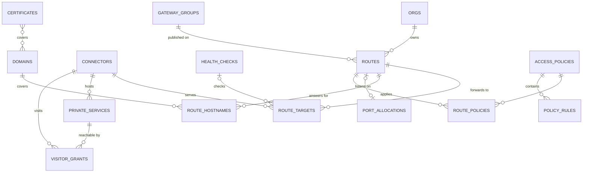
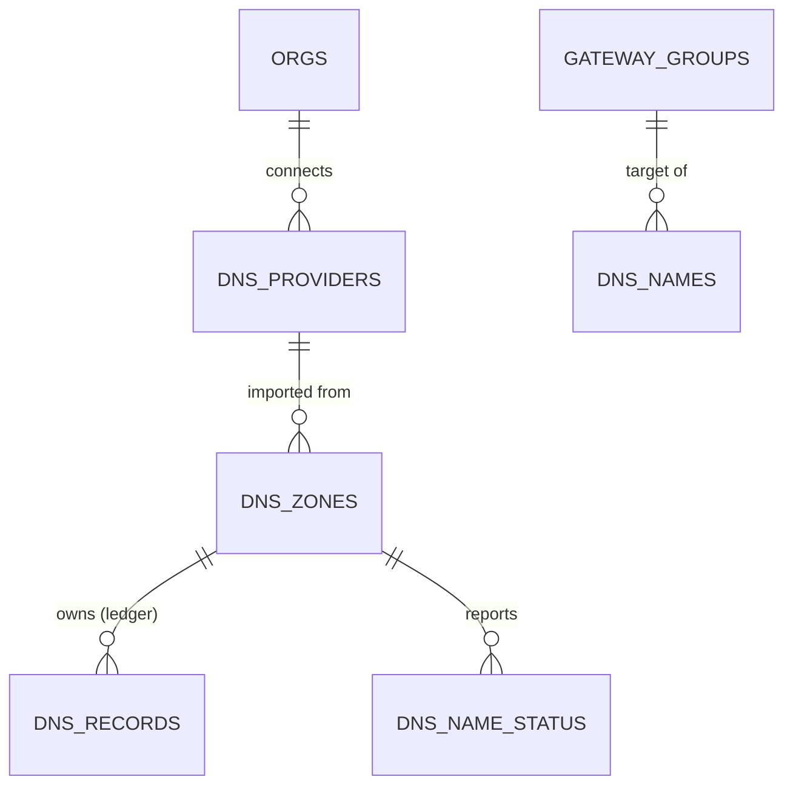
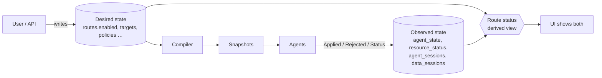

# 06 — Data model

> Status: Phase 1, being implemented. Tags: [F] fact · [R] recommendation · [T] target · [V] verify
> at implementation ([README](../README.md#how-to-read-these-documents)).

## Principles

1. **Typed, end to end.** Every setting is a column or a typed child table derived from the same
   protobuf model the API and the agent protocol use. There are no opaque configuration blobs.
2. **One source of truth per fact.** A route exists once, in `routes`; there is no second copy
   inside an agent configuration.
3. **Desired and observed state are separate tables.** Users write desired state; only agent
   sessions, and for DNS the DNS job, write observed state
   ([Desired vs observed state](#desired-vs-observed-state)).
4. **Every configuration record belongs to an org**, enforced at three layers
   ([Tenancy enforcement](#tenancy-enforcement)).
5. **Versioned, reviewed migrations** for both supported databases
   ([Migrations](#migrations)).

Polymorphic parameters (for example the parameters of an access-policy rule, which differ per rule
kind) are stored as a **typed protobuf message with a `oneof`**, serialised into one column. The
controller owns that schema, validates it on every write, and migrations can rewrite it. It is not
an opaque blob: no foreign system's configuration is embedded, and every field is known.

## Identifiers

- [R] IDs are text: `<prefix>_<26-character Crockford base32 encoding of a UUIDv7>`, e.g.
  `rte_01JA2Z8Q6W7Y3V9K4M5N6P7Q8R`. They sort by creation time, are globally unique, show their type
  in logs and URLs, and behave the same on SQLite and PostgreSQL. `uuid.NewV7` is available in
  `google/uuid` [F google/uuid v1.6.0 `version7.go:23`].
- Names (`routes.name`, `connectors.name`) are unique per org and may be changed; IDs never change.

| Prefix | Entity | Prefix | Entity |
|---|---|---|---|
| `org_` | org | `rte_` | route |
| `usr_` | user | `tgt_` | route target |
| `mem_` | membership | `dom_` | domain |
| `ses_` | session | `crt_` | certificate |
| `tok_` | API token | `pol_` | access policy |
| `sva_` | service account | `hck_` | health check |
| `enr_` | enrollment token | `psv_` | private service |
| `con_` | connector | `vgr_` | visitor grant |
| `gw_` | gateway | `prt_` | port allocation |
| `gwg_` | gateway group | `aud_` | audit entry |
| `dnp_` | DNS provider | `dnz_` | managed DNS zone |
| `dnn_` | DNS name | `dnr_` | owned DNS record |
| `cak_` | CA key | `cab_` | CA bundle |
| `pwr_` | password reset | `whk_` | webhook |
| `rel_` | release | `rol_` | rollout |
| `ost_` | org settings | `ctn_` | controller node |

## Entities

### Identity and access

| Table | Key fields | Notes |
|---|---|---|
| `orgs` | id, name, slug, created_at, deleted_at | One row in a single-org install. A **system org** owns shared gateway groups and instance-level DNS providers; it is created with the first such resource |
| `users` | id, email (unique), display_name, password_hash (argon2id, nullable for SSO-only), status, created_at, last_login_at | Global, not org-scoped: a user can be a member of several orgs |
| `memberships` | id, org_id, user_id, role (`owner`, `admin`, `operator`, `viewer`), created_by | Unique (org_id, user_id) |
| `instance_admins` | user_id | Instance-level role ([04](04-security.md#roles)) |
| `invitations` | id, org_id, email, role, token_hash, expires_at, accepted_at | The invitation is a one-time link; it is also e-mailed if SMTP is configured |
| `password_resets` | id, user_id, token_hash, created_by, expires_at, used_at | One-time reset links, created by an Admin, by `rpmgr user reset-password` on the controller host, or by the user through e-mail if SMTP is configured ([04](04-security.md#human-authentication-and-sessions)) |
| `sessions` | id, user_id, token_hash, created_at, last_seen_at, idle_expires_at, absolute_expires_at, elevated_until, amr, ip, user_agent, revoked_at | Server-side sessions ([04](04-security.md#human-authentication-and-sessions)) |
| `totp_credentials`, `webauthn_credentials`, `recovery_codes` | user_id, … (TOTP seed encrypted; recovery codes hashed) | |
| `identity_providers` | id, org_id, issuer, client_id, client_secret_enc, group_role_mapping | OIDC SSO |
| `external_identities` | idp_id, subject, user_id | Unique (idp_id, subject) |
| `service_accounts` | id, org_id, name, role | Non-human principals for automation |
| `api_tokens` | id, org_id, owner_type (user, service_account), owner_id, name, prefix, token_hash, scopes, expires_at, last_used_at, last_used_ip, revoked_at | Expiry mandatory |
| `enrollment_tokens` | id, org_id, token_hash, role (connector, gateway), gateway_group_id, gateway_id (gateway tokens), connector_id (re-enrollment only), labels, ephemeral, max_uses (null: unlimited, ephemeral tokens only), use_count, expires_at, created_by, last_used_at, last_used_ip, revoked_at | Consumed atomically ([04](04-security.md#enrollment)). A gateway token is bound to exactly one gateway, which an Admin created first, so a host chooses neither its identity nor its endpoints; a connector token to no gateway; a re-enrollment token to its connector, and it is single-use |

### Fleet

| Table | Key fields | Notes |
|---|---|---|
| `connectors` | id, org_id, name, labels, spiffe_id, pubkey_sha256, ephemeral, enabled, transport, desired_version, created_at, decommissioned_at | One row per enrolled connector. `transport` (`auto`, `quic`, `h2`; null = the instance default) overrides the data-session transport ([03](03-connections.md#transport-selection)) |
| `gateway_groups` | id, org_id, name, region, public_hostnames (DNS names or anycast addresses for **public** traffic), trusted_proxy_cidrs (the proxies whose forwarding headers gateways keep, [03](03-connections.md#http-routes)), dns_target (typed `oneof`: `cname` FQDN, or `addresses` list of IPv4/IPv6; unset = nothing is published) | Shared groups belong to the system org. `dns_target` is where managed DNS records for this group point ([15](15-dns.md#publication-rules)). A group has **at most 4 gateways**, enforced by the store, because connectors keep a session to every gateway of the group ([03](03-connections.md#multiple-gateways)) |
| `gateway_group_grants` | gateway_group_id, org_id | Which orgs may publish routes on a shared group |
| `gateways` | id, org_id, gateway_group_id, name, slot, spiffe_id, pubkey_sha256, **tunnel_endpoints** (this gateway's own `host:port` addresses for connectors; its WSS hostname in Phase 2), enabled, desired_version, created_at, decommissioned_at | Connectors dial each gateway at its own endpoint, because they must know which gateway ID they reach ([03](03-connections.md#establishment)). An Admin creates a gateway before it enrolls, so its identity columns are empty until then. `slot` (1–4) is unique among a group's gateways that are not decommissioned: the store gives a new gateway the lowest free slot, and the unique index keeps a group at four gateways under concurrent creates |
| `port_pools` | id, gateway_group_id, protocol (tcp, udp), port_from, port_to, org_id (nullable = any granted org) | |
| `port_allocations` | id, org_id, gateway_group_id, protocol, port, route_id | Unique (gateway_group_id, protocol, port) |
| `port_quotas` | org_id, gateway_group_id, protocol, max_ports | Maximum ports an org may allocate in a gateway group (Phase 1). Unique (org_id, gateway_group_id, protocol); no row = limited only by the pools |
| `issued_certificates` | serial, org_id, subject_type, subject_id, spiffe_id, pubkey_sha256, not_before, not_after, first_seen_at, superseded_at, revoked_at, revocation_reason, certificate (DER), enrollment_token_id | Source of the deny-list ([04](04-security.md#revocation)). `serial` is lower-case hexadecimal. An enrollment records the token it consumed and keeps the DER, so a retry with the same token and key within the retry window of [04](04-security.md#tokens) gets the same certificate. Agent certificates belong to their org; controller node certificates have no org and are visible only in the system scope |

### PKI and ACME

| Table | Key fields | Notes |
|---|---|---|
| `ca_keys` | id, kind (`root`, `intermediate`, `config_signing`, `audit_checkpoint`), algorithm, public_key, certificate, key_enc, not_before, not_after, status (`next`, `active`, `retired`) | Instance-level keys of [04](04-security.md#ca-hierarchy). `key_enc` is envelope-encrypted under the KEK, and null for an offline root (`rpmgr ca offline-root`). Each kind has one `active` key; the controller refuses to start otherwise. Only the system scope reads or writes the table |
| `acme_storage` | key, value_enc, modified_at | certmagic's storage (account keys, orders, certificates in progress); locks use `leases` (holder, expiry, fencing token), so replicas never order the same certificate twice ([S6](spikes/S6.md)) |
| `ca_bundles` | id, org_id, name, pem | Custom CAs for verifying HTTPS upstreams, referenced by `route_targets.tls_ca_bundle_id` |

### Routing

| Table | Key fields | Notes |
|---|---|---|
| `routes` | id, org_id, name, type (`http`, `tcp`, `udp`, `tls_passthrough`), gateway_group_id, **enabled**, transport, description, labels, version, created_at, updated_at, updated_by | The only place a route exists. `version` is the optimistic-concurrency counter ([07](07-api.md#concurrency)). `transport` (`auto`, `quic`, `h2`; null = the connector's) pins the route's data-session transport on every connector serving it ([03](03-connections.md#transport-selection)) |
| `route_http` | route_id, org_id, path_prefix, header_matches, tls_mode (`acme`, `certificate`), certificate_id, port80 (`redirect` default, `serve`, `off`), host_header (`preserve` or a value), request_headers_set, response_headers_set, websocket, max_body_bytes, dns_proxied | One row per `http` route. `port80` decides what plain HTTP on port 80 does; ACME HTTP-01 challenges are always answered there. `dns_proxied` opts the route's hostnames into Cloudflare's proxy (Phase 2, [15](15-dns.md#proxied-http-routes)) |
| `route_tcp` | route_id, org_id, port_allocation_id, listener_mode (`plain`, `http_connect`), idle_timeout | `http_connect` is an HTTP CONNECT multiplexer on one port |
| `route_udp` | route_id, org_id, port_allocation_id, flow_idle_timeout | |
| `route_hostnames` | route_id, org_id, gateway_group_id, route_type, hostname, path_prefix (`''` for `tls_passthrough`), domain_id | `http` and `tls_passthrough`; group, type and prefix are copied from the route so the constraint can be declared here. Unique (gateway_group_id, hostname, path_prefix). Within a group a hostname is **either** exactly one `tls_passthrough` route **or** any number of `http` routes, enforced by the store, so the gateway's SNI decision is never ambiguous |
| `route_targets` | id, org_id, route_id, connector_id, kind (`address`, `unix`), host, port, unix_path, upstream_protocol (`tcp`, `http`, `https`, `h2c`), tls_server_name, tls_ca_bundle_id, tls_spki_sha256, proxy_protocol (`none`, `v1`, `v2`), weight, priority, health_check_id, enabled | Several rows = load balancing and failover. `tls_ca_bundle_id` references `ca_bundles`; `tls_spki_sha256` optionally pins the upstream's public key |
| `route_limits` | route_id, org_id, bandwidth_bytes_per_sec, max_connections, requests_per_sec | Enforced on the gateway |
| `health_checks` | id, org_id, type (`tcp`, `http`), http_path, expected_status, interval, timeout, unhealthy_threshold, healthy_threshold | Run by the connector next to the target |
| `access_policies` | id, org_id, name, description | Reusable across routes |
| `policy_rules` | id, org_id, policy_id, position, kind (`ip_allow`, `ip_deny`, `basic_auth`, `oidc`, `rate_limit`, `require_header`), params (typed proto `oneof`) | Evaluated in order |
| `route_policies` | route_id, policy_id, org_id, position | |
| `domains` | id, org_id, fqdn (unique), wildcard, status (`pending`, `pending_approval`, `verified`, `failed`), method (`dns_txt`, `http`, `trusted`, `delegated`), challenge_value, verified_at, last_checked_at, version | Ownership per org ([04](04-security.md#route-and-hostname-ownership)). `wildcard = false` covers exactly `fqdn`; `true` covers `fqdn` and every name below it. `trusted`: marked by the Instance Admin without proof (Phase 1, [D13](14-open-decisions.md#tenancy-and-data)); `delegated`: a label under the instance base domain handed to the org by the Instance Admin (Phase 2, [D23](14-open-decisions.md#tenancy-and-data)); `pending_approval`: a nested claim waiting for the Instance Admin (Phase 2) |
| `certificates` | id, org_id, source (`acme`, `uploaded`), sans, not_before, not_after, chain, key_enc, status, last_error, issuer | ACME state in progress lives in `acme_storage` |
| `private_services` | id, org_id, name, connector_id, protocol (`tcp`, `udp`), target (as in `route_targets`), p2p_mode (`relay_only`, `prefer_p2p`), enabled, version | Reachable only by connectors with a visitor grant ([03](03-connections.md#private-services)) |
| `visitor_grants` | id, org_id, private_service_id, visitor_connector_id, bind_address, bind_port, enabled | The bind must also be allowed by the visitor host's local policy |

### DNS

Phase 2 ([15](15-dns.md)). Which managed zone a name belongs to is computed by longest suffix over
`dns_zones.name`; no other table stores a zone reference for it.

| Table | Key fields | Notes |
|---|---|---|
| `dns_providers` | id, org_id, kind (`cloudflare`), name, credential_enc, account_id (optional, for account-owned tokens), status (`ok`, `invalid`), token_expires_at, last_checked_at, last_error, version | The credential is write-only ([04](04-security.md#secrets-at-rest-and-in-logs)). Instance-level providers belong to the system org |
| `dns_zones` | id, org_id, dns_provider_id, provider_zone_id, name (unique), sync_state (`active`, `held`, `disabled`), held_reason, pending_plan (typed), pending_plan_hash, provider_status (`ok`, `permission_denied`, `unreachable`, `rate_limited`), publish_route_hostnames, allow_proxied, allow_wildcards, delete_threshold, default_ttl, last_synced_at, version | One row per imported zone; gates and defaults in [15](15-dns.md#publication-rules) |
| `dns_names` | id, org_id, fqdn (unique), gateway_group_id, ttl, version | Explicit names, wildcards allowed; always DNS-only. `gateway_group_id` follows the rule of `routes.gateway_group_id`: an own group or a granted shared group |
| `dns_records` | id, org_id, dns_zone_id, name, type (`A`, `AAAA`, `CNAME`, `TXT`), content, ttl, proxied, provider_record_id, state (`creating`, `synced`, `drifted`, `orphaned`, `error`, `deleting`), reason, adopted_from, adopted_at, last_synced_at | The **ownership ledger**: one row per provider record rpmgr owns. Controller-managed durable state, written only by the DNS job and by adopt/release; never rebuilt from the provider ([15](15-dns.md#ownership-ledger)) |

### Webhooks and releases (Phase 2)

| Table | Key fields | Notes |
|---|---|---|
| `webhooks` | id, org_id, url, secret_enc, event_types, enabled, version | Org-level endpoints ([07](07-api.md#webhooks-phase-2)); the secret is write-only |
| `webhook_deliveries` | webhook_id, org_id, event_id, attempt, status_code, error, sent_at | Delivery log shown in the UI; unique (webhook_id, event_id, attempt) |
| `releases` | id, version, channel (`stable`, `prerelease`), manifest_seq, manifest, signature, mirrored_at | Verified release manifests mirrored under `/dl/` ([04](04-security.md#over-the-air-updates)) |
| `rollouts` | id, release_id, stage (`canary`, `percentage`, `all`), percentage, state (`running`, `paused`, `completed`, `failed`), created_by, created_at | A staged rollout approved by an admin |
| `rollout_targets` | rollout_id, agent_id, state (`pending`, `staged`, `updated`, `rolled_back`, `skipped`), reason, updated_at | Per-agent progress; `skipped` covers hosts with `auto_update: notify` or `off` |

### Phase 3 entities

| Table | Key fields | Notes |
|---|---|---|
| `virtual_networks` | id, org_id, name, cidr, acl (typed) | |
| `vnet_members` | id, org_id, network_id, connector_id, address, wg_public_key, advertised_routes | **Public keys only**; private keys stay on the connector ([04](04-security.md#secrets-at-rest-and-in-logs)) |
| `functions`, `function_versions`, `function_deployments` | id, org_id, name; code_sha256, bundle ref; connector_id, version_id | Bundles are content-addressed and fetched with `FetchResource` |
| `ssh_keys` | id, org_id, user_id, public_key, fingerprint | For SSH ad-hoc tunnels |
| `shell_grants` | id, org_id, user_id, connector_id, granted_by, expires_at | Shell needs grant + host opt-in + step-up |

### System

| Table | Key fields | Notes |
|---|---|---|
| `instance_settings`, `org_settings` | instance: id (single row); org: id, org_id (unique); both: value (the serialised `rpmgr.v1.InstanceSettings` or `OrgSettings` message), version, updated_by, updated_at | Runtime settings edited in the UI; boot settings stay in the config file ([10](10-operations.md#configuration)). `default_transport` is the instance default of the data-session transport, `auto` until changed ([03](03-connections.md#transport-selection)). `cloudflare_ip_ranges` is written by a daily job in a configuration transaction, so gateway snapshots stay deterministic ([15](15-dns.md#proxied-http-routes)). One typed message per scope: a field that is not set has its default, updates name their fields in a field mask, and every change is a configuration transaction |
| `instance` | id (single row), trust_domain, db_epoch, created_at | The installation's trust domain, which never changes, and its database epoch, a random UUIDv7 that is new at init and at every restore ([03](03-connections.md#revisions-and-ordering)) |
| `config_seq` | id (single row), seq | Incremented with a row lock inside every configuration transaction, so commit order equals revision order ([03](03-connections.md#revisions-and-ordering)) |
| `config_revisions` | seq, db_epoch, created_at, actor, changed_resources | One row per configuration transaction. `db_epoch` is a random UUIDv7, new at init and on every restore |
| `compiled_snapshots` | agent_id, revision, hash, size_bytes, signature, created_at | Last 5 per agent; for diffing and support |
| `audit_log` | id, org_id (null: the instance chain), seq, prev_hash, hash, ts, actor_type (`user`, `agent`, `system`, `anonymous`), actor_id, credential_id (session or token ID), auth_method, ip, user_agent, request_id, action, target_type, target_id, result (`success`, `failure`, `denied`), diff (redacted), reason | A hash chain per org and one for the instance ([04](04-security.md#audit-log)); seq is unique within a chain. Text is stored as valid UTF-8 without NUL. Fields a client controls are truncated, never refused, so an over-long header cannot keep an event out of the log: user_agent at 512 bytes, request_id at 128 |
| `audit_heads` | chain (org ID or `instance`), seq, hash | The last entry of each audit chain; every append locks and increments it first |
| `audit_checkpoints` | org_id, seq, head_hash, signature, exported_at, sink | |
| `leases` | name, holder, fencing_token, expires_at (Unix milliseconds, so both dialects compare numbers) | Singleton jobs in HA, including the DNS job's `dns` lease ([10](10-operations.md#high-availability)). A takeover raises the fencing token; a job commits its work in a transaction that first checks the lease is still its own, so a replica that lost it commits nothing |
| `controller_nodes` | node_id (`ctn_`), internal_address, last_seen_at | HA: where a replica can be reached by the others over controller-to-controller mutual TLS |
| `secrets_meta` | table_name, row_id, column_name, kek_version, created_at | Bookkeeping for KEK rotation: one row per sealed column of a row, written in the transaction that writes the sealed value |

## Desired vs observed state

**Desired** (written by users and the API):

- `routes.enabled`, `route_targets.enabled`, `private_services.enabled`, `visitor_grants.enabled`,
  `connectors.enabled`, `gateways.enabled`. **One flag per thing.** There is no second "stopped"
  flag and no `enabled` inside a configuration blob, so desired state can never disagree with
  itself.

**Observed** (written only by control-session handlers; `dns_name_status` only by the DNS job):

| Table | Key fields |
|---|---|
| `agent_sessions` | agent_id, session_epoch, controller_node, remote_addr, agent_version, capabilities, connected_at, last_seen_at |
| `agent_state` | agent_id, applied_revision, applied_hash, last_ack_at, last_rejected_revision, last_rejection (structured errors), boot_id, clock_offset_ms |
| `resource_status` | agent_id, resource_type, resource_id, state, reason, since |
| `data_sessions` | gateway_id, connector_id, transport (`quic`, `h2`, `wss`), rtt_ms, established_at |
| `route_traffic_hourly`, `route_traffic_daily` | route_id, bucket, bytes_in, bytes_out, connections, errors |
| `dns_name_status` | dns_zone_id, org_id, name, status, reason, since |

**Derived route status** (computed, never stored as desired state):

| Status | Meaning |
|---|---|
| `disabled` | `enabled = false` |
| `pending` | The latest revision touching the route is not yet applied by every agent involved |
| `ready` | Enabled, applied, at least one ready target, at least one gateway session |
| `degraded` | Ready, but some targets unhealthy or some gateways without a session |
| `unavailable` | Enabled and applied, but no ready target (all unhealthy, blocked by local policy, or connectors offline) |
| `error` | An agent rejected the revision; the rejection reasons are attached |

DNS publication is reported separately, as `dns_status` per hostname (`not_managed`, `pending`,
`published`, `conflict`, `ambiguous`, `held`, `error`; [15](15-dns.md#publication-rules)). It never
changes the route status, which describes whether the gateways can serve the route.

High-resolution metrics live in Prometheus; the database holds only hourly and daily rollups for
the UI. [R] Retention: hourly rollups 30 days, daily rollups 400 days, both configurable.

## Tenancy enforcement

Every configuration table carries `org_id NOT NULL`. Isolation is enforced at three layers
([ADR-0012](adr/0012-org-scoped-tenancy.md)):

1. **API**: the authorization interceptor resolves the target resource's org and checks the caller's
   membership and role ([04](04-security.md#one-enforcement-point-with-defence-in-depth)).
2. **Store**: Ent queries on org-owned tables require an `OrgScope` that only the authorization
   layer can construct (unexported fields, unexported context key). System jobs use an explicit
   system scope, granted only together with an audit record. A mixin on every org-owned table
   implements it in three parts ([S5](spikes/S5.md)):
   - a **deny-by-default privacy policy**: without a scope, every query and mutation fails;
   - an **interceptor** that adds `org_id = <scope>` to every query, edge traversal and eager
     load, so another org's IDs yield `NotFound`, not a permission error;
   - a **mutation hook** that adds the same condition to every update and delete and refuses a
     create in another org.

   Ent skips its policies when a caller sets `privacy.DecisionContext(ctx, privacy.Allow)`, and
   allows when no rule decides; the interceptor and the hook ignore both, and lint bans
   `privacy.DecisionContext` outside `internal/store`
   ([12](12-testing-and-quality.md#security-testing)).
3. **Database**: foreign keys between org-owned tables are **composite** — for example
   `route_targets (org_id, route_id) REFERENCES routes (org_id, id)` and
   `route_targets (org_id, connector_id) REFERENCES connectors (org_id, id)` — so a route can never
   point at another org's connector, even through a bug in the layers above or plain SQL. Every
   org-owned table has `UNIQUE (org_id, id)` for them to reference, and `org_id REFERENCES
   orgs (id)`. Ent cannot declare composite keys, so a diff hook adds them when migrations are
   generated ([Migrations](#migrations)). They keep `ON DELETE NO ACTION`: a parent that still has
   children cannot be deleted, and no row can move to another org under its children. This works
   on both SQLite and PostgreSQL ([S5](spikes/S5.md)).

Exceptions, each explicit:

- `users` are global (a person can belong to several orgs); access is always through `memberships`.
- Shared **gateway groups** belong to the system org; other orgs reference them through
  `gateway_group_grants`, and their routes on that group are still owned by their own org.
  `routes.gateway_group_id` and `port_allocations.gateway_group_id` are therefore single-column
  foreign keys; the grant is checked above the database.
- Names under the instance base domain that are delegated to an org
  ([D23](14-open-decisions.md#tenancy-and-data)) are published in the system org's zone. The DNS
  job writes those records under the audited system scope; the ledger rows belong to the system
  org.

A **cross-tenant leak test suite** creates two orgs with identical resources and asserts that no API
method, list filter or search returns or modifies the other org's data
([12](12-testing-and-quality.md#security-testing)).

## Lifecycle and deletion

- **Configuration is hard-deleted.** The audit log keeps the redacted before-image, so history is
  not lost, and there is no `deleted_at` filter to forget in a query.
- **Tombstones** only where identity matters: connectors and gateways (`decommissioned_at`, kept
  for the tombstone period so their certificates stay on the deny-list until expiry), users
  (deactivated, not deleted, while audit entries reference them), orgs (a grace period before
  purge). Both periods are defined in [04](04-security.md#lifecycle).
- **Ephemeral connectors** are hard-deleted 30 minutes after their last disconnect
  ([04](04-security.md#lifecycle)).
- **Deleting a connector** that still serves route targets is refused with a list of the affected
  routes, unless the request explicitly cascades.
- **Deleting a route** removes its DNS records in managed zones on the next DNS pass, unless another
  source still needs the name ([15](15-dns.md#publication-rules)).
- **Removing a managed zone or a DNS provider** keeps the records at the provider and drops the
  ledger rows; removing the records as well is an explicit option that goes through a plan
  ([15](15-dns.md#connecting-importing-and-disconnecting)). An **org purge** removes the org's owned
  records if the provider still accepts the token, then drops the rows.

## Migrations

- [R] Schema defined in **Ent**; versioned, forward-only SQL migrations, one directory per dialect,
  with an `atlas.sum` checksum file ([ADR-0011](adr/0011-sqlite-postgres-ent-atlas.md)).
  - **Generated** by rpmgr code on Ent's Go API and the `ariga.io/atlas` library, replaying the
    directory on a clean dev database, with the composite-key diff hook
    ([Tenancy enforcement](#tenancy-enforcement)). The Atlas CLI's Apache-2.0 build cannot read Ent
    schemas, so it is not used for generation ([S5](spikes/S5.md)).
  - **How:** `go run ./tools/storemigrate diff -dialect sqlite -name <name>`, and for PostgreSQL
    with `-dev <empty database>`; the files go to `internal/store/migrations/{sqlite,postgres}` and
    are embedded in the binary.
  - **Checked in CI:** regenerating yields no new migration; Atlas lint (community CLI); every
    migration applied on both dialects; the resulting schema equals the Ent schema.
- Migrations are embedded in the binary and applied by it with Atlas's migration executor and a
  revision table of its own, `rpmgr_schema_revisions`. An edited or unlisted migration file is
  refused before anything runs. Single node: applied at startup under a database lock. HA: applied
  explicitly with `rpmgr migrate` before upgrading the replicas.
- **One transaction per file.** A file that fails leaves no change and no revision. On SQLite,
  Atlas changes a table by rebuilding it between `PRAGMA foreign_keys = off` and `= on`, a pragma
  SQLite ignores inside a transaction; the controller therefore switches foreign keys off on the
  migrating connection, runs the file in a transaction and `PRAGMA foreign_key_check` before the
  commit, which fails the file on any violation ([S5](spikes/S5.md)).
- **No down migrations.** Rollback means restoring the pre-upgrade backup. On SQLite, the controller
  takes a `VACUUM INTO` copy before migrating. `VACUUM INTO` writes a consistent copy while readers
  and the writer keep working; it needs an ordinary connection, because a `query_only` connection
  refuses it, but it takes no write lock ([S8](spikes/S8.md)).
- **SQLite → PostgreSQL** (Phase 2): `rpmgr migrate-db --from <sqlite path> --to <postgres DSN>`
  copies a stopped controller's database into an empty, fully migrated PostgreSQL database. It runs
  offline (all controllers stopped), keeps secrets envelope-encrypted under the same KEK, and keeps
  the `db_epoch`, because the content is unchanged ([10](10-operations.md#high-availability)).
- CI applies every migration to an empty database and to a database seeded at the previous release,
  on both dialects ([12](12-testing-and-quality.md#continuous-integration)).
- The migrations written while Phase 1 is developed are squashed into one baseline before
  `v0.1.0-rc.1`, because no release had them; from then on migrations are forward-only
  ([D57](14-open-decisions.md#engineering)).

## Database engines

| Engine | Use | Notes |
|---|---|---|
| **SQLite** (pure Go, `modernc.org/sqlite`) | Default; single controller | Needed for `CGO_ENABLED=0` static builds. WAL mode, `busy_timeout`, one writer connection. `PRAGMA foreign_keys = 1` on every connection: SQLite enforces no foreign key without it, and the controller refuses a connection on which it is off ([S5](spikes/S5.md)). Works on linux/amd64, arm64, armv7 and riscv64 ([S8](spikes/S8.md)). Every setting is part of the DSN, so each pooled connection has it; [R] `synchronous = FULL`, `busy_timeout` 5 s, and readers in a separate `query_only` pool. `sqlite.StrictPragmas(true)` is set at start, because the DSN comes from the boot file and a `_pragma` value otherwise also runs whatever follows a `;` [F modernc.org/sqlite v1.60.1 `strictpragma.go:20-43`]. An `ON DELETE RESTRICT` violation carries the extended code `SQLITE_CONSTRAINT_TRIGGER`, not `SQLITE_CONSTRAINT_FOREIGNKEY`; the store maps both to the same error ([S8](spikes/S8.md)). The path in the boot file must not contain `?`, `#` or `%`, so it cannot add DSN parameters. A running controller holds an exclusive lock on `<database>.lock`; a second controller on the same file refuses to start, while administration commands open the database without the lock. Pinned to a current version |
| **PostgreSQL** | HA, larger installations (Phase 2) | Required for more than one controller replica. Existing SQLite installations move with `rpmgr migrate-db` ([Migrations](#migrations)). Phase 1 generates and tests its migrations but does not offer it ([D57](14-open-decisions.md#engineering)) |
| MySQL | **Dropped** | A third dialect multiplies migration and test cost. The importer still reads MySQL source databases ([11](11-migration.md)) |
