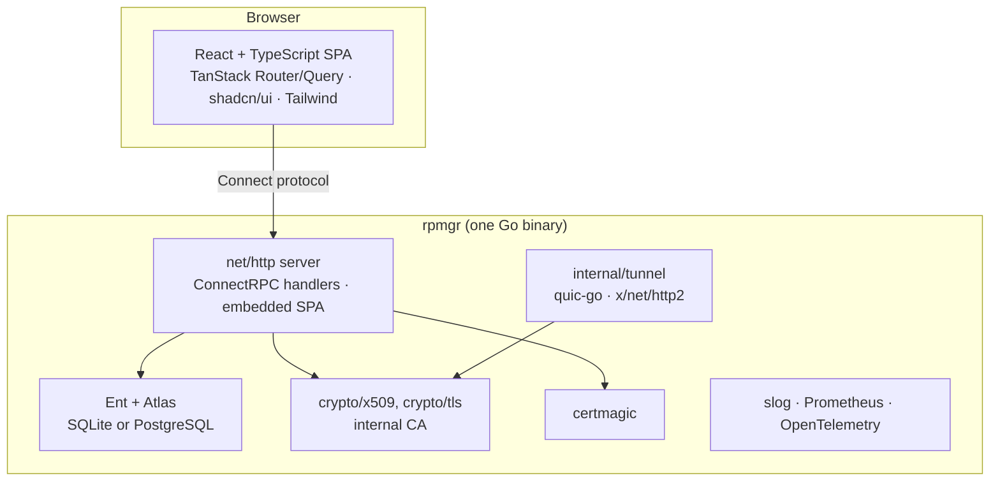

# 08 — Software stack

> Status: design, not implemented. Tags: [F] fact · [R] recommendation · [T] target · [V] verify at
> implementation ([README](../README.md#how-to-read-these-documents)).
>
> Versions are **not pinned in this document**; they are pinned in `go.mod`, `package.json` and the
> toolchain files when implementation starts, and kept current by an automated dependency bot. Where
> a library was available to check during this design, the version checked is named.

## Overview

## Language and runtime

| Choice | Rationale | Rejected |
|---|---|---|
| **Go**, the latest stable minor at the first commit, pinned with the `toolchain` directive in `go.mod`; the `go` directive is at least 1.26, which `modernc.org/sqlite` v1.60.1 requires [F modernc.org/sqlite v1.60.1 `go.mod:3`] (quic-go v0.61 requires 1.25 [F quic-go:go.mod:3]) | The ecosystem rpmgr needs is Go: quic-go, wireguard-go, gVisor netstack, certmagic, `crypto/tls`. Static, cross-compiled binaries; good networking performance; one language for all three roles | Rust: technically a good fit (QUIC, TLS, userspace WireGuard and ACME libraries exist). [R] Rejected because the maintainer's existing work is Go and rpmgr reuses Go components (quic-go, wireguard-go, gVisor netstack, certmagic) directly. Java/.NET: runtime size and cross-compiling agents |
| Standard library first: `net/http` (method-and-pattern routing), `log/slog`, `crypto/tls`, `crypto/x509`, `embed` | Fewer dependencies, fewer supply-chain risks, long-term stability | gin (adds surface for little gain over `net/http` routing); logrus (superseded by `slog`) |
| `CGO_ENABLED=0` everywhere | Fully static binaries, trivial cross-compilation, distroless images | — |

## API and protocols

| Choice | Rationale | Rejected |
|---|---|---|
| **Protocol Buffers + buf** (lint, breaking-change check, generation for Go and TypeScript) | One schema for the database model, the public API, the agent protocol and the UI types; breaking changes caught in CI | Hand-written TypeScript mirrors of Go types (they drift from the server) |
| **ConnectRPC** (`connect-go`, `connect-es`) | One handler stack on `net/http` serves the browser (Connect protocol, JSON, works over HTTP/1.1), agents (gRPC protocol over HTTP/2 mTLS) and the CLI; `curl`-friendly ([ADR-0010](adr/0010-connectrpc.md)) [V S4] | grpc-go + grpc-gateway (two stacks, REST mapping annotations, a separate gRPC-Web proxy for browsers). grpc-go remains the fallback for the agent protocol if S4 fails |
| **protovalidate** | Validation rules live in the `.proto` files and are enforced on the server; the same rules are visible to every client | Validation only in UI code (bypassable, duplicates logic) |

## Networking

| Choice | Rationale | Rejected |
|---|---|---|
| **quic-go** for QUIC and HTTP/3, wrapped behind `internal/tunnel` | Mature Go QUIC with streams, RFC 9221 datagrams, GSO/ECN on Linux [F quic-go v0.61.0, see [03](03-connections.md#quic-parameters)]; the wrapper isolates the pre-1.0 API | Writing a QUIC stack; KCP (no standard encryption, weaker ecosystem) |
| **`golang.org/x/net/http2`** for the reverse-HTTP/2 TCP transport | Standard, battle-tested multiplexing with flow control, half-close and PING ([ADR-0005](adr/0005-reverse-http2-fallback.md)) [V S2] | hashicorp/yamux (no usable half-close in v0.1.1 [F yamux:stream.go:95-110]); smux (same class of design, no clear advantage) |
| **`github.com/coder/websocket`** for the WSS transport (Phase 2) and the Phase 3 terminal | Maintained, small, `context`-aware API; only needed for TLS-intercepting proxies and the browser terminal | gorilla/websocket: a viable alternative with no advantage for rpmgr |
| **pires/go-proxyproto** for PROXY protocol | [R] A maintained implementation of PROXY protocol v1 and v2 | Own implementation |
| **certmagic** for ACME | DNS-01 (wildcards), pluggable storage with locking, mature renewal logic [V S6]. Its DNS-01 solver takes a libdns `RecordAppender` + `RecordDeleter` [F certmagic:solvers.go:589-592]; rpmgr implements that in an adapter over its own DNS providers, so `libdns/libdns` (already a certmagic dependency) is used only as an interface | `x/crypto/acme/autocert`: only TLS-ALPN-01 and HTTP-01 [F x/crypto v0.54.0 `acme/autocert/autocert.go:96-97`], a simple cache interface without distributed locking |
| **Own Cloudflare API client** in `internal/dns/cloudflare` (`net/http`), behind an internal `Provider` interface (Phase 2) | rpmgr needs about seven endpoints, including the batch endpoint, record comments, `proxied`, pagination and `retry-after` handling ([15](15-dns.md#provider-interface)) | `libdns/cloudflare` v0.2.2 (cannot set `proxied` [F libdns-cloudflare:models.go:293-295], no comments, reads one page of zones [F libdns-cloudflare:provider.go:207], no rate-limit handling [F libdns-cloudflare:provider.go:18]); `cloudflare-go` v7 (a generated SDK for the whole API) |
| **wireguard-go** + **gVisor netstack** (Phase 3) | Userspace WireGuard that works without kernel modules; kernel WireGuard optional where available | — |

## Data

| Choice | Rationale | Rejected |
|---|---|---|
| **SQLite** via `modernc.org/sqlite` (pure Go) as default | Zero-ops single-node installs; works with `CGO_ENABLED=0` on linux/amd64, arm64, armv7 and riscv64 ([S8](spikes/S8.md)) | `mattn/go-sqlite3` (needs cgo) |
| **PostgreSQL** for HA | Multiple controller replicas, leases, notifications | MySQL (dropped: a third dialect multiplies migration and test cost; [ADR-0011](adr/0011-sqlite-postgres-ent-atlas.md)) |
| **Ent** (schema as code, typed queries, interceptors, privacy rules) + **Atlas** (versioned migrations, lint) | One schema for both dialects; tenancy enforcement in one place ([06](06-data-model.md#tenancy-enforcement)). Only Apache-2.0 parts: migrations are generated through Ent's Go API with the `ariga.io/atlas` library and applied by the binary with Atlas's executor; the community Atlas CLI cannot read Ent schemas and is used in CI for lint only ([S5](spikes/S5.md)). Ent's generator is pinned as a `go.mod` tool, with `golang.org/x/tools` and `ariga.io/atlas` pinned above Ent's own requirements | sqlc + goose (two query sets for two dialects; tenancy only by convention); bun (viable fallback, not needed after S5); GORM (`AutoMigrate` without versioned migrations) |
| `google/uuid` `NewV7` for IDs | Time-ordered IDs on both dialects [F google/uuid v1.6.0] | Auto-increment integers (leak counts, clash across orgs and restores) |

## Security libraries

| Choice | Rationale |
|---|---|
| `crypto/tls`, `crypto/x509`, `crypto/ecdsa` | TLS 1.3, internal CA, P-256 keys ([04](04-security.md#pki-and-identity)) |
| `golang.org/x/crypto/argon2` | Password hashing (`IDKey` [F x/crypto v0.54.0 `argon2/argon2.go:101`]) |
| `coreos/go-oidc` | OIDC SSO verification |
| A maintained WebAuthn library | Passkeys [V VB-01] |
| Ed25519 (`crypto/ed25519`), minisign-compatible format | Release manifest signatures verified in-binary ([ADR-0013](adr/0013-signed-ota.md)) |

## Observability

| Choice | Rationale |
|---|---|
| `log/slog`, JSON in production, with a redacting handler | Structured, standard, secret-safe ([04](04-security.md#secrets-at-rest-and-in-logs)) |
| Prometheus `client_golang` on the admin listener | De-facto standard; existing Prometheus setups scrape rpmgr without extra tooling |
| OpenTelemetry (OTLP) traces | Trace context travels in `StreamOpen`, so a request can be followed from gateway to connector ([03](03-connections.md#framing)) |

## Frontend

| Choice | Rationale | Rejected |
|---|---|---|
| **Vite + React + TypeScript**, a single-page app embedded with `embed.FS` ([ADR-0014](adr/0014-vite-react-spa.md)) | The UI is a static SPA served by the controller; nothing needs server rendering | Next.js static export: `output: 'export'` disables server rendering, middleware and API routes, so the framework adds build complexity without its main features |
| **TanStack Router + TanStack Query**, with **connect-query** for generated hooks | Type-safe routes, caching, invalidation driven by `WatchEvents` [V VB-06] | Hand-written fetch wrappers |
| **shadcn/ui + Tailwind CSS** (Radix primitives) | Accessible components, owned in the repo | Heavy component frameworks |
| **react-hook-form** with **protovalidate-es** as its resolver | Fast feedback in forms from the same protovalidate rules the server enforces, so client and server cannot drift; the server's result remains authoritative [V VB-16] | Hand-written zod schemas: a second copy of the rules; kept only as the fallback if VB-16 fails |
| **Recharts**, through the shadcn/ui chart components | Traffic and latency charts in the same component system as the rest of the UI | — |
| **CodeMirror 6** for YAML views | Small, extensible, works with a strict CSP [V VB-07] | Monaco (large; rpmgr has no raw JSON editor) |
| **xterm.js** (Phase 3 terminal) | Standard browser terminal | — |
| **i18next**, English as the source language | Mature and widely used | — |
| Unit tests with Vitest, end-to-end tests with Playwright | Standard for Vite projects ([12](12-testing-and-quality.md#test-strategy)) | — |

## Build, packaging, delivery

| Area | Choice |
|---|---|
| Build | `go build` with `-trimpath`, pinned toolchain, reproducibility check; `buf generate`; Vite build embedded |
| Artifacts | Phase 1: `rpmgr` for linux/{amd64,arm64,armv7,riscv64}. Phase 2: connector builds for windows/amd64 and darwin/{amd64,arm64} (built in CI from Phase 1 on, not released), and the connector-only variant, released as `rpmgr-connector_<version>_<os>_<arch>` and installed as `rpmgr` |
| Containers | Distroless, non-root OCI images `ghcr.io/felix-homelab/rpmgr` (multi-arch), signed |
| Packages | Phase 2: `.deb` and `.rpm` built with nfpm, served from a signed apt/yum repository on GitHub Pages; a Homebrew tap (macOS connector) and winget/MSI (Windows connector). `.apk` is not planned; a Helm chart is Phase 3 ([10](10-operations.md#install)) |
| Services | Hardened systemd units; Windows service and macOS launchd daemon for connectors in Phase 2 ([10](10-operations.md#install)) |
| Signing | Ed25519 release manifests (in-binary verification); cosign, an SPDX JSON SBOM generated with syft, SLSA provenance for the ecosystem [V VB-05] |
| CI | GitHub Actions: lint (golangci-lint with gosec and forbidigo rules), `govulncheck`, `-race` tests, fuzzing, `buf lint`/`buf breaking`, migrations on both dialects, e2e topology matrix, Playwright, gitleaks secret scanning; nightly correctness runs; benchmarks on the reference testbed before each release ([12](12-testing-and-quality.md#continuous-integration)) |
| Repository hosting | GitHub, `github.com/felix-homelab/rpmgr`, without a mirror ([D3](14-open-decisions.md#product-and-project)); Go module path `github.com/felix-homelab/rpmgr` |

## Dependency policy

- Prefer the standard library; add a dependency only with a written reason in the PR.
- Every dependency is pinned (`go.sum`, lockfile), scanned (`govulncheck`, npm audit), and updated by
  Dependabot with CI as the gate.
- Libraries with pre-1.0 APIs on the hot path (quic-go) sit behind an internal interface.
- No dependency may fetch code or binaries at runtime. Edge-function runtimes (Phase 3) are
  distributed through the signed release manifest ([04](04-security.md#supply-chain-and-updates)).
