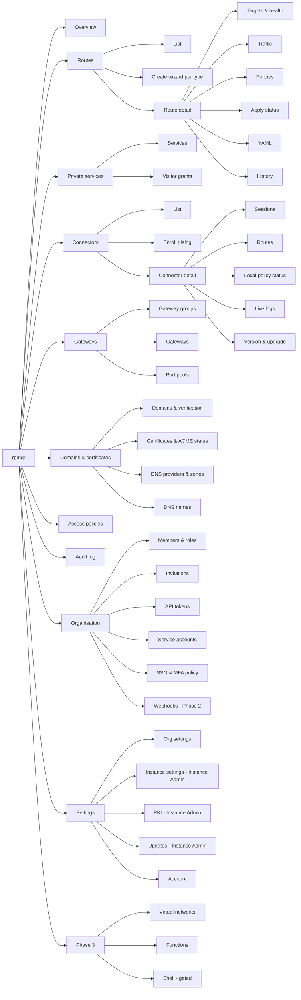

# 09 — Web UI

> Status: Phase 1, being implemented. Tags: [F] fact · [R] recommendation · [T] target · [V] verify
> at implementation ([README](../README.md#how-to-read-these-documents)).

The web UI is the main way most operators use rpmgr. It is a single-page application embedded in the
`rpmgr` binary and served by the Controller on the same origin as the API. Everything the UI can do
is also possible through the public API and `rpmgr apply` ([07](07-api.md)). The UI has no private
endpoints.

## UX principles

| # | Principle | What it means in practice |
|---|---|---|
| U1 | **Forms are the model** | Every form maps 1:1 to a protobuf message of the public API. A form submits the complete typed resource, with an etag. It never merges over a stored blob, because there is no blob. A field the form does not show cannot exist. |
| U2 | **Saved ≠ applied, and the UI says which** | After every save, the UI shows the new revision and the per-agent apply status: `pending` → `applied` / `rejected` / `apply_timeout` ([07](07-api.md#writes-and-apply-status), [03](03-connections.md#configuration-reconciliation)). A rejection lists the agent and the structured reasons. |
| U3 | **Desired and observed, side by side** | Each resource shows what was configured (desired) next to what the agents report (observed): enabled vs the route status `disabled` / `pending` / `ready` / `degraded` / `unavailable` / `error`, and per target the connector's readiness `ready` / `not_ready (reason)` ([06](06-data-model.md#desired-vs-observed-state)). There is never a second "enabled" switch. |
| U4 | **Every error says what to do** | A route blocked by a connector's local policy shows the exact host command with a copy button, e.g. `sudo rpmgr policy allow-target 10.0.0.5:5432` ([04](04-security.md#connector-local-policy)). An unverified domain shows the TXT record to create. A DNS conflict names the foreign record that occupies the hostname and offers **Adopt** ([15](15-dns.md#conflicts)). |
| U5 | **YAML instead of raw JSON editors** | Every resource has a *YAML* tab: view, copy and download (Phase 1); edit and import arrive with declarative manifests in Phase 2 ([D58](14-open-decisions.md#project-and-process)). The YAML is the same document `rpmgr apply -f` accepts. It is validated by the same server-side rules as the form, and the result is shown as a diff before saving. |
| U6 | **No lost updates** | Every write carries the etag of the version the user started from. On a conflict, the UI shows "changed by *alice* 2 min ago" with a field-level diff and lets the user reapply their change on top or discard it. |
| U7 | **Dangerous actions are deliberate** | Deleting, revoking, minting enrollment tokens, granting roles, opening a shell, adopting or releasing DNS records and approving a held DNS zone's plan need a confirmation that names the object. Where [04](04-security.md#human-authentication-and-sessions) requires step-up re-authentication, the UI asks for it inline and keeps the user's place. |
| U8 | **Accessible** | [T] WCAG 2.2 AA: full keyboard operation, visible focus, labels on every control, ARIA live regions for apply-status changes, contrast in both themes, no information carried by colour alone (status chips have an icon and text). |
| U9 | **Fast to navigate** | A command palette (`Ctrl/⌘ K`) jumps to any resource by name or ID and runs common actions ("create route", "enroll connector"). Lists are paginated on the server, filterable and sortable, and keep their filter state in the URL. |
| U10 | **Light, dark and system themes** | Follows the OS preference by default; the user's choice is stored server-side in their profile. |
| U11 | **Localised** | English is the source language. Translations use i18next with the same keys. Missing keys fall back to **English**, so a partial translation never shows raw keys or another language. Phase 1 ships English only ([D32](14-open-decisions.md#project-and-process)); every string is keyed from the start, so further languages are translation files without code changes. |

## Information architecture



| Area | Contents | Minimum role to view / change ([04](04-security.md#roles)) |
|---|---|---|
| **Overview** | Health of agents, sessions and certificates; routes not `ready`; pending, rejected or timed-out applies; expiring certificates and tokens; unverified domains; DNS conflicts, held DNS zones and expiring DNS-provider tokens; agents below `min_agent_version`; a traffic summary | Viewer |
| **Routes** | List; create wizard per type (`http`, `tls_passthrough`, `tcp`, `udp`); detail with targets, health checks, traffic, access policies, transport override (advanced), per-agent apply status, YAML, change history | Viewer / Operator |
| **Private services** | Services, visitor grants, relay vs P2P state per grant | Viewer / Operator |
| **Connectors** | List with status, version, transport, RTT, last seen; enroll dialog; detail with data and control sessions, served routes, local-policy status, transport override (`auto`, `quic`, `h2` or the instance default), live logs, version and staged upgrade | Viewer / Admin to enroll or revoke (Operator if the org allows it) |
| **Gateways** | Gateway groups (region, public hostnames for route traffic, DNS target for managed DNS records, port pools), gateways (own tunnel endpoints — address/port and, for WSS, the gateway's own hostname — status, version, sessions, listeners), drain action. Connectors dial each gateway at its own tunnel endpoints; group-level DNS or anycast names are for public traffic only ([03](03-connections.md#establishment)) | Viewer / Admin |
| **Domains & certificates** | Domain claims with the verification flow (TXT record or HTTP token, a "check now" button, status), certificates with source (ACME/uploaded), SANs, expiry, last ACME error. Phase 2: DNS providers (connect, rotate token, status, token expiry), managed zones (import, gates, plan approval, records, conflicts, adopt and release) and DNS names ([15](15-dns.md)) | Viewer / Admin; foreign records of a zone: Admin |
| **Access policies** | IP allow/deny lists, basic auth, OIDC forward-auth, rate limits; where each policy is used | Viewer / Operator |
| **Audit log** | Searchable by actor, action, target and time; entry detail with the redacted diff; chain-verification status; export (step-up) | Admin |
| **Organisation** | Members and roles; invitations as copyable one-time links, also e-mailed when SMTP is configured; API tokens (personal tokens in Phase 1, service accounts and their tokens in Phase 2: list, create with mandatory expiry, revoke); SSO and MFA policy; Phase 2: webhooks (endpoints and delivery log) | Admin; SSO and MFA policy are Owner-only |
| **Settings** | **Org settings**, and **instance settings** for the Instance Admin. Both are runtime settings stored in the database and editable here, with validation, a description and the default for each field. Boot settings (listen addresses, database DSN, KEK source) are shown read-only with the file they come from ([10](10-operations.md#configuration)). Instance settings include the default data-session transport ([03](03-connections.md#transport-selection)). Two instance-level pages: **PKI** (CA and intermediate status, intermediate rotation with step-up, leaf-certificate lifetime and grace period, password-hash profile, [04](04-security.md#pki-and-identity)) and **Updates** (release check, on by default; update channel; manifest upload for air-gapped installs; staged rollouts in Phase 2, [04](04-security.md#over-the-air-updates)). | Owner (org settings) / Instance Admin (instance settings, PKI, Updates) |
| **Account** | Profile, password, MFA (TOTP, passkeys, recovery codes), active sessions with revoke, personal API tokens, theme and language | Any user |
| **Restore review** (only after a fail-closed restore) | A full-width banner and a per-org checklist: each org stays read-only until its Owner (or the Instance Admin) re-confirms that org's memberships and roles; API tokens and service accounts are listed as suspended with a per-item re-enable action; users are forced through password reset and MFA re-verification at login. The banner explains that the instance-wide review is ended by the Instance Admin with `rpmgr restore confirm` on the controller host — not from the UI, because restored Owner memberships are exactly what is in doubt ([10](10-operations.md#backup-and-restore)) | Org Owner (own org); Instance Admin |
| **Phase 3: Virtual networks** | Networks (CIDR, ACL), members, endpoints, topology graph with measured links | Operator |
| **Phase 3: Functions** | Function code and versions, deployments to connectors, ingress routes | Operator |
| **Phase 3: Shell** | A tab in the connector detail. It appears only when the connector's local policy allows it and the user has an explicit `connector.shell` grant. Opening it needs step-up re-authentication. | Explicit grant |

## Key screens

### Routes list

```
┌ Routes ──────────────────────────────────────────────────────────────── [+ Create route] ┐
│ Search: [ app.example.com            ]  Type: [All ▾]  Status: [All ▾]  Group: [eu ▾]    │
├──────────────────────┬────────┬───────────────┬────────────┬──────────────┬─────────────┤
│ Name / hostnames     │ Type   │ Gateway group │ Targets    │ Status       │ Applied     │
├──────────────────────┼────────┼───────────────┼────────────┼──────────────┼─────────────┤
│ wiki                 │ http   │ eu            │ 2/2 ready  │ ● ready      │ ✓ rev 1042  │
│  wiki.example.com    │        │               │            │              │             │
│ postgres             │ tcp    │ eu  :25432    │ 0/1 ready  │ ▲ unavailable │ ✓ rev 1040 │
│                      │        │               │ 1 blocked by local policy                 │
│ grafana              │ http   │ eu            │ 1/1 ready  │ ○ disabled   │ ⧗ pending   │
│  grafana.example.com │        │               │            │              │  2/3 agents │
├──────────────────────┴────────┴───────────────┴────────────┴──────────────┴─────────────┤
│ 3 of 27   ◂ 1 2 3 ▸                                                       Export YAML   │
└─────────────────────────────────────────────────────────────────────────────────────────┘
```

**How the list works.**
- It reads all of the org's routes and filters them in the browser by text (name or address),
  type, status and gateway group. It sorts them by name and shows 25 a page. The filters and the
  page stay in the URL (U9).
- **Targets** shows how many are ready, and how many a connector's local policy blocks.
- **Status** shows the observed state, with an icon and text, and how many agents rejected the
  route.
- **"Create a route"** opens a form: the type, the gateway group, and the fields of that type.
  - **Defaults:** HTTP routes start with ACME certificates and a redirect on port 80. TCP and UDP
    routes start on port 0, a free port of the group's pools.
  - **Retries:** the creation carries one request ID, however often it is retried.
  - **After creating,** the apply status follows live, and a link opens the new route to add its
    targets.
- **Preview** (`PreviewRoute`), in the create and edit forms, checks the route as the save would,
  without saving. It shows where the route would be reached, the gateways and connectors that would
  carry it, and anything a gateway would refuse.
- [R] The "Applied" column of the mock-up is left out in Phase 1. It needs the revision that last
  changed each route, which the API does not report. Rejections show under Status instead, and the
  apply status of a change shows after each save.

### Route detail

```
┌ Route: postgres (tcp)                      [Enabled ●━]  [Edit]  [YAML]  [⋯ Delete]   ┐
│ Desired: enabled · gateway group eu · port 25432          Observed: ▲ unavailable      │
├ Targets & health ─────────────────────────────────────────────────────────────────────┤
│ Connector   Address          Weight  Health       Status                                │
│ db-host-1   10.0.0.5:5432    100     tcp / 10 s   ▲ not_ready: blocked by local policy  │
│             Run on db-host-1:  sudo rpmgr policy allow-target 10.0.0.5:5432   [Copy]    │
├ Apply status (revision 1040) ─────────────────────────────────────────────────────────┤
│ gw-eu-1 ✓ applied    gw-eu-2 ✓ applied    db-host-1 ✓ applied (target not_ready)      │
├ Traffic (24 h) ──────────────────────────── Policies ──────────────────────────────────┤
│ ▁▂▃▅▇▅▃▂▁  in 1.2 GB · out 310 MB          IP allow-list "office" · rate limit 50/s    │
├ History ──────────────────────────────────────────────────────────────────────────────┤
│ rev 1040  alice  changed target port 5433 → 5432           2026-10-06 09:12  [diff]    │
└─────────────────────────────────────────────────────────────────────────────────────────┘
```

**How the detail works.**
- It shows the configured settings next to the observed state (U3), and how many of the group's
  gateways serve the route.
- **Each target** shows its connector by name, its address and weight, and whether it serves; if
  not, it says why.
- **Targets are added, edited and removed** on the page.
  - **The form:** the connector (fixed once the target exists), a host and port or a socket path,
    the protocol to the target (HTTP, verified HTTPS with its server name, CA bundle and key pin,
    or h2c for HTTP routes; TCP otherwise), the PROXY protocol for TCP and TLS-passthrough routes,
    weight, priority and whether it is enabled.
  - **Edits** send the whole target as read, with the update mask of those fields and its etag
    (U1).
  - **Removal** first asks, naming the target's address.
  - **After each change,** the apply status follows live.
- **A target that a connector's local policy blocks** shows the command for that connector's host,
  with a copy button (U4). The target is shell-quoted, for example a socket path with a space.
- **A target whose connector reaches the gateways only over TLS and HTTP/2** is marked as served
  over the fallback for QUIC. A route pinned to HTTP/2 is not marked.
- **Gateways that do not serve the route, and agents that rejected it,** are listed with their
  reasons.
- UDP routes show the MTU hint of [03](03-connections.md#udp-routes).
- **Access policies:** the policies the route applies, in order. They are attached from the org's
  policies, detached, and moved up or down. They are then saved as one change: the route as read,
  with the mask `policy_ids` and its etag.
- **The "Enabled" switch** turns the route on or off; it is the only desired on/off switch (U3).
  - It sends the route as read, with the mask `enabled` and the route's etag.
  - The revision's apply status then follows live (U2): the state over the online agents, each
    agent that has not applied it with its reasons, and the offline agents, through
    `WatchApplyStatus`, in a live region (U8).
  - If the route changed since the page read it, the switch says so, and the page shows the route as
    it is now.
- **"Edit"** opens the route's form, with the fields the API lets a route of its type change.
  - **Full resource (U1):** the form starts from the route as read and sends it whole, with its
    fields set from the form, the update mask of those fields and the etag. A field the form does
    not show keeps what the server sent, so a save loses nothing.
  - **Validation:** before sending, the form checks the API's rules. The server's violations land
    on their fields, and any it cannot place are shown with the form.
  - **After a save,** the apply status follows live, as for the switch.
  - **A save that meets a newer version (U6)** opens a panel in the form. It says who changed the
    route and how long ago, and lists the fields either side changed, with the user's value next to
    the saved one. Fields both sides changed differently are marked.
    - "Put my changes on the new version" refills the form with the saved version and the user's
      changes on top, for a second save.
    - "Drop my changes" refills it with the saved version.

### Connectors

- **The list** (`/connectors`) shows the org's connectors in service, sorted by name. Each row has
  its control session (connected or offline, with an icon and text), version, last contact and
  labels. A text filter (name or `key=value` label) and a session filter stay in the URL (U9).
- **The detail page:**
  - **Sessions:** the control session (address, last contact), and the data sessions per gateway,
    with transport, round-trip time and start.
  - **Routes:** those with a target on the connector. Those it reports not ready show their reason,
    and, for a target its local policy blocks, the command for its host with a copy button (U4).
  - **Settings:** name, labels, transport policy and whether it serves. They are saved as the whole
    connector as read, with their mask and the etag (U1).
  - **Decommission** comes after a confirmation that names the connector and says what it does
    (U7). The page then returns to the list.

### Gateways

- **The groups** (`/gateways`): each with its region, public hostnames, and how many of its gateways
  are connected. A new group is created there, and the page then opens it.
- **A group's page** lists its gateways by slot, with their tunnel endpoints, state (not enrolled,
  connected or offline, and drained), version and last contact. It also edits the group's name,
  region, public hostnames and trusted proxies, as the whole group as read with their mask and the
  etag (U1).
- **Gateway actions** on a group's page:
  - **Add a gateway** with its name and its own tunnel endpoints. A group has at most four; the
    server says so.
  - **Edit** its name and endpoints.
  - **Drain or resume** it (R22, [03](03-connections.md#multiple-gateways)). A drained gateway takes
    no new public connections, and it ends the open ones after the gateway drain period.
  - **Decommission** it, after a confirmation that names it.
  - **For a gateway that has not enrolled,** make its enrollment token after a step-up. The token is
    bound to that gateway and valid for 1 hour, and is shown once next to the install command,
    which does not hold it.
  - **After each change,** the apply status follows live.
- **Port pools and quotas** on a group's page:
  - the group's TCP and UDP port pools, from which TCP and UDP routes get their public ports;
  - a pool is added, its range changed, or removed after a confirmation that names it;
  - a range is checked first: 1 to 65535, the first port no larger than the last;
  - per protocol, the org's quota of the group's ports, with how many are in use. An empty quota is
    removed, so that the pools alone limit the org.

### Domains and certificates

- **Domains** (`/domains`):
  - **Each claim:** its name (`*.` for a wildcard), status with an icon and text, method, last
    check and last error.
  - **A pending or failed claim shows the proof it waits for (U4):** the TXT record's name and
    value, or the URL at which the org's gateways serve the HTTP token and its value, each with a
    copy button. "Check now" checks it at once.
  - **Claiming** takes the name, whether names below it are covered, and the method (TXT record or
    HTTP token). The name is lower-cased, without a trailing dot.
  - **Removal** comes after a confirmation that names the claim.
  - **The Instance Admin** can mark a claim trusted after a step-up
    ([15](15-dns.md)).
- **Certificates**, on the same page:
  - **Each certificate:** its names, source (ACME or uploaded), status, expiry and issuer, its last
    error, and the routes that use it. An expiry within 21 days is pointed out.
  - **Uploading** takes the chain and the private key as PEM, pasted or read from a file in the
    browser. The key leaves the page once it is sent.
  - **An ACME certificate** can be renewed now.
  - **Removal** comes after a confirmation that names the certificate. The server refuses a
    certificate that routes use, and says which.
- **CA bundles,** which HTTPS targets verify their upstreams with: each with its certificates'
  subjects and expiry and how many targets use it. A bundle is added, changed (name and PEM, as the
  whole bundle as read with mask and etag), or removed after a confirmation.

### Access policies

- **The list** (`/policies`): each policy with its description, its rules in the order they apply
  (allow or deny addresses, basic auth with its users' names), and the routes that use it.
- **The form** creates a policy, or changes one as the whole policy as read with its name,
  description and rules, their mask and the etag (U1).
  - **Rules** are added, removed and moved up or down.
  - **Basic auth:** each user has a name and a password. Passwords are write-only: an existing user
    whose password field stays empty keeps their password.
- **Removal** comes after a confirmation. The server refuses a policy that routes use, and says
  which.
- **After each change,** the apply status follows live.

### Organisation

- **`/org`** shows the org's name, which the Owner can change.
- **Members:** each with name, e-mail address, role and since when. A member's role is changed with
  a step-up where [04](04-security.md#roles) requires one (granting Admin or Owner). A member is
  removed after a confirmation that names them.
- **Invitations:** an address and a role. The step-up rule is the same.
  - The answer is a one-time link with its expiry. It is shown with a copy button.
  - The page says whether the controller e-mailed the link, or whether it must be sent by hand.
- **The invitation link** opens `/invite#<token>`.
  - A signed-in user joins with their account.
  - Without a session, the page creates an account for the invited address, with a name and a
    password, and the user then signs in.
  - Pages that need no session never send the user to sign in.

### Enroll connector dialog

```
┌ Enroll a connector ─────────────────────────────────────────────────────────── [×] ┐
│ Name         [ db-host-1          ]   Labels  [ site=office ] [+]                  │
│ Gateway group[ eu ▾ ]                Type    (●) permanent  ( ) ephemeral           │
│ Token valid  [ 1 hour ▾ ]   Uses: 1                                                │
│ Allow targets on the host (written into the local policy by the installer;        │
│ none listed = the connector may reach nothing until a target is allowed):         │
│ [ 10.0.0.5:5432 ] [+]                                                              │
├────────────────────────────────────────────────────────────────────────────────────┤
│ 1. On the host, run:                                                       [Copy]  │
│   curl -fsSL https://panel.example.com/install.sh | sudo sh -s -- \                │
│     --controller https://panel.example.com --ca-pin sha256:3q2+7w… \               │
│     --allow-target 10.0.0.5:5432                                                   │
│ 2. When the installer asks for it, paste this token (shown once):          [Copy]  │
│   rpmgr_enr_•••••••••••••••••••••••••••••••••••••••••••••_8f2k1a          [Show]     │
│                                                                                    │
│ The token is never part of the command line, and it expires in 1 hour.            │
│ Waiting for the connector to enroll …  ⧗                                           │
└────────────────────────────────────────────────────────────────────────────────────┘
```

- The token is shown once, masked by default, and is never put into the command. This keeps it out
  of argv, unit files and shell history ([04](04-security.md#join-command)). Because `curl … | sh`
  occupies the script's standard input, the install script reads the token from the terminal
  (`/dev/tty`) with echo off. Unattended installs use `--token-file`, or `RPMGR_ENROLL_TOKEN`
  passed through explicitly (`sudo --preserve-env=RPMGR_ENROLL_TOKEN …`).
- Targets entered in the dialog become `--allow-target` flags. Without any, the default local
  policy is `allow_targets: []` ([04](04-security.md#connector-local-policy)).
- The dialog waits on the enrollment event and switches to the new connector's detail page when it
  connects.
- **Making the token:**
  - it needs a step-up;
  - its creation is one request, however often it is retried;
  - it is valid for 15 minutes up to 30 days, 1 hour by default, and can be scoped to a gateway
    group;
  - an ephemeral token may enroll several connectors, 0 meaning any number;
  - the dialog asks for the install command with the targets as `--allow-target`.
- [R] The mock-up's "Name" field is left out. A token does not name the connector it enrolls: the
  connector takes its host's name, and it is renamed on its page.
- **The connectors page lists the enrollment tokens** that can still enroll, with creation, expiry,
  uses, labels and last use. A token is revoked after a confirmation. Tokens that re-enroll one
  connector belong to that connector and are not listed.

### Managed DNS zone (Phase 2)

```
┌ Zone: example.com · Cloudflare account "home" ───────────────── ▲ held: first plan  [Sync now] ┐
│ Gates: publish route hostnames ✓ · proxied ✗ · wildcards ✗ · delete threshold 10    [Edit]     │
├ Plan 9f3c…e1 (approve to publish) ─────────────────────────────────────────────────────────────┤
│ + CNAME  wiki.example.com                  → eu.gw.example.net    route wiki                   │
│ + CNAME  nas.example.com                   → eu.gw.example.net    route nas                    │
│ ! A      grafana.example.com               203.0.113.5 (foreign)  conflict: route grafana      │
│                                                                   [Adopt → eu]                 │
│ ~ wiki.example.com no longer follows the foreign *.example.com                                 │
│                                               [Discard]  [Approve plan · step-up]              │
├ Records (read live from Cloudflare) ───────────────────────────────────────────────────────────┤
│ Name                     Type   Content               Owner             Status                 │
│ example.com              A      203.0.113.5           foreign           —                      │
│ grafana.example.com      A      203.0.113.5           foreign           ! conflict             │
│ *.example.com            CNAME  example.com           foreign           —                      │
│ mail.example.com         MX     10 mx.example.net     foreign           —                      │
└────────────────────────────────────────────────────────────────────────────────────────────────┘
```

- **Import** is a short flow: connect a Cloudflare account (API token, step-up), choose zones (only
  `active`, `full` zones can be selected; the others say why), review the first plan, approve it
  ([15](15-dns.md#connecting-importing-and-disconnecting)).
- **Approve** is bound to the plan's hash. If anything changed since the plan was shown, the new
  plan replaces it and the approval has to be repeated.
- **Foreign records** are shown only to Owners and Admins, read live from Cloudflare and never
  stored. Adopting one shows its current content, which is kept for a later "release and restore".
- **Route detail** shows one DNS line per hostname: `dns_status`, the published records and, for
  `http` routes, the proxy toggle. When the zone does not allow proxied names the toggle is
  disabled and says so.

## Frontend architecture

| Concern | Choice | Notes |
|---|---|---|
| Application | **Vite + React + TypeScript** single-page app, built to static assets and embedded with `embed.FS` | Nothing needs server rendering; a static export of a server framework cannot use its SSR, middleware or API routes, so a plain SPA is simpler ([08](08-software-stack.md#frontend)) |
| Routing | TanStack Router, with typed routes and URL search params for list filters | — |
| Server state | TanStack Query through **connect-query**, with generated clients for `rpmgr.v1` | One generated client; no hand-written API layer |
| Live updates | Connect **server streaming** for events (apply status, agent status) and live logs | WebSockets only for the Phase 3 shell |
| Components | shadcn/ui on Radix primitives, styled with Tailwind | — |
| Forms | react-hook-form with **protovalidate-es** as its resolver, so the form checks the same proto rules the server enforces, for immediate feedback only (VB-16, resolved). **The server's protovalidate result is authoritative**, and the server's field errors (`buf.validate.Violations`) are mapped back onto form fields; a violation of a field the form does not edit is shown with the form | Forms submit the full typed resource (U1) |
| YAML editing | CodeMirror 6 with a YAML mode and schema-driven completion | Smaller than Monaco ([08](08-software-stack.md#frontend)) |
| Terminal (Phase 3) | xterm.js over a WebSocket with a single-use ticket ([04](04-security.md#human-authentication-and-sessions)) | — |
| Charts | Recharts, through the shadcn/ui chart components, for traffic and latency | Same component system as the rest of the UI ([08](08-software-stack.md#frontend)) |
| i18n | i18next, English source, English fallback; Phase 1 ships English only | See U11 |

**Code and patterns** (`web/`):
- **Pages and routes.** Each page is a component in `src/pages/` with a route in `src/router.tsx`
  (TanStack Router, code-based). The pages of the information architecture arrive with their
  slices; an unknown path shows a "not found" page.
- **Data.** Pages call the API only through connect-query hooks on the generated method
  descriptors, e.g. `useQuery(AuthService.method.getSession, {})`. The transport is the UI's own
  origin. There is no hand-written API layer.
- **Generated code.** `npm run generate` writes the TypeScript code of `rpmgr.v1` to `src/gen/` with
  buf and `protoc-gen-es`; `build`, `test` and `typecheck` run it first. It is not committed.
- **Text.** Every string is `t("key")` with its English text in `src/locales/en.json`. A unit test
  fails when the code uses a key without English text.
- **Components.** shadcn/ui components are copied into `src/components/ui/` with their MIT license
  notice.
- **Tests.** Vitest with jsdom. The API is answered by Connect's router transport, so tests need
  no server.
- **Libraries in chunks of their own.** React, TanStack, Protobuf-ES with Connect, and the
  generated code each get a chunk. Browsers keep them across releases that do not change them.

**Signing in.** Every page except the sign-in pages needs a session
([04](04-security.md#human-authentication-and-sessions)):
- Without a session, or when it ends by expiry or revocation, the UI goes to `/login` and returns
  to the page afterwards. It returns only to its own paths, never to another site.
- The login page asks for the e-mail address and password. When the API answers `MFA_REQUIRED`, it
  asks for an authenticator code or a recovery code.
- A wrong address and a wrong password show the same message. A rate limit shows when to try
  again.
- **One-time links.** Each kind opens its own page. The page reads the token from the URL fragment,
  then removes it from the address bar and the history.
  - The first-user link opens `/setup#<token>`. The page asks for the e-mail address, the name and
    a password, creates the account and signs the user in.
  - A reset link opens `/reset#<token>`, which sets a new password. The user then signs in again,
    because the reset ended every session.
- `/forgot` asks for a reset link by e-mail. Its answer does not depend on whether the address
  belongs to an account. Without a mail relay, it says to ask an Owner or the Instance Admin.
- New passwords are checked in the browser for length (12 to 256 characters) and for a matching
  repetition before they are sent.
- **Step-up.** An action the API answers with `STEP_UP_REQUIRED` opens a dialog over the page
  (U7). The dialog asks for the password, or for an authenticator or recovery code if the user has
  an authenticator. After `StepUp` it runs the action again, so the user keeps their place.
  Cancelling ends the action with the API's error. Pages run such actions through `useStepUp()`.

**Account** (`/account`, opened by the user's name in the header):
- **Profile:** the display name and the theme. The e-mail address is shown, but it cannot be
  changed there.
- **The theme** applies at once, and on every page from the profile, so it follows the user to
  every browser. "Like the system" follows the operating system's preference.
- **Password:** the change needs the current password, and it ends the user's other sessions.
- **Two-factor authentication:** setting up an authenticator, renewing the recovery codes and
  removing the authenticator each need a step-up and end the user's other sessions.
  - **Setup:** a QR code of the authenticator's URI, drawn as SVG, and the key for typing in. A first
    code turns the authenticator on.
  - **Recovery codes** are shown once, with a copy button.
  - **Removal** first says that the password alone will then sign the user in.
- When an org's policy refuses a user without a second factor (`MFA_REQUIRED`), the UI opens the
  account page with a notice to set one up.
- **Sessions:** the user's live sessions, newest first, each with its browser, address and last
  activity. Any session but the current one can be ended, after a confirmation that names its
  address; the current one ends by signing out.
- **API tokens:** the user's personal tokens of the org, each with its name, prefix, scopes, expiry
  and last use.
  - **New tokens:** a name, 1 to 365 days of validity (90 by default) and scopes from the
    permissions of [04](04-security.md#roles); `org.read` is preselected.
  - **Creation** needs a step-up. The token is shown once, with a copy button.
  - **Revocation** comes after a confirmation that names the token.

In Phase 1 the UI works in the user's first org. The org switcher comes with the multi-org UI
([05](05-features.md), Phase 2).

**Serving.** The controller serves the UI on every path of its UI name that the API and
`/.well-known/rpmgr/` do not take:
- `npm run build` in `web/` writes the app to `internal/webui/ui/app/`, which is not committed, and
  `go build` embeds it.
- A binary built without the app serves a placeholder page that says so.
- A path that is a built file gets that file. Every other path gets the app's page, for the SPA's
  router to show. Unknown API services (`/rpmgr.…`), other `/.well-known/` paths and missing files
  under `/assets/` get 404.
- The page carries the response's nonce wherever the build wrote the placeholder
  `RPMGR_CSP_NONCE`. A build without that placeholder stops the controller at start.

**Security of the frontend**

- **No credentials in browser storage.** The session is an `HttpOnly` `__Host-` cookie. The SPA
  never sees a token and stores none in `localStorage` or `sessionStorage`, where any XSS could
  read it.
- **Strict Content Security Policy:**
  `default-src 'self'; script-src 'self'; style-src 'self' 'nonce-<per-response>'; img-src 'self' data:; connect-src 'self'; frame-ancestors 'none'; base-uri 'none'; form-action 'self'`.
  CodeMirror injects style elements and must receive the nonce [V VB-07].
  Also: no inline scripts, no `eval`, no third-party origins (fonts and icons are bundled).
  The nonce is 128 random bits, new for each response.
- [R] **Other response headers:**
  - `X-Content-Type-Options: nosniff` and `Referrer-Policy: same-origin` on every UI response.
  - The page is `Cache-Control: no-store`, because its nonce changes.
  - Built files under `/assets/` have content hashes in their names and are cached for a year
    (`immutable`); other built files are `no-cache`.
- **Cross-origin protection.** The SPA calls the API on the same origin. CSRF and WebSocket
  protections are described in [04](04-security.md#human-authentication-and-sessions).
- **Rendering untrusted data.** Hostnames, labels, log lines and audit diffs are rendered as text;
  `dangerouslySetInnerHTML` is banned by lint.

## Testing the UI

- Component and unit tests for form ↔ proto mapping: every form must round-trip a full resource
  without losing fields. This is the regression test for U1.
- End-to-end tests (Playwright) for the main flows: first-run setup, enroll a connector, create an
  HTTP route through to `applied`, a local-policy block (`not_ready`, snapshot still `applied`) shown
  with its command, etag conflict,
  step-up prompt, token creation and revocation.
- Every page a Playwright flow visits is checked with axe for WCAG 2.2 A and AA. A flow also fails
  on any CSP violation, and on anything in `localStorage` or `sessionStorage`.
- Accessibility checks (axe) in CI on every page, plus manual keyboard and screen-reader passes per
  release.
- Security checks (CSP present, no tokens in storage, `dangerouslySetInnerHTML` lint) are part of
  [12](12-testing-and-quality.md#security-testing).
