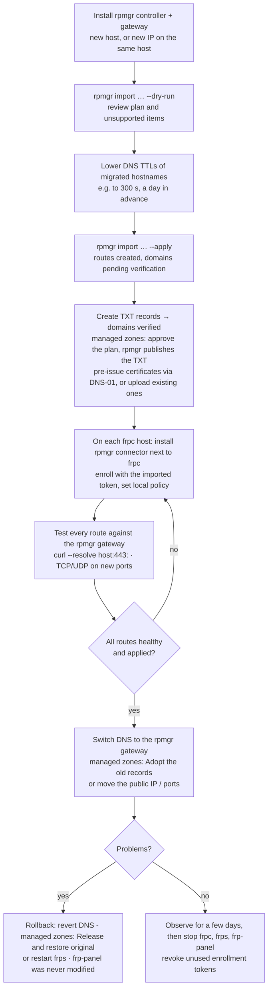

# 11 — Migration from frp and frp-panel

> Status: design, not implemented. Tags: [F] fact · [R] recommendation · [T] target · [V] verify at
> implementation ([README](../README.md#how-to-read-these-documents)). frp field names are verified
> against frp **v0.70.1** `pkg/config/v1`; frp-panel facts against frp-panel (fork
> `felix-homelab/frp-panel` at commit `6631a75`).
>
> **Sources.** This is the only document that names frp and frp-panel, because the importer reads
> their configurations. Citations `[F frp:<path>:<line>]` refer to
> [fatedier/frp](https://github.com/fatedier/frp) v0.70.1, and `[F frp-panel:<path>:<line>]` to
> [felix-homelab/frp-panel](https://github.com/felix-homelab/frp-panel) at commit `6631a75`; these
> prefixes are not in the README's citation table.

rpmgr is not wire-compatible with frp ([ADR-0003](adr/0003-clean-slate-protocol.md)): stock `frpc`
cannot connect to an rpmgr gateway. Migration therefore means **converting configuration** and
**re-enrolling every host**. The importer does the first part. This document describes both parts
and a cutover plan that keeps the old setup running until the new one has been verified.

## The importer

```sh
# plain frp: client config (and optionally the server config, for ports, domains and plugins)
rpmgr import frp --frpc ./frpc.toml [--frpc ./host2/frpc.yaml …] [--frps ./frps.toml] \
                 --connector-name nas --gateway-group eu --dry-run

# frp-panel: read its database directly
rpmgr import frp-panel --db 'file:/data/data.db' --type sqlite --dry-run
rpmgr import frp-panel --db 'postgres://…'      --type postgres --dry-run
rpmgr import frp-panel --db 'user:pw@tcp(host)/frpp' --type mysql --dry-run
```

| Mode | What it does |
|---|---|
| `--dry-run` (the default) | Reads the source and writes **nothing**. Prints a plan: every resource it would create, a diff against what already exists in rpmgr, and a report of everything it cannot map. With `--report report.json` the plan is also written as JSON. |
| `--apply` | Creates the resources through the public API, as the authenticated user, in one revision per run. Every resource is labelled `imported-from=<source>` and recorded in the audit log. Re-running is idempotent: resources are matched by name and the import label. |

Exit codes: `0` everything mapped; `2` plan contains unsupported items (see the report); `1` error.

Properties:

- **Read-only on the source.** The importer never writes to frp config files or to the frp-panel
  database, so the old setup keeps running and remains the rollback path.
- **Own parser, no frp code.** The importer contains no frp or frp-panel code and uses no Go
  module or npm package from either project; CI denies imports from `github.com/fatedier/frp`,
  `github.com/VaalaCat/frp-panel` and `github.com/felix-homelab/frp-panel`. [R] It has its own
  reader for frp's v1 schema in TOML, YAML and JSON, which is also the format of frp-panel's
  configuration blobs. It expands `{{ .Envs.X }}` templates with Go's `text/template`, resolves
  `includes`, and maps legacy INI keys onto the same model. Unknown keys and unsupported values
  are never dropped silently: they go into the report and make the exit code `2`. The mapping
  tables below are the specification. The fixtures are written for rpmgr, not copied from frp's
  example configurations. [V] At implementation, check frp v0.70.1's behaviour for `includes`,
  template functions and INI defaults against frp's documentation. In CI, check every fixture
  with an unmodified `frpc verify` binary, run as an external tool, not linked into rpmgr.
- **Build tag.** [R] The importer is compiled in only behind a build tag that release builds of
  the full binary enable. This keeps its parsers and database drivers (including MySQL) out of the
  connector-only variant.
- **Templates need the right environment.** frp configs can read environment variables at load
  time. Run the importer on the frpc host, or pass `--env-file`; unset variables are reported.
- **Nothing becomes reachable by surprise.** Imported HTTP hostnames need a verified domain before
  their route can be served ([04](04-security.md#route-and-hostname-ownership)). The importer
  creates the domain claims in `pending verification` and lists the TXT records to create. With a
  DNS provider, nothing is published either until an Owner or Admin approves the held zone's plan,
  and existing records stay untouched until they are adopted.
- **DNS automation (Phase 2).** `--dns-provider <name>` names a DNS provider that is already
  connected; the importer never takes a provider token on its command line
  ([04](04-security.md#secrets-at-rest-and-in-logs)). Zones of that provider that cover imported
  hostnames are imported if needed and start **held**
  ([15](15-dns.md#held-zones-and-plan-approval)). An `http` route gets `dns_proxied` if the
  existing record of its hostname is proxied. Existing records that point at frps show as
  conflicts, which the cutover resolves by adopting them.
- **Secrets are re-protected, never copied in the clear.** Passwords for basic auth are re-hashed
  with argon2id; secrets the importer cannot convert are not imported at all (see
  [Not migrated](#not-migrated)).

## Mapping: frp proxy types

| frp `type` | rpmgr | Phase | Notes |
|---|---|---|---|
| `tcp` | `tcp` route | 1 | `remotePort` → port allocation in the gateway group's port pool (`0` → random) |
| `udp` | `udp` route | 1 | Payloads above the datagram limit use reliable framing ([03](03-connections.md#udp-routes)) |
| `http` | `http` route | 1 | Served on 443 with an ACME certificate by default, plus an HTTP→HTTPS redirect on 80. `--keep-plain-http` sets the route's `port80: serve`, so it is also served as plain HTTP on 80 ([06](06-data-model.md#routing)). frp served these on `vhostHTTPPort` without TLS. |
| `https` | `tls_passthrough` route | 1 | Same behaviour as frp (SNI passthrough, TLS ends behind the gateway). If the proxy used the `https2http`/`https2https` plugin, the importer **proposes** an `http` route with TLS terminated at the gateway instead, because that is what the plugin achieved. |
| `tcpmux` (`multiplexer = "httpconnect"`) | `tcp` route with `http_connect` listener mode | 2 | `customDomains` → CONNECT host names; `httpUser`/`httpPassword` → `Proxy-Authorization` check |
| `stcp` | private service (TCP) | 2 | Relay with end-to-end TLS ([03](03-connections.md#private-services)) |
| `sudp` | private service (UDP) | 2 | End-to-end: over the relay, payloads are length-prefixed frames inside the `rpmgr-e2e` TLS stream (never gateway-visible datagrams); with P2P (Phase 3), datagrams of the end-to-end `rpmgr-p2p` session ([03](03-connections.md#private-services)) |
| `xtcp` | private service with P2P preferred | 2 (relay) / 3 (P2P) | Imported as a private service that runs relayed from Phase 2; the P2P upgrade comes in Phase 3. The P2P preference is stored and takes effect then |

## Mapping: proxy fields

| frp field | rpmgr | Notes |
|---|---|---|
| `name` | route name | frp prefixes names with `user.` on the wire; the importer uses the configured name. Duplicates are suffixed and reported. |
| `enabled` | `enabled` | One flag; see the frp-panel rules below for `Stopped` |
| `localIP`, `localPort` | target `host:port` on the connector that ran this frpc | Every target must also be allowed by that host's **local policy**, whose default is `allow_targets: []` (nothing, not even loopback). The importer prints the `--allow-target` list for the installer ([04](04-security.md#connector-local-policy)). |
| `remotePort` | port allocation | Must fall inside a port pool; frps `allowPorts` becomes the pool |
| `customDomains`, `subdomain` | route hostnames | `subdomain` + frps `subDomainHost` → `<subdomain>.<base domain>`. Each hostname needs a verified domain. |
| `locations` | path-prefix rules | Longest prefix wins, as in frp |
| `routeByHTTPUser` | routing by authenticated user | Kept as a rule that matches the basic-auth user of an access policy |
| `httpUser`, `httpPassword` | basic-auth access policy | The password is re-hashed with argon2id; the plaintext is not stored ([04](04-security.md#secrets-at-rest-and-in-logs)) |
| `hostHeaderRewrite` | target `host_header` | — |
| `requestHeaders.set`, `responseHeaders.set` | header rules on the route | — |
| `loadBalancer.group` (+ `groupKey`) | several targets in **one** route | All proxies of a group become targets of one route, possibly on several connectors. `groupKey` is dropped: the controller decides which connectors may serve a route. |
| `healthCheck.*` (`type` tcp/http, `path`, `intervalSeconds`, `timeoutSeconds`, `maxFailed`, `httpHeaders`) | route health check | Same semantics; rpmgr adds passive checks |
| `transport.bandwidthLimit`, `bandwidthLimitMode` | per-route bandwidth limit, **enforced at the gateway** | The mode is ignored: frp's default `client` mode was enforced by frpc. Behaviour change, reported. |
| `transport.proxyProtocolVersion` | target PROXY protocol `v1`/`v2` | — |
| `transport.useEncryption` | dropped | All rpmgr traffic is encrypted with TLS 1.3 ([03](03-connections.md#properties-common-to-all-rpmgr-internal-sessions)) |
| `transport.useCompression` | dropped | Compression inside encrypted channels is not offered: little benefit for typical traffic, CPU cost, and compression under encryption leaks information for HTTP (CRIME/BREACH class) |
| `annotations`, `metadatas` | labels | Keys reserved by frp-panel (`token`, `x-vaala-frp-client-id`) are dropped |
| `plugin` | target kind, see the next table | — |

## Mapping: client plugins

| frp plugin | rpmgr target kind | Phase | Notes |
|---|---|---|---|
| `unix_domain_socket` | unix-socket target | 1 | Path must be allowed in the local policy (`unix:` entry) |
| `http2http` | HTTP target with host rewrite | 1 | — |
| `http2https`, `https2https` | HTTPS target (TLS origination) **with certificate verification** | 1 | frp's plugins skip upstream verification; rpmgr verifies by default and offers an explicit per-target CA bundle or a pinned public key (`tls_spki_sha256`). Targets that only worked because verification was off are reported. |
| `https2http` | `http` route with TLS at the gateway, HTTP target | 1 | The plugin's `crtPath`/`keyPath` can be imported as an uploaded certificate (`--import-certs`), or replaced by ACME (default) |
| `tls2raw` | dropped (D31): a `tls_passthrough` route if the service speaks TLS itself, otherwise a `tcp` route | — | rpmgr does not terminate TLS for raw TCP, on the gateway or on the connector ([14](14-open-decisions.md#project-and-process)); reported |
| `static_file` | built-in static-file target | 3 | Reported as unsupported until Phase 3 |
| `http_proxy`, `socks5` | egress-proxy target kind, gated by `allow_egress_proxy` | 3 | Reported as unsupported until Phase 3 |
| `virtual_net` | virtual networks | 3 | Reported as unsupported until Phase 3 |

## Mapping: visitors

| frp visitor field | rpmgr | Notes |
|---|---|---|
| `type` (`stcp`, `sudp`, `xtcp`) | visitor grant for the matching private service | — |
| `serverName`, `serverUser` | the private service it refers to | Resolved across all imported configs; unresolved visitors are reported |
| `secretKey` | dropped | Access is a grant to a connector identity, not a shared secret |
| `bindAddr`, `bindPort` | visitor listener | Must be allowed by `allow_listen` in the visitor host's local policy |
| `keepTunnelOpen` | keep the P2P session warm | Phase 3 |
| `fallbackTo`, `fallbackTimeoutMs` | dropped | Relay-first makes a fallback visitor unnecessary |
| proxy-side `allowUsers` | grants | Each listed user's visitors get a grant; `*` is reported for manual review rather than granted to everyone |

## Mapping: frps settings

| frps field | rpmgr | Notes |
|---|---|---|
| `bindPort`, `kcpBindPort`, `quicBindPort`, `transport.*`, `transport.tls.*` | not applicable | rpmgr's transports and TLS are fixed by design ([03](03-connections.md)) |
| `auth.*` (token, OIDC) | not applicable | Replaced by per-agent certificates ([04](04-security.md#pki-and-identity)) |
| `vhostHTTPPort`, `vhostHTTPSPort` | gateway listeners | Normally 80/443; other ports are kept if requested |
| `tcpmuxHTTPConnectPort` | `http_connect` listener | Phase 2 |
| `allowPorts` | gateway group port pool | — |
| `maxPortsPerClient` | reported | rpmgr has no per-connector quota; the value is suggested as the org's port quota for the gateway group ([06](06-data-model.md#fleet)) |
| `subDomainHost` | instance base domain | Needs verification like any domain. The Instance Admin delegates `<org-slug>.<base>` labels under it to orgs (Phase 2, [D23](14-open-decisions.md#tenancy-and-data)) |
| `httpPlugins` | webhook definitions, **disabled**, for review | frp's plugin protocol (`Login`, `NewProxy`, …) does not exist in rpmgr; each plugin is listed with the events it used |
| `webServer` (dashboard, Prometheus) | not applicable | Built into the controller and every role |
| `sshTunnelGateway` | SSH ad-hoc tunnels | Phase 3; reported |
| `natholeAnalysisDataReserveHours` and STUN settings | not applicable | P2P uses the gateway's view of the connector's address |

## frp-panel specifics

| frp-panel data | rpmgr | Notes |
|---|---|---|
| **Users** | users in one org | The first admin becomes **Owner** (and Instance Admin); others become **Operator** by default (`--default-role`). frp-panel hashes passwords with bcrypt at cost 14 [F frp-panel:utils/hash.go:25]; rpmgr uses argon2id. Default: users must **reset their password** on first login. [R] Optionally (`--accept-bcrypt-once`), the bcrypt hash is accepted for the first successful login, immediately re-hashed with argon2id, and then deleted. |
| User `Token` (frp auth token) | dropped | No tunnel tokens in rpmgr; agents authenticate with their own certificates ([04](04-security.md#pki-and-identity)) |
| `TenantID` | org | All rows import into one org unless `--org-per-tenant` |
| **Clients** | **connectors** | Each non-shadow client becomes one connector record (name, comment → description). The host must **re-enroll**: rpmgr identities are new keys, and the old `ConnectSecret` is not imported. The importer creates one enrollment token per connector, single-use, valid for **7 days** for the migration window (within the 30-day maximum, [04](04-security.md#tokens)). The tokens are written once to a 0600 file. |
| Shadow clients (`IsShadow`, `OriginClientID`) | collapse into their origin connector | frp-panel ran one frpc per server; in rpmgr one connector serves routes on any gateway group it is assigned to. Each shadow's proxies become routes on the gateway group of that shadow's server. |
| Ephemeral clients | skipped | `--include-ephemeral` to import them anyway |
| **Servers** | **gateways** in gateway groups | One gateway group per frp-panel server by default (`--merge-groups` to combine). The master's built-in `default` server maps to the gateway inside `all-in-one`. Gateways re-enroll like connectors. |
| Server config (frps JSON) | gateway group settings | As in [Mapping: frps settings](#mapping-frps-settings); the panel's own `multiuser` auth plugin is dropped |
| **Proxies**: client config blob and `ProxyConfig` rows | routes, private services, visitor grants | The client blob is authoritative for every proxy it contains. `ProxyConfig` rows with `Stopped = true` are also imported: frp-panel removes stopped proxies from the blob, and its rebuild deletes only rows that are not stopped [F frp-panel:services/dao/proxy.go:277,520-521]. On a name conflict the blob wins, and the conflict is reported. |
| `enabled` (blob), `Stopped` (row), `Stopped` (client) | **one** `enabled` flag | `enabled = blob.enabled ≠ false AND NOT row.Stopped AND NOT client.Stopped`. Anything disabled anywhere imports as disabled; the report lists every route whose state was derived this way ([06](06-data-model.md#desired-vs-observed-state)) |
| Workers (workerd) | Phase 3 functions | Code and config template are written to the import bundle and not activated |
| WireGuard networks, devices, endpoints, links | Phase 3 virtual networks | Network CIDR, ACL, endpoints and links are imported as definitions. **Private keys are not imported**: agents generate new ones, so enabling a virtual network is a re-keying event ([04](04-security.md#secrets-at-rest-and-in-logs)) |
| Traffic statistics (`ProxyStats`, `HistoryProxyStats`) | optional daily rollups | `--with-stats` |
| Self-signed CA and certificates (`Cert`) | not imported | rpmgr creates its own PKI |
| Env settings (`APP_*`, `MASTER_*`, `CLIENT_*`) | mostly not applicable | Reported with their rpmgr equivalent where one exists, e.g. `CLIENT_FEATURES_ENABLE_REMOTE_SHELL` → `allow_remote_shell` in the host's local policy, set by hand on the host |

## Cutover plan

The old setup stays up until each route has been verified on rpmgr. Rollback is a DNS change or
restarting `frps`, never a restore.



Points to watch:

- **Same IP and ports.** If the rpmgr gateway must take over the IP and ports `frps` uses (80, 443,
  `vhostHTTPPort`, TCP route ports), there is a short window between stopping `frps` and starting
  the gateway. Prepare everything else first; the gateway starts from its snapshot in seconds.
- **Certificates before the switch.** ACME HTTP-01 and TLS-ALPN-01 only succeed once DNS points at
  the rpmgr gateway. To avoid serving without a certificate, use DNS-01 or upload the existing
  certificates before switching. Hostnames in managed zones use DNS-01 automatically
  ([15](15-dns.md#acme-dns-01)).
- **Managed DNS.** Adopting the existing record of a hostname switches it to the gateway group's DNS
  target and keeps the old content; "Release and restore original" is the rollback
  ([15](15-dns.md#ownership-ledger)). Proxied records always have Cloudflare's automatic TTL
  [F cf:dns/manage-dns-records/reference/ttl], so step C only matters for DNS-only records. If frps
  is reached through a wildcard record, every name rpmgr publishes stops following that wildcard;
  the zone's first plan lists them.
- **Visitors.** A connector's visitor listener cannot bind a port that an frpc visitor still holds.
  Stop the frpc visitors on that host when enabling the corresponding visitor grants.
- **TCP/UDP route ports** that move to a new IP need client-side changes, or DNS names that clients
  already use.
- **Local policy.** Until each host allows its targets, the snapshot is still applied, but the
  affected targets report `not_ready(blocked_by_local_policy: <ip:port>)` and their routes show as
  `unavailable`. The importer's per-host `--allow-target` list and the UI's copyable commands cover
  this; `rpmgr policy allow-target` reloads the policy without a new revision
  ([09](09-web-ui.md#ux-principles)).

## Not migrated

These are never imported, by design:

- frp authentication: `auth.token`, OIDC settings, `additionalScopes`; frp-panel user frp tokens.
- Agent credentials: frp-panel `ConnectSecret`s, join tokens, sessions; its self-signed CA and
  certificates.
- `secretKey`s of `stcp`/`sudp`/`xtcp` (replaced by grants).
- WireGuard private keys.
- `transport.useEncryption`, `transport.useCompression`.
- Transport tuning: `transport.protocol`, KCP/QUIC/WebSocket settings, `tcpMux*`, `poolCount`,
  heartbeat settings, `dialServer*`, `connectServerLocalIP`, `loginFailExit`, `natHoleStunServer`.
  A `transport.proxyURL` is reported, because the connector honours `HTTPS_PROXY`/`ALL_PROXY`/
  `NO_PROXY` instead.
- frpc admin API and `store` settings; frps `webServer` settings.
- frp-panel's reserved metadata (`x-vaala-frp-client-id`, `token`) and its `multiuser` plugin.
- Ephemeral clients (unless `--include-ephemeral`).
- Until Phase 3: `static_file`, `http_proxy`, `socks5` and `virtual_net` plugins, `sshTunnelGateway`,
  workers, WireGuard networks. These are imported as inactive definitions where possible and listed
  in the report.
