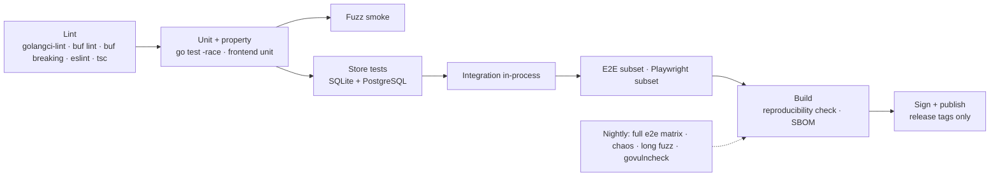

# 12 — Testing and quality

> Status: design, not implemented. Tags: [F] fact · [R] recommendation · [T] target · [V] verify at
> implementation ([README](../README.md#how-to-read-these-documents)). Performance targets are
> defined in [03-connections.md](03-connections.md#performance-budget); security controls in
> [04-security.md](04-security.md). This document defines how they are proven.

## Test strategy

**Definition of done** ([CONTRIBUTING](../CONTRIBUTING.md#definition-of-done), applied to every
change): the project builds cleanly with no new warnings, existing tests pass, new or changed
behaviour has tests that cover **error cases and edge conditions** (invalid input, boundary values,
failure paths) and not only the happy path, and anything that could not be run or verified is stated
in the change description.

| Layer | What | Examples | Runs |
|---|---|---|---|
| **Unit** | Pure logic, no network | Snapshot compiler, local-policy evaluation, authorization rules, framing encode/decode, backoff schedule, revision ordering, ClientHello routing decisions | Every commit |
| **Property** | Invariants over generated inputs | Compiler determinism (same database state, identity and capabilities → byte-identical snapshot and hash); unchanged resources keep equal hashes across unrelated edits; "latest wins" revision application never goes backwards without a new `db_epoch` ([03](03-connections.md#revisions-and-ordering)); DNS: the desired record set and plan hash are deterministic, applying a plan and planning again yields an empty plan, and no generated plan touches a foreign record ([15](15-dns.md)) | Every commit |
| **Fuzz** (Go native fuzzing) | Parsers facing untrusted or semi-trusted input | Stream framing (`varint ‖ protobuf`, size limits), `StreamOpen`/`StreamResult` handling, TLS ClientHello parser on the 443 peek path, local-policy parser (parse error ⇒ deny-all), importer inputs ([11](11-migration.md)), enrollment token format/checksum | Short smoke run per PR; long runs nightly; crashers become regression tests |
| **Store** | Database behaviour on both dialects | Migrations, privacy rules, composite foreign keys, atomic token consumption ([04](04-security.md#tokens)) | Every PR |
| **Integration** (in-process) | Controller + gateway + connector in one test binary, real sockets on loopback | Enrollment → session → route → traffic; reconciliation with `Rejected` (malformed snapshot) and last-known-good; local-policy blocks as resource-level `not_ready` with the snapshot `Applied`; policy reload; asynchronous drain after `Applied`; revocation via `DenyListUpdate`; DNS job against a **fake Cloudflare API** (an in-process HTTP server with pagination, 429 with `retry-after`, all-or-nothing batch failures, comment length limits, A/CNAME coexistence errors, pending and partial zones, injected latency and crashes between call and commit) | Every PR |
| **End-to-end** | Real processes/containers, real network impairment | [End-to-end topology matrix](#end-to-end-topology-matrix) | Subset per PR, full nightly |
| **Frontend** | SPA | Unit tests for form ↔ proto mapping (no field may be dropped on save), apply-status rendering; Playwright e2e against an all-in-one instance: first-user setup, login with MFA, enroll a connector, create a route, see `applied`, see a `rejected` reason, see a local-policy `not_ready` target with its command, revoke; [R] axe accessibility checks on every page | Unit per PR; Playwright per PR on a small set, full nightly |

### Database tests

- **Dual-dialect migrations.** Every migration is applied on SQLite and PostgreSQL, from an empty
  database and from the schema of every supported previous release with fixture data; the resulting
  schema must equal the Ent schema, and fixture data must survive ([06](06-data-model.md)).
  Regenerating the migrations from the Ent schema must yield no new file, a changed `atlas.sum` must
  be refused, and on SQLite a file that leaves a foreign-key violation must be rolled back
  ([06](06-data-model.md#migrations)).
- **Store scoping.** Without a scope, with a forged scope and with `privacy.DecisionContext` set,
  no row is reachable; plain SQL cannot make a row reference another org's row
  ([06](06-data-model.md#tenancy-enforcement)).
- **Cross-tenant leak suite.** Two orgs with identical resources. Generated from the service
  registry: every `Get`, `List`, `Update`, `Delete` and every streaming method is called by a user
  of org B with IDs from org A. Expected: `NotFound` (not `PermissionDenied`, so existence does not
  leak), empty lists, and no row of org A changed. A new RPC is covered automatically.
- **Authorization-annotation completeness.** A test walks every registered RPC and fails if one
  lacks the `(rpmgr.v1.authz)` option; the server also refuses to start in that case
  ([04](04-security.md#one-enforcement-point-with-defence-in-depth)).

## End-to-end topology matrix

The matrix runs controller, gateways and connectors as separate processes in containers, so that
restarts, kills and network impairment are real.

**Dimensions**

| Dimension | Values |
|---|---|
| Route type | `tcp`, `udp` (payloads below and above the datagram limit, [03](03-connections.md#udp-routes)), `http` (h1, h2, WebSocket, gRPC), `http` with ACME (against Pebble, the local ACME test server, as in [S6](spikes/S6.md); Phase 2: DNS-01 through the fake Cloudflare API with a test DNS server answering the challenges), `tls_passthrough`, private TCP, private UDP; Phase 2: `tcp` with `http_connect`, load-balanced routes with health checks |
| Transport | Each value of the transport setting: `auto`, `quic`, `h2`, also mixed per route on one connector ([03](03-connections.md#transport-selection)); QUIC; TLS + reverse HTTP/2 (all streams gateway-opened, connector-initiated streams via `OpenRequest`); WSS through a TLS-intercepting proxy test double, Phase 2 ([03](03-connections.md#transports-and-fallback)) |
| Scenario | Steady state; configuration change on an **unrelated** route; change on the **same** route; route removed (drain); gateway planned restart (`Drain`); gateway `SIGKILL`; controller down; controller restore with a new `db_epoch`; connector revoked; tightened access policy; target blocked by local policy; policy file edited and reloaded (no new revision); certificate expiry and grace re-authentication (fake clock); clock skew; UDP blackholed mid-session; NAT rebinding (source port change) |

**Assertions** (every cell):

- Data integrity: echo services verify checksums in both directions.
- **0 connection resets on unchanged routes** during configuration changes
  ([03](03-connections.md#configuration-reconciliation)).
- Half-close: after the client's FIN the service still delivers its remaining bytes
  ([03](03-connections.md#one-stream-per-user-connection)).
- `apply_status` reaches the expected state (`applied`, or `rejected` with the expected reason).
- Recovery times stay within the bounds implied by [03](03-connections.md#timeouts-keepalive-and-backoff)
  (e.g. when UDP is blocked, TCP is chosen within 300 ms plus the TCP+TLS handshake time).
- Security cells: revoked or tightened → affected connections closed immediately; local-policy
  block → snapshot `Applied`, target `not_ready(blocked_by_local_policy: <ip:port>)` and no dial
  attempt observed at the target; after `rpmgr policy allow-target` and the reload the target becomes
  `ready` without a new revision.

**Chaos tests** (nightly): random process kills, packet loss and reordering bursts, latency spikes,
controller database restarts, and clock jumps, while a load generator checks integrity and the
"0 resets on unchanged routes" invariant.

**Where the cells run.** The in-process integration tests live in `internal/itest`, the container
tests in `test/e2e` (Docker Compose, `tc netem`, IPv4 and IPv6). Each feature adds its cells to the
per-PR subset when it is built; the nightly run covers the full cross-product. Cells that need a
controlled clock (certificate expiry and grace re-authentication, clock skew) run in-process with
real traffic and a fake clock; clock jumps in chaos tests use the clock-offset hook of the
`rpmgrtest` build. Before the public API exists, end-to-end tests seed their configuration with the
`rpmgrtest` seeding command ([D60](14-open-decisions.md#security-defaults)).

## Benchmarks

The benchmark suite proves or disproves the targets in
[03-connections.md](03-connections.md#performance-budget). It also shows how the two transports
compare, which the documentation turns into a recommendation per kind of network; the default
transport itself is a setting ([ADR-0004](adr/0004-quic-default-transport-policy.md), D45).

**Testbed** (the reference testbed, D30): three short-lived 2-vCPU cloud VMs — **client**,
**gateway**, **connector + service** — with `tc netem` on the gateway↔connector link, run once on
x86-64 and once on arm64; plus a **Raspberry Pi 5** as connector for the CPU-constrained case. The
suite is the harness of spike S1 (tag `spike/s1`, [S1](spikes/S1.md)), moved to `bench/` in Phase 1
as a load generator that drives real `rpmgr` processes.

**Until the reference testbed runs** (VB-20, before v1.0.0), the suite runs on GitHub-hosted x86-64
and arm64 runners with `tc netem`, started by hand. Phase 1 measures the targets there; the results
are recorded as runner measurements, each missed target gets a recorded decision, and the release
regression check compares runner baselines and is reported, not blocking, for v0.x releases
([D49](14-open-decisions.md#project-and-process)).

| Axis | Values |
|---|---|
| RTT | 1, 20, 80, 200 ms |
| Loss | 0, 0.5, 1, 2 % |
| Systems | direct (no tunnel), rpmgr over QUIC, rpmgr over TLS + reverse HTTP/2 |
| Host settings | GSO on/off, UDP buffer sysctls applied/not applied ([03](03-connections.md#host-tuning-applied-by-the-installer)) |

**Workloads**

| Workload | Measures | Target in 03 |
|---|---|---|
| iperf3, 1 stream | Single-stream throughput | ≥ 80 % of a direct TCP connection at 0 % loss, for each transport |
| iperf3, 32 streams | Aggregate goodput under loss | QUIC ≥ 1.5 × the TCP + h2 transport at 1 % loss |
| Connect + echo at 1 000 connections/s | Connection-setup latency p50/p99 | p99 ≤ 1 × RTT + 2 ms |
| h2load against an HTTP route | Requests/s, latency, errors | — (baseline) |
| UDP at 1 200- and 1 400-byte payloads | Packets/s, loss, share sent on the oversize path | — (baseline) |
| 10 000 idle connectors on one gateway | Memory and CPU at idle | — (baseline) |
| 1 configuration change/s under load | Snapshot apply time, resets on unchanged routes | apply p99 ≤ 2 s for 1 000 routes; 0 resets |
| `SIGKILL` gateway, then controller, under load | Recovery time, lost connections | — (bounded by 03 failure modes) |

**Measurements**: throughput and latency from the tools; CPU cycles per byte via `perf stat` on the
gateway and connector, recorded per Gbit/s as a baseline for the release regression check
([03](03-connections.md#targets-t)); memory via the runtime metrics; GSO and buffer status via the
`rpmgr_quic_*` metrics ([10](10-operations.md#observability)).

**When**: the benchmarks run on the reference testbed, started by hand, **before every release**:
the full matrix, plus a regression check against the last release's baseline. A regression of more
than 10 % blocks the release ([RELEASING](../RELEASING.md#release-process)). Nightly CI runs on
GitHub-hosted runners, whose shared VMs are too noisy for a performance gate, so it runs correctness
only (end-to-end matrix, chaos tests, long fuzzing). **Results are recorded with the release**, and
a missed target is recorded, not hidden.

## Security testing

| Control | How it is tested |
|---|---|
| **Static analysis** | `golangci-lint` with `gosec`, plus `forbidigo` rules that fail the build on: `InsecureSkipVerify` anywhere outside test helpers (tests use a generated test CA instead), `math/rand` in packages handling keys, tokens or nonces, `secret.Value.Reveal()` outside an allow-listed set of packages ([04](04-security.md#secrets-at-rest-and-in-logs)), `privacy.DecisionContext` outside `internal/store`, because it skips Ent's privacy policies ([06](06-data-model.md#tenancy-enforcement)). |
| **Dependencies** | `govulncheck` on every PR and nightly; dependency updates via Dependabot with the same CI gates. |
| **Repository hygiene** | OpenSSF Scorecard; CI actions pinned by commit SHA; protected default branch. |
| **Secret scanning** | gitleaks in CI (and as an optional pre-commit hook), with custom rules for the token prefixes `rpmgr_enr_`, `rpmgr_pat_`, `rpmgr_sat_`, `rpmgr_ses_` (checksum makes matches reliable, [04](04-security.md#tokens)) and for private keys. |
| **TLS configuration** | Every `tls.Config` and `quic.Config` is built by a small set of constructors; tests assert TLS 1.3 only for internal sessions, client certificates required where specified, no `InsecureSkipVerify`, `Allow0RTT` false and no `ListenEarly`/`DialEarly`, `Renegotiation` never set, and every rpmgr check in `VerifyConnection`, none in `VerifyPeerCertificate` ([03](03-connections.md#properties-common-to-all-rpmgr-internal-sessions)). |
| **Security regression tests** | One test per security control listed below, named after the control. Examples below. A CI check lists every named test below that applies to the current phase, clause by clause, with the clauses of later phases named as deferred, and fails when one is missing from the code ([D61](14-open-decisions.md#project-and-process)). |
| **Test-only code** | Test root keys, the end-to-end seeding command and fault hooks (an agent that rejects snapshots, a clock offset) exist only under the build tag `rpmgrtest`; release builds refuse it ([D60](14-open-decisions.md#security-defaults)). |
| **Fuzzing** | See [Test strategy](#test-strategy); crashers are committed as regression inputs. |
| **Authorization** | Cross-tenant leak suite and annotation completeness test ([Database tests](#database-tests)). |
| **External review** | Sought before 1.0 (paid or sponsored); not a release gate (D28). Before 1.0 a documented self-review: threat model checked against the code, review of every security-sensitive package, a fuzzing campaign. The v1.0.0 release notes state whether an external review happened; its findings are tracked to closure. |

Examples of security regression tests:

| Test | Asserts |
|---|---|
| `TestNoReplayableHandshake` | A recorded control-session handshake replayed later does not yield a session (TLS 1.3, no 0-RTT) |
| `TestRejectsUnpinnedCA` | Enrollment and sessions fail against a server whose root does not match the pin |
| `TestRelaySeesCiphertextOnly` | Bytes observed at the gateway relay for a private service never contain the plaintext test pattern |
| `TestTokenScopesBoundedByCreator` | Minting a token with permissions the creator lacks fails; expiry > 1 year fails |
| `TestShellRequiresOwnershipGrantAndOptIn` | Shell open fails for another org's connector, without a grant, without host opt-in, without step-up, with a wrong Origin |
| `TestUnverifiedDomainRejected` | Creating a route on a hostname outside the org's verified domains fails |
| `TestBadSnapshotKeepsLastKnownGood` | A snapshot that fails preparation leaves all existing routes serving traffic |
| `TestSecretsNeverLogged` | Running the full integration suite with a log sink that fails on any known secret value or token prefix |

Regression tests for design-review findings:

| Test | Asserts |
|---|---|
| `TestEnroll_BundleWithExtraRootRejected` | A trust bundle containing the pinned root plus an extra root: only the pinned root is kept; a controller presenting a chain to the extra root fails enrollment; later roots from the `Enroll` response are accepted only if cross-signed by a trusted root |
| `TestH2_ConnectorInitiatedStreams` | On the reverse-HTTP/2 transport the connector never opens a stream: the session control stream is the gateway's first request, and `RELAY_OUT` / `CONTROL_PASSTHROUGH` work via `OpenRequest{open_id}`; the gateway never blocks at `MaxConcurrentStreams` |
| `TestTLS_WrongGatewayIDRejected` | A connector dialing gateway G1 (`ServerName` `<G1>.gateway.<td>`) rejects a valid certificate of gateway G2 from another group or org; no client uses `InsecureSkipVerify` |
| `TestDenyList_AppliedDespiteRejectedSnapshot` | An agent that rejects a malformed snapshot still applies a later `DenyListUpdate`; the deny-list never shrinks on a `db_epoch` change |
| `TestOTA_ReplayedOldManifestRejected` | A genuinely signed manifest with a lower `seq` is refused; the floor can be lowered only by a higher `seq`; the service user cannot write the binary or `/var/lib/rpmgr-update/` |
| `TestOTA_FreshHostReplayRejected` | On a freshly installed host that never updated, an old, genuinely signed manifest (lower `seq`) is refused: floor and `seq` were initialised at install time from the running version and its release `seq` |
| `TestOTA_SignedDowngradeAccepted` | A newly signed manifest with a higher `seq` that lowers the floor installs an older version; replaying any older manifest (lower `seq`) is refused; the automatic rollback to `.prev` after a failed health check works although `.prev` is below the floor |
| `TestOTA_StagedFileSwapTOCTOU` | While the updater runs, the service user replaces the staged artifact or plants a symlink; the updater reads through `openat2(RESOLVE_NO_SYMLINKS \| RESOLVE_BENEATH)`, verifies its root-only copy and installs only that copy, or aborts |
| `TestOTA_HostileStagingRefused` | A symlinked staging **directory**, a FIFO, a device file, or a file larger than the manifest's size or the 256 MiB cap is refused without hanging or filling the disk |
| `TestOTA_CrossFilesystemInstall` | With `/var` and the binary's directory on different filesystems, the update succeeds: the verified copy is written as `.rpmgr.new` in the target directory, fsynced, re-hashed and renamed there (no `EXDEV`) |
| `TestOTA_PackageOwnedBinaryRefused` | On a package install (`install.json` records the method), the updater refuses to replace the binary; updates come from the package manager |
| `TestOTA_UpdaterHonoursPolicy` | With `auto_update: off` in `policy.yaml`, the root updater refuses a staged update even if the agent staged it; rollback happens when the agent's `/readyz` (control session + applied snapshot) is not ready within 5 min |
| `TestRestore_RevocationsReapplied` | After restoring a backup taken before a certificate revocation, an API-token revocation, a member removal and a password change, all stay in effect (revocation log); restoring the same backup twice yields two different `db_epoch`s |
| `TestRestore_IncompleteLogFailsClosed` | With a broken sink hash chain, or an unreachable local log of a replica that reported an unshipped backlog: all API tokens and service accounts are suspended, all sessions invalidated, users must reset passwords and re-verify MFA, and the instance is in read-only restore review; entries present only in a reachable replica's local log are merged and re-applied |
| `TestRestore_OrgOwnerCannotEndInstanceReview` | During restore review an org Owner can re-confirm only their own org's memberships and roles and cannot end the instance-wide review; only the Instance Admin's `rpmgr restore confirm` on the controller host ends it |
| `TestRevocation_EnforcedWhileSinkDown` | With the shared sink unavailable, revoking a connector, removing a member and changing a password are committed and enforced immediately; the entries are in the replica's fsync'd local log; the "revocation log not yet off-host" alert fires and clears after shipping; sink sequence numbers have no gaps (conditional create of `<seq>`) |
| `TestDenyList_PersistedAcrossGatewayRestart` | A gateway restarted while the controller is down loads its persisted deny-list before accepting sessions and refuses a revoked connector whose certificate is still within its validity; a `DenyListUpdate` with a lower version or after a new `db_epoch` never removes an unexpired entry; entries disappear after the covered certificate's `NotAfter`; a digest mismatch in the control-session `Hello` triggers a resend |
| `TestEnrollReplace_TokenBoundToConnector` | A re-enrollment token minted for connector A cannot replace connector B; minting it requires step-up; after replacement the old certificates are revoked **by serial** and the new certificate keeps working |
| `TestBasicAuth_HashOncePerTTL` | Repeated requests with the same valid credentials cost one argon2id verification per 5 min (HMAC cache hit); failed attempts are rate-limited per client IP before hashing; concurrent hashing is capped per gateway |
| `TestBasicAuth_CacheScopedToPolicy` | A credential cached for org X's route on a shared gateway does not authenticate on org Y's route; ("al","ice1") and ("ali","ce1") produce different keys; tightening the policy flushes the cache immediately |
| `TestPrivateUDP_GatewaySeesCiphertextOnly` | Private UDP over the relay travels as frames inside `rpmgr-e2e`; no gateway-visible DATAGRAM frame carries private payload, and the test pattern never appears at the gateway |
| `TestFlowControl_StalledStreamsDoNotFreezeSession` | Three (or more) stream peers stop reading; other streams on the same session, including the session control stream, keep flowing; when unread bytes of streams without read progress for ≥ 30 s exceed 50 % of the connection window, those streams are reset oldest-first until below the threshold; the session is never taken out of service by application-level pings alone |
| `TestFlowControl_PausedClientNotResetWithoutPressure` | A suspended ssh client, a paused download and a slow consumer apply backpressure for minutes without window pressure and are not reset (only the route idle timeout applies) |
| `TestH2_AdmissionUnderBudget` | Reverse-HTTP/2 sessions are admitted against the process-wide window budget; when it is tight, new h2 sessions get smaller windows instead of exceeding the budget; public `h3` cannot consume the tunnels' QUIC budget share |
| `TestGateway_PerGatewayTunnelEndpoints` | Connectors dial each gateway of a group at that gateway's own `tunnel_endpoints` (and own WSS hostname) with `ServerName` `<gateway-id>.gateway.<td>`, and hold a session to every gateway; a group-level DNS/anycast name is never used for data sessions |
| `TestOpenRequest_Semantics` | On the TCP transport an `OpenRequest` is answered by `OpenRejected{open_id, code}` or a gateway-opened stream whose `StreamOpen` carries the `open_id` and the result; the connector writes no `StreamResult` on it; duplicate `open_id`s are rejected; an unanswered request times out after 10 s |
| `TestH2_ConnectorFINKeepsClientDirection` | On the TCP transport, after the connector's in-band FIN the gateway reads EOF (not a reset) and every byte the client still sends reaches the service; the connector never ends the HTTP response while the request is open ([S2](spikes/S2.md)) |
| `TestH2_ResetReturnsConnectionWindow` | With the connection window exhausted by stalled streams, resetting them on the gateway (cancel and close the response body) returns their unread bytes, and new streams and the control stream flow again |
| `TestH2_IdleStreamMemoryBounded` | With `MaxReadFrameSize` 16 KiB on both ends, 10 000 open idle streams on one session use less than 100 KiB per stream for both ends together (S2: 62 KiB) |
| `TestReauth_ExpiredWithinGrace` | Via SNI `reauth.controller.<td>`, a certificate expired less than 30 days ago is re-issued after a lost `Renew` response and after a restore; one expired longer, a revoked serial or a revoked identity is refused; the normal control endpoint never accepts an expired certificate |
| `TestReauth_SupersededSerialRefused` | After a newer serial of the same identity was seen in an authenticated session, `Reauth` with an older (leaked or cloned) certificate is refused, also after a restore (supersession marks re-applied from the revocation log) |
| `TestStatelessReset_DetectedWithinPingInterval` | After a gateway restart with the persisted reset key, an idle connector detects the dead session within 15 s (padded ≥ 64-byte session `Ping`), not after the 30 s idle timeout |
| `TestDNS_ForeignRecordNeverModified` | Over generated zones and source changes, the DNS job never updates or deletes a record outside its ledger; a foreign A, AAAA or CNAME at a desired name, or a foreign record next to a desired CNAME, yields `conflict` and no write |
| `TestDNS_CrossOrgPublishRefused` | A route hostname, DNS name or pending claim of org B under org A's managed zone produces no record and no challenge TXT in org A's zone; a nested claim approved by the Instance Admin does not change that |
| `TestDNS_PendingZoneIsNotProof` | Importing a `pending`, `partial` or `secondary` zone fails; a TXT record visible through the API but not at the authoritative nameservers does not verify a claim |
| `TestDNS_CrashRelinksByMarker` | A crash after the provider call and before the commit leaves a `creating` row; the next pass links the record by its marker instead of reporting a conflict; a marker-only record without a ledger row is `orphaned` and never deleted |
| `TestDNS_RestoreStartsHeld` | After a restore, every managed zone is `held`; the plan lists records created after the backup as orphaned and deleted ones as creates; nothing is written before approval; with `--dns-disabled` nothing is written at all |
| `TestDNS_DeletionGuard` | A pass removing the address records of more than `delete_threshold` names holds the zone; replacements do not count; `delete_threshold = 0` holds on every removal; an approval with a stale plan hash fails with `PLAN_CHANGED` |
| `TestDNS_FailStatic` | With the provider unreachable, rate-limited or refusing the token, no record is deleted or changed and published names stay published; the next successful pass converges |
| `TestDNS_RateBudgetAndRetryAfter` | The job and DNS-01 together stay within the per-provider budget; after a 429 no call is made before `retry-after` |
| `TestDNS_BatchFallbackPerRecord` | A batch with one invalid record fails all-or-nothing at the fake API; the retry applies every other record and marks only the failing name `error` |
| `TestDNS_LeaseCheckedBeforeBatch` | A replica whose `dns` lease expires within the safety margin sends no batch; after takeover the new holder starts with a full pass |
| `TestDNS_ProxiedOnlyForHttp` | `dns_proxied` is refused on zones that do not allow it; tcp, udp and `tls_passthrough` hostnames and DNS names are never proxied; a hostname whose `http` routes disagree keeps its published proxy state |
| `TestDNS_ReservedNamesNeverWritten` | The controller's public URL and aliases, the agent endpoints and `_acme-challenge.*` names are never written, even when a route or DNS name asks for them |
| `TestDNS_TokenWriteOnlyAndBaseURLFixed` | The provider token is never returned by any API, export or log; a release build has no setting or flag that changes the Cloudflare API URL |
| `TestGateway_CFConnectingIPOnlyForProxiedFromCloudflare` | `CF-Connecting-IP` sets the client address only for `dns_proxied` routes and only from a peer in the Cloudflare ranges of the snapshot; from any other peer, or on another route, it is ignored and IP rules see the TCP peer; `X-Forwarded-For` from Cloudflare peers is not trusted |
| `TestTransport_PinnedRouteUsesPinnedSessions` | On a connector whose effective transport is `auto` (QUIC), a route pinned to `h2` is served only over the connector's h2 sessions and the other routes only over QUIC; the most specific level wins (route over connector over instance) ([03](03-connections.md#transport-selection)) |
| `TestTransport_PinNeverFallsBack` | With UDP blocked, a route pinned to `quic` is `not_ready(transport_unavailable: quic)` and no stream of it goes over h2, while a route on `auto` moves to h2 ([03](03-connections.md#transport-selection)) |
| `TestTransport_ChangeKeepsOpenConnections` | Changing the instance default, a connector's or a route's transport moves new user connections at once; open connections finish on their session; a session no route needs is closed only after its last stream; unchanged routes see 0 resets ([03](03-connections.md#transport-selection)) |
| `TestACME_ValidationWaitsForEveryGateway` | For HTTP-01 and TLS-ALPN-01 the CA is asked to validate only after every gateway serving the name acknowledged its `AcmeChallenge`; a gateway without a control session, or one that does not acknowledge within the deadline, fails the order without a validation request; gateways keep challenges in memory only and never read the database ([03](03-connections.md#service-sketch), [S6](spikes/S6.md)) |
| `TestACME_DNS01OnlyManagedZones` | Hostnames in managed zones are issued via DNS-01 through the zone's provider; other hostnames keep HTTP-01/TLS-ALPN-01; the challenge TXT is removed after issuance |
| `TestPolicy_MetadataAlwaysDenied` | Targets 169.254.169.254, `fd00:ec2::254`, `100.100.100.200`, link-local fe80::/10 and IPv4-mapped forms such as `::ffff:169.254.169.254` are denied unless explicitly listed, even inside an allowed CIDR |
| `TestOTA_ChannelAndVariantEnforced` | A host with `update_channel: stable` refuses a manifest with `channel: prerelease`; a connector-variant install refuses a `full` artifact and a full install refuses a `connector` artifact, even when both are genuinely signed ([04](04-security.md#over-the-air-updates)) |
| `TestPolicy_AutoUpdateAndChannelDefaults` | With no policy file, the connector allows no target and the root updater behaves as `auto_update: auto` and `update_channel: stable`; the installer always writes `auto_update` explicitly ([04](04-security.md#connector-local-policy)) |
| `TestRevocationLog_SingleNodeWithoutSink` | On a single node without a sink, every revocation is enforced and appended to the local `revocations.log`; the UI shows the standing hardening warning and the "not yet off-host" alert never fires; a second controller replica refuses to start while no sink is configured ([04](04-security.md#revocation-log)) |
| `TestGatewayGroup_MaxFourGateways` | Adding a fifth gateway to a gateway group is refused by the store ([03](03-connections.md#multiple-gateways)) |
| `TestDomain_TrustedOnlyByInstanceAdmin` | Only the Instance Admin, with step-up, can mark a domain `trusted`; an org Owner cannot; a trusted domain still obeys global uniqueness ([04](04-security.md#route-and-hostname-ownership)) |
| `TestTLS_VerifyConnectionOnResumption` | A resumed TLS 1.3 session runs `VerifyConnection` on both sides; an identity revoked after the first handshake is refused on resumption; a ticket is not resumed after its certificate expired ([S7](spikes/S7.md)) |
| `TestSPIFFE_TrustDomainExact` | A certificate whose URI SAN host is a sub-domain of the trust domain, which the name constraint admits, is refused by `VerifyConnection`; a URI or DNS name outside the trust domain is refused by the name constraints ([S7](spikes/S7.md)) |
| `TestReauth_NoSessionTickets` | The `reauth.controller.<td>` configuration issues no session ticket and resumes none, not even a ticket from `controller.<td>` ([S7](spikes/S7.md)) |
| `TestCSR_BoundToConnection` | `Enroll`, `Renew` and `Reauth` refuse a CSR without the connection's `tls-exporter` value, with an altered value, or captured on another connection ([S7](spikes/S7.md)) |

## Continuous integration

CI runs on **GitHub Actions**, on GitHub-hosted runners. Benchmarks are not part of CI; they run on
the reference testbed ([Benchmarks](#benchmarks)).

- **Protobuf**: `buf lint` and `buf breaking` against the default branch; a breaking change to
  `rpmgr.v1` or `rpmgr.agent.v1` fails CI unless it comes with a new package or ALPN version
  ([03](03-connections.md#versioning-and-capabilities)). Before v1.0.0, a PR labelled `breaking`
  with `!` in its title may pass ([D56](14-open-decisions.md#engineering)).
- **Go**: `go vet`, `go test -race` for all packages; `CGO_ENABLED=0` builds for every release
  platform. Windows and macOS connector builds are compiled from Phase 1 on (build only); their
  end-to-end tests start in Phase 2, when those platforms ship
  ([05](05-features.md#platform-support)).
- **Migrations** on both dialects, as described in [Database tests](#database-tests).
- **Reproducibility**: the release build runs twice in separate environments and the artifacts'
  SHA-256 must match.
- **Supply chain**: SBOM generation, SLSA provenance, signing of the release manifest and cosign
  signatures happen only on release tags, with the signing keys outside CI
  ([04](04-security.md#supply-chain-and-updates)).
- **Docs**: link check and Mermaid rendering for `docs/`, so design documents stay valid as they
  evolve.
- **Repository rules** ([CONTRIBUTING](../CONTRIBUTING.md)): the PR title and the header of every
  commit in the PR are valid Conventional Commit headers of at most 72 characters, and no fix-up
  commit is left; the branch name matches the allowed patterns, and a PR from a `tmp/` branch fails;
  a PR changes `CHANGELOG.md` or carries the `no-changelog` label
  ([RELEASING](../RELEASING.md#changelog)); a PR with 400–800 lines of production code gets a
  warning, and one above 800 fails unless it is labelled `mechanical`
  ([D53](14-open-decisions.md#project-and-process)); every commit carries a DCO `Signed-off-by:`
  line of its author (commits of the dependency bot are exempt); every source file starts with an
  `SPDX-License-Identifier: Apache-2.0` header; on release tags, the tag matches the release pattern
  and the changelog has a section for it. The dependency bot groups its updates per ecosystem under
  the prefix `build(deps)` (`ci(deps)` for actions), so its titles pass the same rules
  ([D55](14-open-decisions.md#project-and-process)).
- **Gate**: nothing merges to `main` unless all per-PR stages pass; nightly failures open an issue
  automatically.

**Implemented so far.** CI covers the repository itself and, from Phase 1 on, the Go code. Each
check is a script in `.github/scripts/` that runs the same way on a developer machine (the
Docker-based ones need Docker), and `test-checks.sh` tests the checks with valid and invalid input.

| Workflow and job | Checks | Script |
|---|---|---|
| `pr-rules` / `pr-rules` | PR title, branch names, commit headers, DCO sign-off, changelog or `no-changelog` (labels read when the check runs); re-runs when the title or labels change, and no run is cancelled, so the newest run never blocks a merge as cancelled | `check-pr-title.sh`, `check-branch-name.sh`, `check-commits.sh`, `check-dco.sh`, `check-changelog.sh` |
| `ci` / `lint` | SPDX headers; actionlint (with shellcheck) and actions pinned by commit SHA; tests of the checks | `check-spdx.sh`, `check-workflows.sh`, `test-checks.sh` |
| `ci` / `docs` | Relative links and heading anchors in all Markdown files (lychee, offline); every Mermaid diagram renders (mermaid-cli) | `check-links.sh`, `check-mermaid.sh` |
| `ci` / `secrets` | gitleaks over the full history, with the rules in `.gitleaks.toml` | `check-secrets.sh` |
| `ci` / `go` | gofmt, a tidy `go.mod`, `go vet`, the banned TLS and QUIC settings (`InsecureSkipVerify`, `VerifyPeerCertificate`, `Renegotiation`, 0-RTT; also as composite-literal keys, which forbidigo does not see), `go test -race`; a 10 s run of every fuzz target; golangci-lint with gosec, errorlint, bodyclose, depguard (`math/rand` and `math/rand/v2` in `internal/{authz,pki,secret,token,tunnel}`) and forbidigo (`secret.Value.Reveal` outside its allow-list, `privacy.DecisionContext` outside `internal/store`) ; govulncheck on the code paths rpmgr calls | `check-go.sh` (with `tools/bannedapi`), `check-fuzz.sh`, `check-golangci.sh`, `.golangci.yml`, `check-govulncheck.sh` |
| `ci` / `proto` | `buf lint` (STANDARD); `buf breaking` (FILE) against `main`, passed only by a PR labelled `breaking` with `!` in its title before v1.0.0 (D56); the code in `gen/` regenerated and compared. buf runs at a pinned version through the go command, the generators are tool dependencies in `go.mod` | `check-buf.sh`, `buf.yaml`, `buf.gen.yaml` |
| `ci` / `build` | `go build` and `go vet` of every package, tests included, with `CGO_ENABLED=0` for linux/{amd64,arm64,armv7,riscv64}, windows/amd64 and darwin/{amd64,arm64} | `check-build.sh` |
| `ci` / `go-arm64` | Every test natively on a GitHub-hosted arm64 runner, with the race detector, and again for armv7 on the same host | `check-test-arch.sh` |
| `nightly` / `govulncheck`, `fuzz`, `riscv64` | govulncheck against the latest vulnerability database; every fuzz target for 10 minutes; every test for riscv64 under QEMU user-mode emulation. A failure opens the issue "Nightly run failed", or comments on the open one. Also started by hand | `check-govulncheck.sh`, `check-fuzz.sh`, `check-test-arch.sh` |
| `scorecard` / `analysis` | OpenSSF Scorecard, weekly and on every push to `main`; results in the code-scanning alerts and the public Scorecard API | — |

The jobs `pr-rules`, `lint`, `docs`, `secrets`, `go`, `proto`, `build` and `go-arm64` are required
status checks of the `main` ruleset; each new job is added to the ruleset by the maintainer once its
PR is merged. Tool images are pinned by digest in the scripts and actions by commit SHA; Dependabot
updates the actions. The race detector needs cgo for its runtime; release builds stay
`CGO_ENABLED=0`. The web and migration stages and the size check are added by their Phase 1 slices.
