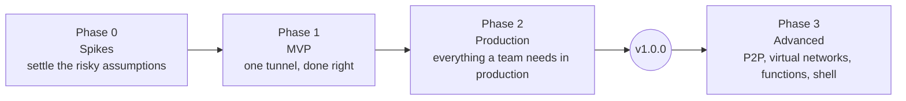

# 13 — Roadmap

> Status: design, not implemented. Tags: [F] fact · [R] recommendation · [T] target · [V] verify at
> implementation ([README](../README.md#how-to-read-these-documents)).

## Approach

rpmgr is built in four phases. Each phase ends with explicit **exit criteria**; the next phase starts
only when they are met or a recorded decision waives one.

rpmgr has a single maintainer (D27). There are no dates: each phase ends when its exit criteria are
met, not on a deadline.

**Versioning:** releases are `v<major>.<minor>.<patch>` (SemVer, [RELEASING](../RELEASING.md)).
Phases 1 and 2 ship `v0.x` releases; **v1.0.0** is cut at the end of Phase 2, after the documented
security self-review; an external review is sought but is not a gate (D28). From v1.0.0 on, the
public API (`rpmgr.v1`) and the agent protocol (`rpmgr-tunnel/1`) follow the compatibility rules in
[07](07-api.md#versioning-and-compatibility) and [10](10-operations.md#upgrades-and-version-skew).

## Phase 0 — spikes

Small, throw-away prototypes that answer the questions the design depends on. The maintainer runs
every spike. Each spike produces a short written result (`docs/spikes/Sx.md`, from
[`docs/spikes/TEMPLATE.md`](spikes/TEMPLATE.md)) and updates the ADR it decides, from *Proposed* to
*Accepted* or to a changed decision. The **Rule** column was agreed before the spikes run (closed
decisions in [14](14-open-decisions.md)): a spike result applies its rule and leaves nothing to
decide.

How spikes run, also agreed before they start:

- **Workflow** ([CONTRIBUTING](../CONTRIBUTING.md#spikes), D36): one issue per spike; the code on
  a `tmp/` branch that is never merged and is kept as the archive tag `spike/sx`; the result, the
  ADR and the affected documents in one PR.
- **Versions** (D39): a spike pins the current releases of what it tests and re-checks, at those
  versions, every `[F]` fact its decision rests on; a re-checked fact cites the new version inline.
- **External parts** (D37): S1 needs the reference testbed (D30), and S6 needs Let's Encrypt
  staging and a real test zone. The harness and a local dry run come first; the maintainer runs
  the external parts afterwards. A local dry run never decides a rule: until the external run,
  the spike stays *Running* and its ADR *Proposed*.
- **Platforms and clients** (D38): S8 runs arm64, armv7 and riscv64 under QEMU user-mode emulation
  when no such hardware is at hand, and arm64 again on the Raspberry Pi 5 of the reference
  testbed. In S3, "real clients" are headless Chromium and Firefox, whose TLS stacks are those of
  Chrome and Firefox, plus curl and Go's `crypto/tls`.

| ID | Question | Method | Pass criteria | Decides | Rule |
|---|---|---|---|---|---|
| **S1** | Is QUIC (quic-go) or TLS + reverse HTTP/2 the better default transport, and by how much? | Benchmark subset from [12](12-testing-and-quality.md#benchmarks): RTT {1, 80} ms × loss {0, 1} %, 1 and 32 streams, CPU per Gbit/s, on the reference testbed (D30, [12](12-testing-and-quality.md#benchmarks)) | Data sufficient to set the default transport policy; numbers recorded | [ADR-0004](adr/0004-quic-default-transport-policy.md), D19 | QUIC and TCP + h2 are compared head-to-head on four metrics: single-stream throughput, 32-stream goodput at 1 % loss, connection-setup latency p99 and CPU per Gbit/s ([03](03-connections.md#targets-t)); the default is the transport that wins more of the four; a tie keeps QUIC |
| **S2** | Does reverse HTTP/2 (connector as h2 server on a connection it dialled) give full-duplex streams with half-close and reset semantics? | Prototype with `x/net/http2`: 1 GiB in both directions concurrently; half-close each side; abort mid-stream; gateway-opened session control stream and `OpenRequest`-driven streams for connector-initiated opens; tuned windows and stream limits set on a `ClientConn` over an existing connection; behaviour at the stream limit; stall detection under connection-window pressure; how much of the extra round trip a first chunk carried in `OpenRequest` hides | Correct bytes, FIN and RST mapping in all cases; no deadlock under flow-control pressure; never blocks at the stream limit | [ADR-0005](adr/0005-reverse-http2-fallback.md) | Pass: reverse HTTP/2 as designed. Fail: a patched yamux |
| **S3** | Can the gateway multiplex TCP/443 and UDP/443 as designed? | ClientHello peek with real clients (headless Chromium and Firefox, curl, Go; D38) incl. post-quantum key shares; SNI-based certificate selection with `GetConfigForClient`; one quic-go listener serving `h3` and `rpmgr-tunnel/1` | All clients routed correctly; peek within limits; both ALPNs served from one UDP socket | [03](03-connections.md#port-443-multiplexing), [ADR-0004](adr/0004-quic-default-transport-policy.md) | If one quic-go listener cannot serve both ALPNs well, tunnels move to a separate UDP port (gateway boot-file key `listen.tunnel_udp`, [10](10-operations.md#boot-files)) |
| **S4** | Does ConnectRPC carry the agent control session? | Bidirectional stream over `net/http` HTTP/2 with mutual TLS: cancellation, deadlines, message-size limits, HTTP/2 PING liveness, 10 000 concurrent idle sessions (memory); behaviour behind a TLS-passthrough route | All behaviours correct; memory per idle session recorded | [ADR-0010](adr/0010-connectrpc.md), D20 | ConnectRPC if every check passes; otherwise grpc-go for the agent protocol only |
| **S5** | Do Ent + Atlas deliver the data model on both dialects with tenancy enforced in one place? | Subset schema (orgs, connectors, routes, targets) with composite foreign keys, an `OrgScope` privacy rule, migrations generated and linted for SQLite and PostgreSQL; check which Atlas features the Apache-2.0 community build provides | Cross-org access impossible through the store; migrations apply cleanly on both | [ADR-0011](adr/0011-sqlite-postgres-ent-atlas.md), [ADR-0012](adr/0012-org-scoped-tenancy.md), D18 | Ent + Atlas, using only Apache-2.0 parts (Ent, the `ariga.io/atlas` Go library). If Atlas CLI features we need are missing from the community build, migrations are generated through Ent's Go API. If Ent itself fails (privacy rules, composite foreign keys): bun |
| **S6** | Can certmagic run on the controller with database storage while gateways answer the challenges? | Pebble (local ACME test server), then Let's Encrypt staging: HTTP-01 and TLS-ALPN-01 answered by a gateway; DNS-01 through rpmgr's libdns adapter over the Cloudflare client (fake Cloudflare API with Pebble, then a real test zone with staging), with a second certmagic configuration for HTTP-01/TLS-ALPN-01 on the same storage, chosen per name; locking with two controllers | Certificates issued and renewed for both kinds of names, including a wildcard; no duplicate orders under concurrency | [04](04-security.md#controller-certificates), [08](08-software-stack.md#networking), [15](15-dns.md#acme-dns-01), [ADR-0015](adr/0015-dns-provider-integration.md), D17 | certmagic on the controller. If gateway-answered challenges cannot work with certmagic: acmez (certmagic's ACME library) with rpmgr's own solvers and storage |
| **S7** | Does the PKI behave as designed? | Issue and renew 7-day leaf certificates with new keys; URI and DNS name constraints enforced by Go's verifier; per-identity DNS SANs with `ServerName` set per peer; `VerifyConnection` runs on resumed TLS sessions and rejects a revoked identity; `Reauth` endpoint accepting certificates expired within the grace period and nothing older, and refusing superseded serials; CSR bound to the TLS session via exported keying material | All checks pass; revocation effective on resumed sessions | [ADR-0008](adr/0008-internal-ca-mtls-spiffe.md) | Name constraints not enforced: rely on the `VerifyConnection` checks only. `VerifyConnection` not run on resumed sessions: TLS resumption disabled for internal sessions. CSR binding works: mandatory for `Enroll`, `Renew` and `Reauth`; otherwise not used |
| **S8** | Does pure-Go SQLite cover the controller's platforms? | Current `modernc.org/sqlite` on linux/amd64, arm64, armv7, riscv64 (QEMU user-mode emulation where no hardware is at hand; arm64 also on the Raspberry Pi 5, D38): test suite, WAL, `VACUUM INTO` | Tests pass on the supported platforms; unsupported ones documented | [ADR-0011](adr/0011-sqlite-postgres-ent-atlas.md) | The controller ships only on platforms that pass; the others are documented as unsupported |
| **S9** | How do controller replicas share session ownership? (Run at the **start of Phase 2**.) | PostgreSQL `LISTEN/NOTIFY` (or polling-free alternative) for the session registry and push fan-out; controller-to-controller mutual TLS for imperative operations; revocation-log shipping to the shared sink with conditional-create sequencing; kill a replica under load | An agent's push reaches it within 1 s of commit; failover within the reconnect backoff | [10](10-operations.md#high-availability) | If `LISTEN/NOTIFY` is insufficient: push fan-out over controller-to-controller mutual TLS |

**Exit criteria:** S1–S8 have written results, including the maintainer's external runs for S1
and S6 (D37); every affected ADR is *Accepted* or changed; the documents in this folder are
updated to match.

## Phase 1 — MVP

"One tunnel, done right": the smallest product that is secure, correct under change, and useful for
a homelab or a small team.

**Scope** (everything tagged P1 in [05](05-features.md#feature-catalogue)):

- **Linux only** (D29): every role on amd64 and arm64; connectors on armv7 and riscv64 best effort
  ([05](05-features.md#platform-support)).
- `rpmgr controller`, `gateway`, `connector`, `all-in-one`; SQLite.
- Enrollment with CA pin; internal CA; 7-day certificates with renewal; deny-list.
- Control session with reconciliation, revisions, apply status, last-known-good.
- Data sessions: QUIC and TLS + reverse HTTP/2, happy eyeballs; multiple gateways per group
  (the WSS transport for TLS-intercepting proxies follows in Phase 2).
- Routes: `http` (ACME HTTP-01/TLS-ALPN-01 and uploaded certificates), `tcp`, `udp`,
  `tls_passthrough`; port pools; TCP/UDP/443 multiplexing.
- Targets: address and unix socket; HTTP/HTTPS (verified)/h2c upstreams; PROXY protocol.
- Access policies: IP rules and basic auth. Domain verification; trusted domains (D13). Port
  quotas per org and gateway group.
- Connector-local policy.
- Web UI: overview, routes, connectors, gateways, domains and certificates, members, audit log,
  settings (including PKI), YAML view. English only (D32).
- Local accounts, TOTP, roles, sessions, step-up; personal API tokens for the CLI. Invitations and
  password resets as one-time links; e-mail only if SMTP is configured.
- Audit log with hash chain and signed checkpoints stored locally; Prometheus metrics; traffic
  rollups.
- Signed releases; install scripts and binaries served by the controller; backup and restore.

**Exit criteria:**

- End-to-end topology matrix ([12](12-testing-and-quality.md#end-to-end-topology-matrix)) green for
  all P1 route types on QUIC and on TCP/h2, including **zero resets on unchanged routes**.
- Every [T] target in [03](03-connections.md#targets-t) measured; each miss has a recorded decision.
- Every security regression test in [12](12-testing-and-quality.md#security-testing) that applies
  to P1 scope passes.
- Lint bans (`InsecureSkipVerify`, `.Reveal()` outside allowed packages) active in CI.
- Threat model reviewed against the implementation.
- An upgrade from one P1 release to the next tested with live traffic.

## Phase 2 — production

Everything a team needs to run rpmgr in production.

**Scope** (P2 in [05](05-features.md#feature-catalogue)):

- Several targets per route, health checks, passive health.
- OIDC forward-auth on routes; bandwidth, connection and rate limits; require-header rule.
- Private services (TCP, UDP) with visitor grants and end-to-end TLS.
- `tcp` routes in `http_connect` mode; header-based HTTP matching; ACME DNS-01; custom error pages.
- Live logs; webhooks; audit export and external audit sinks.
- Staged, signed over-the-air updates with rollback, for Linux script installs; update channels
  (`stable`, `prerelease`).
- Optional connector-only build (D21).
- Windows service and macOS launchd connectors (winget/MSI, Homebrew); no OTA for them before
  Phase 3 (D29).
- `.deb` and `.rpm` packages from a signed repository.
- PostgreSQL and multiple controller replicas (S9 first); `rpmgr migrate-db` from SQLite to
  PostgreSQL; KEK from HashiCorp Vault or OpenBao Transit.
- Importers ([11](11-migration.md)); declarative manifests.
- DNS automation with Cloudflare: providers, managed zones, route records, DNS names, adopt and
  release, plan approval, proxied `http` routes ([15](15-dns.md)).
- Service accounts and their tokens; OIDC SSO for the UI; WebAuthn; multi-org UI with shared
  gateway groups and grants (D14); delegated base-domain labels and Instance-Admin approval of
  nested claims (D23).

**Exit criteria:**

- Every feature marked P2 in [05](05-features.md#feature-catalogue) implemented and tested.
- Importers tested against real source configurations and databases (SQLite, MySQL, PostgreSQL)
  ([11](11-migration.md)).
- HA failover tested: killing a controller replica drops no tunnelled connection.
- Cross-tenant leak suite green with two orgs.
- DNS automation tested against the fake Cloudflare API in CI and against a real test zone: no
  foreign record is ever modified, and VB-09–VB-12 have recorded results.
- Documented self-review completed: threat model checked against the code, review of every
  security-sensitive package, a fuzzing campaign. An external security review is sought (paid or
  sponsored) but is not a gate (D28); its findings, if any, are addressed, and the v1.0.0 release
  notes state whether it happened → **v1.0.0**.

## Phase 3 — advanced

Each item is independent and can be scheduled on its own. Each item gets its detailed design in
these documents before it is implemented ([CONTRIBUTING](../CONTRIBUTING.md#documenting-features));
a Phase 3 sketch is a plan, not an open question.

| Item | Depends on | Notes |
|---|---|---|
| P2P upgrade for private services | Private services (P2) | Relay stays the fallback |
| Virtual networks (WireGuard) | Local policy `allow_vnet_routes` | Linux first; keys generated on agents |
| Edge functions (`workerd`) | Signed release manifest distributes the runtime | `allow_functions` |
| Remote shell | Shell grants, step-up, WebSocket ticket | Off by default; see [14](14-open-decisions.md) |
| SSH ad-hoc tunnels | User SSH keys | `ssh -R` to a gateway, authenticated by users' registered SSH keys |
| Egress proxy and static file targets | `allow_egress_proxy`, path allow-list | |
| HTTP/3 ingress | S3 | Shares UDP/443 |
| Terraform provider | Stable `rpmgr.v1` | |
| Socket hand-off on gateway restart | — | [V VB-08] |
| More DNS providers; per-gateway public addresses with health-aware DNS records; DNS for gateway tunnel and WSS hostnames; Authenticated Origin Pulls | DNS automation (P2) | [15](15-dns.md), D22, D25 |
| Active connections view | — | |
| OTA for Windows and macOS connectors | Windows and macOS connectors (P2) | Needs a root-equivalent updater per platform (D29) |
| Helm chart | OCI images | [00](00-vision-and-scope.md#non-goals) |
| Cloud KMS providers (AWS, GCP, Azure) for the KEK | KMS interface (P2) | By demand ([04](04-security.md#secrets-at-rest-and-in-logs)) |

## Verification backlog

`[V]` items that do not need a Phase 0 spike. Each is checked when the related feature is
implemented, and the result recorded in the PR.

| ID | Item | Where used |
|---|---|---|
| VB-01 | Choose a maintained WebAuthn library and check its attestation and passkey support | [04](04-security.md#human-authentication-and-sessions) |
| VB-02 | ~~Minimum Go version that provides `http.CrossOriginProtection`~~ **Resolved:** present in Go 1.25 [F Go 1.25.14 `net/http/csrf.go:36`] | [04](04-security.md#human-authentication-and-sessions) |
| VB-03 | systemd `LoadCredentialEncrypted=` and TPM sealing availability on the [supported distributions](10-operations.md#supported-platforms) (assumed: systemd ≥ 250; the installer falls back to the `file` KEK source) | [04](04-security.md#secrets-at-rest-and-in-logs), [10](10-operations.md#install) |
| VB-04 | Go protobuf support for the `debug_redact` field option in text and JSON output | [04](04-security.md#secrets-at-rest-and-in-logs) |
| VB-05 | Tooling for cosign signatures, SLSA provenance and SBOM generation in the release pipeline | [04](04-security.md#release-signing), [ADR-0013](adr/0013-signed-ota.md) |
| VB-06 | connect-query maturity with TanStack Query; fallback: thin hand-written hooks over generated clients | [08](08-software-stack.md#frontend), [ADR-0014](adr/0014-vite-react-spa.md) |
| VB-07 | CodeMirror 6 under the strict CSP (style nonces) | [09](09-web-ui.md), [ADR-0014](adr/0014-vite-react-spa.md) |
| VB-08 | Listening-socket hand-off across gateway restarts (TCP straightforward; UDP/QUIC harder) | [05](05-features.md#operations) |
| VB-09 | Cloudflare rate-limit scope: whether account-owned tokens have their own budget, and how a 429 caused by rpmgr affects the same user's dashboard and other tokens | [15](15-dns.md#batches-failures-and-the-rate-budget) |
| VB-10 | Cloudflare record comments and batches: the marker round-trips unchanged; a batch patch can change the comment alone; which operation a failed batch reports; listing by comment | [15](15-dns.md#ownership-ledger) |
| VB-11 | Cloudflare proxy: a proxied CNAME to a name in another Cloudflare account (error 1014 or not); proxied wildcards on all plans; request-size and timeout limits that affect routes; whether ACME HTTP-01 reaches the origin through the proxy | [15](15-dns.md#proxied-http-routes) |
| VB-12 | Cloudflare zones and tokens: adding a zone needs no proof of ownership (assumed); partial, secondary and child-zone behaviour; `GET /zones` paging with more than 50 zones; `moved` zones; verifying account-owned tokens; whether a token can be scoped below a zone | [15](15-dns.md#connecting-importing-and-disconnecting) |
| VB-13 | Produce minisign-format Ed25519 signatures with the chosen hardware token, for signing-key statements and release manifests; fallback: rpmgr's own documented raw Ed25519 signature format | [04](04-security.md#release-signing), [ADR-0013](adr/0013-signed-ota.md) |
| VB-14 | The package name `rpmgr` is free in Debian, Fedora, Homebrew, winget and GHCR | [ADR-0001](adr/0001-name-rpmgr.md) |
| VB-15 | `/install.sh` verification chain (root key → signing-key statement → manifest → SHA-256) with OpenSSL ≥ 3.0 (Ed25519 `pkeyutl -rawin`, BLAKE2b-512 prehash) on the supported distributions | [04](04-security.md#install-scripts) |
| VB-16 | protovalidate-es maturity as the react-hook-form resolver; fallback: hand-written zod schemas | [09](09-web-ui.md), [08](08-software-stack.md#frontend) |
| VB-17 | An IANA Private Enterprise Number registered for rpmgr before Phase 1, for the OID of the CSR-binding extension; S7 used 32473, the number reserved for documentation (RFC 5612) | [04](04-security.md#flow), [S7](spikes/S7.md) |

## Risks

| Risk | Impact | Mitigation |
|---|---|---|
| quic-go throughput or CPU cost below targets (NewReno, no GRO, ~1 core per session) | Slower than a direct connection on bulk transfers | S1 decides the default; TCP/h2 is first-class; several sessions per connector; transport selectable per route |
| quic-go API changes (pre-1.0) | Churn in the tunnel layer | Wrapped behind `internal/tunnel`; pinned versions; upgrade with the e2e matrix |
| ConnectRPC unsuitable for the agent stream | Rework of the control session | S4; grpc-go fallback keeps the same protobuf contract |
| Ent/Atlas complexity or limits | Slower data-layer work | S5; bun fallback; the schema is plain SQL underneath |
| Scope: Phase 3 items (WireGuard mesh, `workerd`) are each large | Delays v1.0 | Phase 3 starts only after v1.0.0; each item is independent |
| Release-signing key custody | Compromised or lost update keys | One maintainer holds two offline root keys on two hardware tokens, one of them off-site; either can sign alone; signing-key rotation without new binaries ([04](04-security.md#release-signing), D10) |
| Single maintainer (bus factor 1) | Development and releases stop if the maintainer is unavailable | Design documents, ADRs and runbooks written down; two root tokens in two places; Apache-2.0, so others can fork and continue |
| Users of other tunnel tools expect wire compatibility | Adoption friction | Importer and parallel-run cutover plan ([11](11-migration.md)) |
| A DNS-job bug deletes or rewrites production DNS records | Outage of the published names, possibly of mail or other services | Owned records only; ledger plus marker; deletion guard and held zones; fail-static; property tests and the fake Cloudflare API in CI ([15](15-dns.md)) |
| A DNS-provider token leaks | Takeover of every name in the token's zones | Write-only, KEK-encrypted storage; zone-scoped, IP-restricted, expiring tokens; managed zones separate from mail zones ([04](04-security.md#threat-model)) |
| Cloudflare API changes or rate limits | DNS automation fails or slows down | Own small client behind the `Provider` interface; fail-static; budget well below the limit; VB-09–VB-12 |
