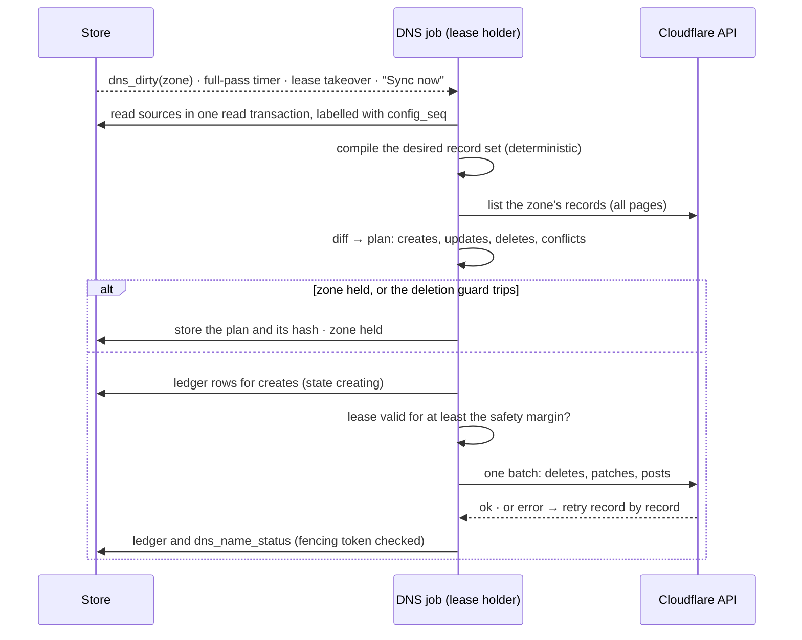
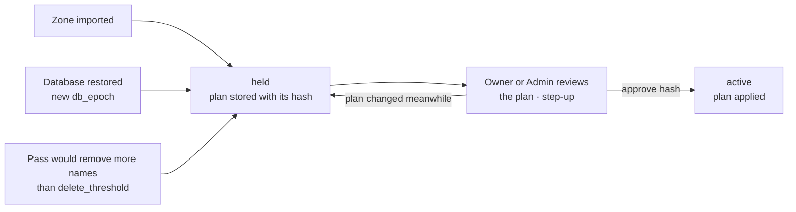

# 15 — DNS automation

> Status: design, not implemented. Tags: [F] fact · [R] recommendation · [T] target · [V] verify at
> implementation ([README](../README.md#how-to-read-these-documents)).
>
> **This document is the single source of truth for DNS automation timers and limits.** The
> decision is [ADR-0015](adr/0015-dns-provider-integration.md). Tables live in
> [06](06-data-model.md#dns), RPCs in [07](07-api.md#services), permissions and threats in
> [04](04-security.md), the library choice in [08](08-software-stack.md#networking) and
> operations in [10](10-operations.md). All of it is Phase 2.

rpmgr can manage the public DNS records of the names it serves. An org connects a Cloudflare
account, imports zones, and from then on route hostnames in those zones are published, changed and
removed by rpmgr. The same credential lets ACME use DNS-01.

## Scope

- **In scope:** records for route hostnames, explicit DNS names, and the TXT record of a pending
  domain claim; adopting and releasing existing records; DNS-01; Cloudflare's proxy for `http`
  routes.
- **Not in scope:** editing arbitrary records (MX, SPF, other TXT); DNS hosting; registrar
  operations; changing zone settings. Phase 3 adds per-gateway addresses, health-aware records,
  infrastructure names and more providers ([05](05-features.md#tls-and-domains)).

## Concepts

| Term | Meaning |
|---|---|
| **DNS provider** | A connected account at a DNS host and its API credential. Phase 2 supports Cloudflare. Owned by an org; providers for instance-level domains belong to the system org |
| **Managed zone** | A provider zone imported into rpmgr. rpmgr publishes records only in managed zones |
| **Source** | Something that needs a record: a route hostname, a DNS name, or a pending domain claim |
| **DNS name** | A name created in rpmgr that points at a gateway group without a route, e.g. `ssh.example.com` for a tcp route or `*.apps.example.com` so that new routes need no new record. Always DNS-only |
| **DNS target** | Where a gateway group's names point: a CNAME to a canonical name, or A/AAAA addresses ([D22](14-open-decisions.md#tenancy-and-data)) |
| **Owned record** | A provider record listed in rpmgr's ledger. rpmgr may change or delete it |
| **Foreign record** | Every other record in the zone. rpmgr reads it, never writes it |

## Publication rules

1. **Same org.** A record is published only in a managed zone of the same org as its source. The
   one exception: names under the instance base domain that the Instance Admin has delegated to an
   org are published in the system org's zone ([D23](14-open-decisions.md#tenancy-and-data)).
2. **Verified coverage.** The name must lie under a verified domain of that org
   ([04](04-security.md#route-and-hostname-ownership)). The exception is the challenge TXT of a
   **pending** claim of the same org: it is published while the claim is pending and deleted once
   the claim is verified or deleted.
3. **Sources and targets.**
   - Route hostnames (`http` and `tls_passthrough`) and DNS names point at the DNS target of their
     gateway group. A group without a DNS target publishes nothing.
   - The DNS target is either `cname` (one CNAME record) or `addresses` (one A record per IPv4 and
     one AAAA record per IPv6 address).
   - A DNS name takes precedence over route hostnames with the same name.
   - If routes in two gateway groups use the same hostname, which the data model allows
     ([06](06-data-model.md#routing)), and no DNS name decides, the name is `ambiguous` and its
     records stay as they are.
4. **Existence, not `enabled`.** Records follow the existence of their source. Disabling a route
   keeps its records, so toggling a route does not churn DNS caches.
5. **Zone gates**, set by the zone's Owner or Admin ([D24](14-open-decisions.md#tenancy-and-data)):

   | Gate | Default | Effect when off |
   |---|---|---|
   | `publish_route_hostnames` | on | Route hostnames are not published (`not_managed`); DNS names and challenge TXTs still are |
   | `allow_proxied` | off | `dns_proxied` on routes in this zone is refused |
   | `allow_wildcards` | off | Wildcard route hostnames and DNS names are not published (`held`) |

   Operators create routes; the gates are how Owners and Admins decide what an Operator's route may
   publish ([04](04-security.md#roles)).
6. **Reserved names are never written:**
   - the controller's public URL, its aliases and the controller endpoints advertised to agents. A
     wrong record there would lock operators out of the UI they need to fix it;
   - gateway tunnel and WSS hostnames (per gateway, Phase 3);
   - `_acme-challenge.*`, which belong to certmagic and to `tls_passthrough` backends that run their
     own DNS-01.
7. **Proxy.**
   - A name is proxied only if **every** `http` route on it has `dns_proxied` set and the zone
     allows it.
   - If the routes disagree, the name keeps its currently published proxy state and shows a warning.
     This lets routes be changed one at a time.
   - Everything else is DNS-only: tcp, udp and `tls_passthrough` routes, DNS names, challenge TXTs.

The result is shown per hostname as `dns_status`:

| Status | Meaning |
|---|---|
| `not_managed` | The name is not in a managed zone, or the zone does not publish route hostnames |
| `pending` | Change committed, not yet published |
| `published` | The provider holds exactly the desired records |
| `conflict` | A foreign record occupies the name ([Conflicts](#conflicts)) |
| `ambiguous` | Two gateway groups claim the name and no DNS name decides |
| `held` | The zone is held, or a gate holds this name |
| `error` | The provider refused the change; the reason is attached |

`dns_status` never changes the route status, which describes whether gateways can serve the route
([06](06-data-model.md#desired-vs-observed-state)).

## Conflicts

The address record set at a name — A, AAAA and CNAME — is owned as one unit.

| Found at the name (not owned) | rpmgr wants | Result |
|---|---|---|
| Nothing | Anything | Create |
| A, AAAA or CNAME | Address records | `conflict`: Adopt, or remove the record at the provider |
| Other types (TXT, MX, …) | A/AAAA | Coexist |
| Other types (TXT, MX, …) | CNAME | `conflict`: a CNAME cannot share a name with other data |
| NS delegation at or above the name, inside the zone | Anything | `conflict` (`delegated`): the records would not be served |
| Wildcard covering the name | Anything | Create; the plan notes that the name no longer follows the wildcard |
| A record with this instance's marker but no ledger row | — | `orphaned` ([Ownership ledger](#ownership-ledger)) |

Cloudflare itself refuses A/AAAA and CNAME at the same name
[F cf-api:openapi.json `POST /zones/{zone_id}/dns_records`].

## Ownership ledger

Every owned record has one row in `dns_records` ([06](06-data-model.md#dns)). The ledger is
controller-managed durable state: it is never rebuilt from the provider.

- **Write-ahead.** The ledger row is written in state `creating` **before** the provider call.
- **Marker.** Each owned record carries the comment `rpmgr <trust-domain> <ledger ID>`, e.g.
  `rpmgr rpmgr-7f3k2q9m dnr_01JA2Z8Q6W7Y3V9K4M5N6P7Q8R` (51 characters). Comments are available on
  all plans, up to 100 characters on Free [F cf:dns/manage-dns-records/reference/record-attributes];
  that the comment round-trips unchanged through the API is checked at implementation [V VB-10].
- **The ledger decides, the marker helps.**
  - A record whose marker names a ledger row in state `creating` is linked to it. This repairs a
    crash between the provider call and the database commit.
  - A record with this instance's marker and no ledger row is `orphaned`: reported, never deleted
    automatically. The zone's Owner or Admin can delete or re-link it.
  - An owned record whose content or marker was edited at the provider has drifted. It is corrected
    and the correction is audited. If the same record drifts again within the stop window
    ([Timers and limits](#timers-and-limits)), rpmgr stops correcting it, marks it `drifted` and
    alerts: another tool is probably writing it.
- **Adopt.** Turns a foreign record at a desired name into an owned one. Its original content is
  stored in the ledger (`adopted_from`), and the next pass rewrites it. Adopt is how the migration
  cutover switches names from an old server to rpmgr ([11](11-migration.md#cutover-plan)).
- **Release.** Removes a record from the ledger. Either the record stays as it is, or it is
  restored to its adopted original. A restore warns when the original is older than the staleness
  limit, because an old address may now belong to someone else.

A provider without record comments (none in Phase 2) has no marker, so the crash repair is
unavailable. The crashed record then shows as a `conflict` at its own name and is adopted.

## The DNS job

The DNS job reconciles managed zones. It is modelled on desired-state reconciliation
([ADR-0007](adr/0007-desired-state-reconciliation.md)), with the differences that an external API
forces.

### One pass



- **Triggers.** Configuration transactions that touch a source send `dns_dirty` with the zone ID:
  in process on a single node, through PostgreSQL `LISTEN/NOTIFY` in HA
  ([10](10-operations.md#high-availability)). Notifications are debounced. A full pass over every
  zone runs on a timer, when a replica takes over the lease, and on "Sync now".
- **Determinism.** The desired set is a pure function of one read transaction, like a snapshot.
  Two replicas compute the same plan and the same plan hash.
- **One writer.** The job runs under the `dns` lease with a fencing token
  ([06](06-data-model.md#system)). The fencing token protects database commits, not Cloudflare. So
  the job checks right before every batch that its lease is valid for at least the safety margin.
  All writes are idempotent, and the next pass converges.
- **Type changes** (CNAME ↔ A/AAAA, e.g. after the DNS target changed) are a delete and a create
  in the same batch.

### Batches, failures and the rate budget

- Changes are sent through the batch endpoint. Cloudflare applies a batch all-or-nothing, in the
  order deletes, patches, puts, posts; it propagates the records individually
  [F cf:dns/manage-dns-records/how-to/batch-record-changes].
- If a batch fails, the job retries its operations one by one, so one bad record does not block the
  others — the same rule as for agents ([03](03-connections.md#configuration-reconciliation)). The
  failing name gets `dns_status = error` with the provider's reason.
- **Rate budget.** Cloudflare allows 1 200 requests per 5 minutes **per Cloudflare user**, counting
  dashboard and API together; a 429 blocks all API calls of that user for the next 5 minutes, and
  the response carries `retry-after` [F cf:fundamentals/api/reference/limits]. rpmgr cannot see
  which Cloudflare user a token belongs to [V VB-09], so it budgets per provider well below the
  limit, honours `retry-after`, and marks the zone `rate_limited` meanwhile. certmagic's DNS-01
  writes use the same budget. [R] Use an account-owned token, or a dedicated Cloudflare user, for
  rpmgr, so a burst never locks a human out of the dashboard.

### Fail-static

If the provider is unreachable, rate-limited or rejects the token, the job **deletes nothing and
changes nothing**. Published records keep serving; names show `pending`; the zone shows the
provider status, and an alert fires ([10](10-operations.md#suggested-alerts)). The next successful
pass catches up.

## Held zones and plan approval

A held zone computes plans but writes nothing until a plan is approved.



- **Who approves.** An Owner or Admin of the zone's org, with step-up; the Instance Admin for
  system-org zones ([04](04-security.md#human-authentication-and-sessions)).
- **Approval is bound to the plan hash.** If sources or provider records changed since the plan was
  shown, approval fails with `PLAN_CHANGED` and the new plan is shown
  ([07](07-api.md#errors)).
- **After import.** The first plan shows what rpmgr will create, the conflicts it found and which
  foreign wildcards it will shadow.
- **Deletion guard.** A pass that would remove all address records of more than the zone's
  `delete_threshold` names holds the zone. Replacing records is not counted. `delete_threshold = 0`
  makes every removal need approval.
- **After a restore.** A restore creates a new `db_epoch`
  ([10](10-operations.md#backup-and-restore)), and every zone starts held. The plan shows:
  - records created after the backup as `orphaned` (delete, or re-link);
  - records deleted after the backup as creates;
  - adopted records whose original content changed since.

  `rpmgr restore --dns-disabled` sets every zone to `disabled`, for a clone restored into staging
  with the same trust domain and KEK. Otherwise approving there would fight production.

## Connecting, importing and disconnecting

1. **Connect.** An Owner or Admin (Instance Admin for the system org) enters an API token, with
   step-up. rpmgr accepts **API tokens only**; there is no field for an email and Global API Key.
   - The token is checked with `GET /user/tokens/verify`, or `GET /accounts/{id}/tokens/verify` for
     an account-owned token [F cf-api:openapi.json].
   - It needs **Zone Read** and **DNS Write** [F cf:fundamentals/api/reference/permissions].
   - [R] Restrict it to the zones rpmgr manages and to the controller's egress addresses, and give
     it an expiry [F cf:fundamentals/api/get-started/create-token].
   - The token is stored write-only, encrypted under the KEK
     ([04](04-security.md#secrets-at-rest-and-in-logs)).
2. **Import.**
   - rpmgr lists the account's zones, all pages (at most 50 per page)
     [F cf-api:openapi.json `GET /zones`].
   - Only zones with status `active` and type `full` can be imported. A newly added zone stays
     `pending` until the domain's nameservers point at Cloudflare
     [F cf:dns/zone-setups/reference/domain-status], and adding one needs no proof of ownership
     [V VB-12]. In a partial (CNAME) setup, Cloudflare is not authoritative
     [F cf:dns/zone-setups/partial-setup] [V VB-12].
   - Import creates the managed zone (held) and, unless the org already has a verified domain
     covering it, a domain claim for the apex with `wildcard = true`.
   - The existing rules apply: global uniqueness, and Instance-Admin approval for nested claims
     ([04](04-security.md#route-and-hostname-ownership)). A zone claimed by another org cannot be
     imported.
3. **Disconnect or remove a zone.**
   - By default the records stay at the provider and the ledger rows are dropped, so nothing that
     works stops working.
   - Removing the records instead goes through a plan and approval.
   - Rotating the token keeps everything.

Permission errors are per zone, because one token can have different rights per zone and the
verify call does not list permissions: a zone where the provider refuses access shows
`permission_denied`.

## Domain verification

- **Authoritative answers.** The `_rpmgr-challenge` TXT record is queried at the zone's
  authoritative nameservers, not through the controller's resolver. Split-horizon DNS and negative
  caching would otherwise give wrong answers. This applies to managed and manual domains alike.
  The zone's nameservers are the NS records of the closest name, from the claim upwards, that has
  any; only they are looked up through the resolver. Each is asked without recursion, and only an
  answer with the authority flag counts; the value may be split into several strings. A claim
  keeps the error of its last check, such as no authoritative answer or a wrong value.
- **Managed zones publish the TXT themselves** for pending claims of the same org (publication rule
  2). The proof is still the public answer, so verification means the same thing with or without a
  provider.
- **Schedule.** Pending claims are checked automatically ([Timers and limits](#timers-and-limits)),
  and with "check now".
- **Trusted domains** ([D13](14-open-decisions.md#tenancy-and-data)). A domain the Instance Admin
  marked trusted (`method = trusted`, Phase 1, [04](04-security.md#route-and-hostname-ownership))
  needs no proof. If another org later proves control of it with a TXT record,
  global uniqueness blocks the second claim and the Instance Admin decides.

## ACME DNS-01

- Hostnames in managed zones get their certificates via DNS-01. Others keep HTTP-01 and
  TLS-ALPN-01 ([04](04-security.md#controller-certificates)).
- certmagic's DNS-01 solver takes a provider implementing libdns `RecordAppender` and
  `RecordDeleter` [F certmagic:solvers.go:589-592]. rpmgr implements both in an adapter that finds
  the managed zone for the name and uses that zone's provider, rate budget and marker.
- Enabling DNS-01 on a certmagic issuer disables its other challenge types
  [F certmagic:README.md:408-422]. rpmgr therefore runs two certmagic configurations on the same
  storage and picks one per name. One certificate cache serves both and picks the configuration
  by the certificate's name, so a renewal uses the same challenge type as the first issuance
  ([S6](spikes/S6.md)).
- This gives wildcard certificates, and certificates issued before DNS points at a gateway, which
  the cutover needs ([11](11-migration.md#cutover-plan)).
- The DNS job ignores `_acme-challenge.*` names.

## Proxied HTTP routes

A proxied name resolves to Cloudflare. Cloudflare terminates TLS and connects to the gateway.

- **Client address.** For a route with `dns_proxied`, the gateway takes the client address from
  `CF-Connecting-IP` [F cf:fundamentals/reference/http-headers], but only when the TCP peer is in
  Cloudflare's published ranges. `X-Forwarded-*` from these peers is not trusted. IP rules and
  rate limits then see the real client ([03](03-connections.md#http-routes)). For every other
  route the gateway's trusted-proxy CIDRs apply as before.
- **Ranges.**
  - A daily job reads `GET https://api.cloudflare.com/client/v4/ips`
    [F cf:fundamentals/concepts/cloudflare-ip-addresses]. It stores the ranges as an instance
    setting in a configuration transaction, so snapshots stay deterministic across HA replicas.
  - A fetched list is accepted only within sanity bounds ([Timers and limits](#timers-and-limits)).
    Otherwise the last accepted list stays, and an alert fires.
  - The binary embeds a fallback list for installations without egress.
- **What the operator must know:**
  - Cloudflare sees the plaintext of proxied routes ([04](04-security.md#threat-model)).
  - Set the zone's SSL/TLS mode to **Full (strict)**. The gateway's ACME certificates satisfy it
    [F cf:ssl/origin-configuration/ssl-modes/full-strict]. rpmgr does not read zone settings, so
    the token does not need that permission.
  - Proxied records always have automatic TTL [F cf:dns/manage-dns-records/reference/ttl].
  - Cloudflare proxies HTTPS only on a fixed set of ports, 443 among them
    [F cf:fundamentals/reference/network-ports].
  - Proxy limits on request size and duration apply [V VB-11].
- **Phase 3:** Authenticated Origin Pulls, available on all plans
  [F cf:ssl/origin-configuration/authenticated-origin-pull], and "accept only from Cloudflare" per
  route. Until then, the require-header rule can demand a secret header set by a Cloudflare
  transform rule ([05](05-features.md#edge-access-control-and-limits)).

## Cloudflare specifics

| Topic | Fact | How rpmgr uses it |
|---|---|---|
| Authentication | Bearer API tokens; the Global API Key is legacy and carries all of the user's permissions [F cf:fundamentals/api/get-started/keys] | API tokens only |
| Token scope | Zone resources, client-IP filter and expiry are configurable [F cf:fundamentals/api/get-started/create-token]; narrowest scope is a zone [V VB-12] | Recommended in the connect form; expiry shown and alerted |
| Zones | Status `initializing`, `pending`, `active`, `moved`; types `full`, `partial`, `secondary`, `internal`; `per_page` ≤ 50 [F cf-api:openapi.json `GET /zones`] | Import `active` + `full` only; all pages |
| Batch | All-or-nothing; deletes, patches, puts, posts in that order; 200 records per batch on Free, 3 500 on paid plans [F cf:dns/manage-dns-records/how-to/batch-record-changes] | One batch per pass, ≤ 200 operations; per-record retry on failure |
| Comments, tags | Comments on all plans, ≤ 100 characters on Free, no line breaks; tags only Pro and above [F cf:dns/manage-dns-records/reference/record-attributes] | Marker in the comment; tags unused |
| Proxy | Only A, AAAA and CNAME can be proxied [F cf:dns/proxy-status]; non-HTTP TCP/UDP needs Spectrum [F cf:spectrum/protocols-per-plan] | Proxy only for `http` routes |
| Apex CNAME | Flattened on all plans [F cf:dns/cname-flattening/set-up-cname-flattening] | A `cname` DNS target also works at the zone apex |
| CNAME across accounts | A proxied CNAME to a name in another Cloudflare account may be refused [V VB-11] | Use an `addresses` target for shared gateway groups if so |
| Rate limit | 1 200 requests / 5 min per user; 429 blocks for 5 min [F cf:fundamentals/api/reference/limits] | Budget per provider, `retry-after` honoured |

The API base URL is compiled in. A test-only build tag can override it; there is no runtime setting,
so not even an Instance Admin can point rpmgr at a server that collects other orgs' tokens. The
client honours `HTTPS_PROXY` ([10](10-operations.md#ports)).

## Provider interface

```go
// internal/dns (sketch)
type Provider interface {
	Verify(ctx context.Context) (TokenInfo, error)            // validity, expiry
	ListZones(ctx context.Context) ([]Zone, error)            // all pages
	ListRecords(ctx context.Context, zoneID string) ([]Record, error)
	Apply(ctx context.Context, zoneID string, b Batch) error  // all-or-nothing if Caps().Batch
	Caps() Capabilities                                       // Comments, Proxy, Batch, ApexCNAME
}
```

- `internal/dns/cloudflare` implements it with `net/http` and about seven endpoints.
- The job, the certmagic adapter and the zone import use only this interface. Further providers are
  added natively, by demand: each is a new package plus its capability flags. A generic libdns-based
  provider is added only if it can be made safe without comment markers
  ([D25](14-open-decisions.md#tenancy-and-data)).
- The adapter implements libdns `RecordAppender` and `RecordDeleter` [F libdns:libdns.go:99,221].

## Timers and limits

| Item | Value |
|---|---|
| Debounce of `dns_dirty` notifications | 2 s |
| Full pass over every zone | 15 min, and on lease takeover |
| Lease safety margin before a batch | 30 s |
| [R] Rate budget per provider | 300 requests / 5 min (Cloudflare allows 1 200 per user) |
| DNS-01 share of the budget | at most half |
| Operations per batch | ≤ 200 (Cloudflare Free limit) |
| `delete_threshold` default | 10 names per pass and zone; 0 = every removal needs approval |
| Drift stop window | a record corrected twice within 1 h is no longer corrected |
| Adopted-original staleness warning | 30 days |
| `default_ttl` | 300 s; proxied records: automatic |
| Pending-claim checks | every 1 min for 15 min, then every 15 min; `failed` after 7 days; [R] by one controller node, 8 checks at once |
| [R] TXT proof query | 5 s per nameserver address, over UDP and again over TCP when truncated; at most 8 nameservers of a zone |
| Token check | every 1 h; expiry warning 14 days ahead |
| Cloudflare IP ranges | refreshed every 24 h; accepted only if non-empty and at most half of the entries changed |
| DNS-01 propagation timeout | 2 min (certmagic default [F certmagic:solvers.go:532]) |
